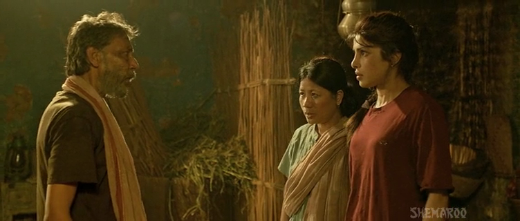
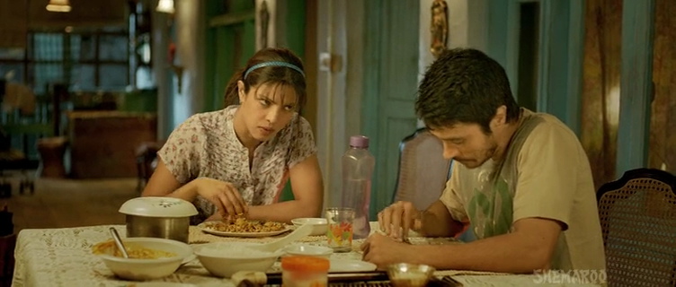
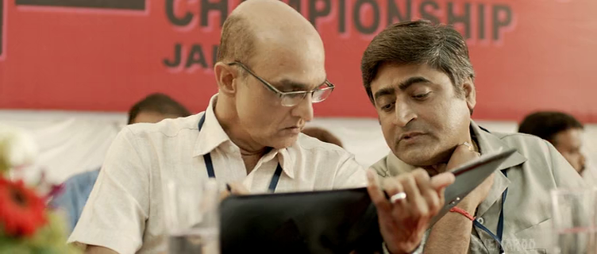
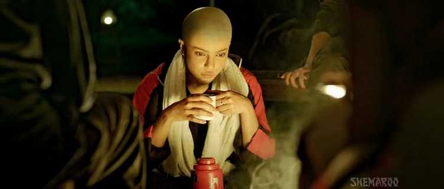

# 10 Lessons I learned from Mary Kom (2014 Movie)

[Movies](https://estheradeniyi.com/category/movies/)[Uncategorized](https://estheradeniyi.com/category/uncategorized/)
# 10 Lessons I learned from Mary Kom (2014 Movie)

by [Esther Adeniyi](https://estheradeniyi.com/author/esther-adeniyi/)on [October 29, 2015May 25, 2018](https://estheradeniyi.com/10-lessons-i-learned-from-mary-kom-20/)[Leave a Comment on 10 Lessons I learned from Mary Kom (2014 Movie)](https://estheradeniyi.com/10-lessons-i-learned-from-mary-kom-20/#respond)

Sharing is caring!

- [0](https://www.facebook.com/sharer/sharer.php?u=https%3A%2F%2Festheradeniyi.com%2F10-lessons-i-learned-from-mary-kom-20%2F&amp;t=10%20Lessons%20I%20learned%20from%20Mary%20Kom%20%282014%20Movie%29)
- [0](https://twitter.com/intent/tweet?text=10%20Lessons%20I%20learned%20from%20Mary%20Kom%20%282014%20Movie%29&amp;url=https%3A%2F%2Festheradeniyi.com%2F10-lessons-i-learned-from-mary-kom-20%2F)
- [0](#)

0shares

I am watching Mary Kom for the third time now. Trust me, I have gone online to search and read movie reviews and things about the real Mary Kom herself.

These
 lessons were compiled from watching the movie; it may not coincide with Mary Kom&#x2019;s real life.

&#xA0;

Contents

- [1 &#xA0;&#xA0;&#xA0;&#xA0; 1. Nobody Talks About Nonentities](#_1_Nobody_Talks_About_Nonentities)
- [2 2. &#xA0; Your Parent(s) may never understand
your passion](#2_Your_Parents_may_never_understand_your_passion)
- [3 .&#xA0;&#xA0;&#xA0;&#xA0; 3. Let all men everywhere be prepared](#_3_Let_all_men_everywhere_be_prepared)
- [4 4. We all need a coach](#4_We_all_need_a_coach)
- [5 5. Behind a successful married woman,
there is most likely a supportive man](#5_Behind_a_successful_married_woman_there_is_most_likely_a_supportive_man)
- [6 &#xA0;&#xA0; 6. Haters are everywhere](#_6_Haters_are_everywhere)
- [7 7. Lack of self control is messy](#7_Lack_of_self_control_is_messy)
- [8 8.&#xA0; Nothing good comes easy](#8_Nothing_good_comes_easy)
- [9 &#xA0;&#xA0; 9. Just
a call can ruin a life](#_9_Just_a_call_can_ruin_a_life)
- [10 10.
We sometimes find love in the hopeless place.](#10_We_sometimes_find_love_in_the_hopeless_place)

## &#xA0;&#xA0;&#xA0;&#xA0; 1. Nobody Talks About Nonentities

&#xA0;&#xA0;&#xA0;&#xA0; Why would there be a movie about Mary Kom (Mangte Chungneijang Mary Kom) if she was just
 anybody? She wasn&#x2019;t and that is why a Nigerian me now knows about an Indian Mary
 through a movie.

## 2. &#xA0; Your Parent(s) may never understand
 your passion

No hating (well, I am becoming a parent soon. See their eyes eh!), but
 parents need to chill and watch their children before concluding that they
 are no good for what their heart desires are. Mary&#x2019;s father was not only
 apprehensive, he was stubborn. He got her frustrated and discouraged her from
 boxing times without number. His concerns were valid but I tell you,&#xA0; if not for this boxer&#x2019;s strong spirit&#x2026;

&#xA0;

## .&#xA0;&#xA0;&#xA0;&#xA0; 3. Let all men everywhere be prepared

Let&#x2019;s rephrase that: let all men who intend to marry (women)
 strap their sandals. Women, women, women. We can be naggy, moody,
 inconsiderate, selfish, the list goes on. In our relationship with our
 partners, we get so used to the familiarity that we take out our frustration on
 them. Chai, this man tried eh. He soooo tried. She complained about giving
 birth too early, about missing her career, about this and that. She made this
 man look like he was responsible for her unhappiness but I put it to you that men
 like this are very scarce. He chose to stay and still be the husband.

&#xA0; 

&#xA0;

## 4. We all need a coach

[&#xA0;](http://4.bp.blogspot.com/-L-I51zVCoFQ/Vi0GualVUFI/AAAAAAAAGg8/HUeC7d7lfiI/s1600/vlcsnap-2015-10-24-19h48m00s168.png)

Or mentor or guide. In any career or field, look out for people that can help you. Mary&#x2019;s coach was the man. She needed that man in her life else she would not have gone as far as she did. Get to submit yourselves to more experienced and older people. It is easier to stand on their shoulders.

## 5.Behind a successful married woman,
 there is most likely a supportive man

 What could Mary Kom get achieved without
 her husband? Not much, if you ask me. He nursed the babies while she was away
 practising. He gave her all the encouragement she needed to further her career.
 He urged her to shun the haters. He was with her all the way. He bought her a
 punching bag to practise at home. He pushed her off the bed to compel her go
 for practice (One of my most favorite scenes in that movie).

## &#xA0;&#xA0;6. Haters are everywhere

&#xA0;&#xA0;&#xA0;&#xA0;&#xA0;&#xA0; There was this government official that was supposed to be on Mary&#x2019;s side. He was just so disapproving of this young lady. Some people don&#x2019;t like you for no reason. The sooner you realize that, the faster you move.

&#xA0;

## 7. Lack of self control is messy

&#xA0; &#xA0; &#xA0;&#xA0; Mary was quick tempered. Her outbursts of anger were very disastrous. She got so angry one day and she shaved off her hair. This bad attitude can be quite destructive. She almost missed her life partner na with this temper palaver.

&#xA0;

## 8.&#xA0; Nothing good comes easy

It was rigorous; her training. I have come to find out however, that boxing isn&#x2019;t the only thing that requires hard work, patience, dedication, commitment etcetera, etcetera. Anything and everything worthwhile requires some effort. No pain, no gain, right?

## &#xA0;&#xA0; 9. Just
 a call can ruin a life

 There was saving grace for her here as this call did not eventually call her career off. One of her twin baby was about to undergo surgery and her husband called. Why he called still gets me annoyed. Oh, yes, she had the right to know; he also needed someone to talk to but his timing was too inappropriate. God forbid the child died after all, she would have lost both child and a very potential achievement. Learn to have good shock absorber enough to spare some people of some life changing calls.

&#xA0;

## 10.
 We sometimes find love in the hopeless place.

 Aaaaaaaand ooooooh, she found her lover, her friend, supporter and husband after she went to fight. For money tho; money to free her sister from the hands of someone her father owed. All the same, she went to fight! Hehehehe&#x2026; Thank God say she look face. She was almost shunning the guy off totally, the guy who became her big fan in life. Ehn, I know that these our street toasters nor dey try at all but if you see the potential of a correct head, ladies, don&#x2019;t shun. We find love in the weirdest of places sometimes.So, any blog reader seen this movie? What are your thoughts about it? Lessons? Criticisms? Pure adaptation? Let me hear from you, iyea?
I need to sign off here. Have a fabulous day today and don&#x2019;t forget that people do not care about nonentities. Love you, xoxo..

Sharing is caring!

- [0](https://www.facebook.com/sharer/sharer.php?u=https%3A%2F%2Festheradeniyi.com%2F10-lessons-i-learned-from-mary-kom-20%2F&amp;t=10%20Lessons%20I%20learned%20from%20Mary%20Kom%20%282014%20Movie%29)
- [0](https://twitter.com/intent/tweet?text=10%20Lessons%20I%20learned%20from%20Mary%20Kom%20%282014%20Movie%29&amp;url=https%3A%2F%2Festheradeniyi.com%2F10-lessons-i-learned-from-mary-kom-20%2F)
- [0](#)

0shares

Tags:[Movies](https://estheradeniyi.com/tag/movies/)