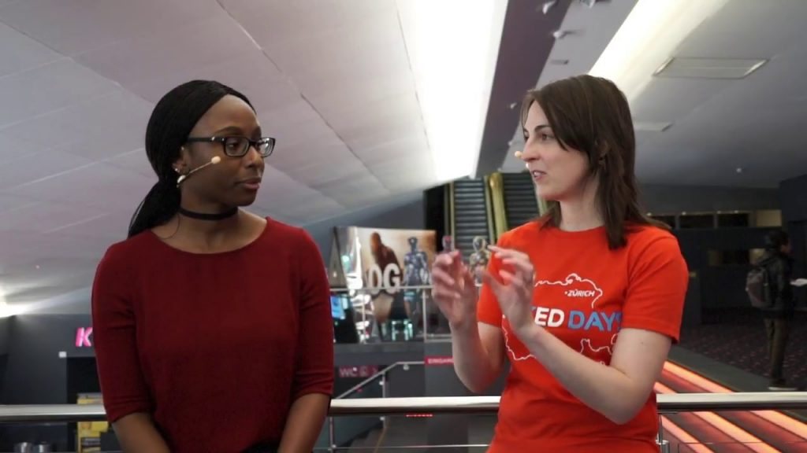

# 3 Bad Reasons to Become a Startup Entrepreneur

[Career](https://estheradeniyi.com/category/career/)
# 3 Bad Reasons to Become a Startup Entrepreneur

by [Esther Adeniyi](https://estheradeniyi.com/author/esther-adeniyi/)on [November 8, 2017April 27, 2018](https://estheradeniyi.com/3-bad-reasons-to-become-startup/)[2 Comments on 3 Bad Reasons to Become a Startup Entrepreneur](https://estheradeniyi.com/3-bad-reasons-to-become-startup/#comments)

Sharing is caring!

- [0](https://www.facebook.com/sharer/sharer.php?u=https%3A%2F%2Festheradeniyi.com%2F3-bad-reasons-to-become-startup%2F&amp;t=3%20Bad%20Reasons%20to%20Become%20a%20Startup%20Entrepreneur)
- [0](https://twitter.com/intent/tweet?text=3%20Bad%20Reasons%20to%20Become%20a%20Startup%20Entrepreneur&amp;url=https%3A%2F%2Festheradeniyi.com%2F3-bad-reasons-to-become-startup%2F)
- [2](#)

2shares

Okay, y&#x2019;all know that entrepreneurship is the in thing now. No denying, you are either an entrepreneur or a side hustler. Okay, thing is, the idea of being called an entrepreneur is such a glamour to some women and I am not sure if it&#x2019;s okay to blame them yet. Anybody wants to be king of their castles. Everyone wants to own something, be something, nurse and launch something to success but is entrepreneurship the immediate way to go? Startup entrepreneurship even?

Were you at Resetssion? The event that held some months ago at Muson Center, Onikan, Lagos. I listened to one of the speakers, Ini Abimbola who is an&#xA0;entrepreneur and she said something about how her life has never been the same since she launched her business. She described how insomnia wasn&#x2019;t just another word and how she fully understood what it meant to have sleepless, turbulent nights.

Listen, this blog post isn&#x2019;t to paint startup entrepreneurship bad, this blog post is to let you recognize bad reasons to become a startup entrepreneur. If you really want to be an entrepreneur, great! But if the reasons listed shortly are reasons why you want to, then I think you should think this through and see how to solve the pressing challenge driving you into startup entrepreneurship.

1. Your boss is annoying

Heck yeah, this can drive you into thinking of taking up your own thing. You have become so intolerant of your boss. S/he is inconsiderate, a slave driver, never pays your salaries on time yet buys a new car every year, unfair, demanding, queen of mood swings, extremely critical, name it. Your boss is annoying!

So, this is where you are right now. You can&#x2019;t cope with your boss anymore.

Entrepreneurship isn&#x2019;t the next thing to do if you have never nursed the idea, yet alone have plans on ground. Begin to think of how to change jobs if it is as bad, very bad as you paint. If you can, there are a few tips to handling an annoying boss:

-avoid one-on-one interactions with them all the time.

-develop a thick skin that never really takes their behavior to heart.

-have a friend you can rant to at work, not gossip, a friend you can pour your heart out to.

-lower the expectations you have of your boss. They can act all they want, you alone can determine your reactions.

[You might like to read : you don&#x2019;t have to be an entrepreneur to be successful](https://www.estheradeniyi.com/you-dont-have-to-be-entrepreneur-to-be)

2. You like the glamour

We don&#x2019;t need to sugar coat anything here, being a startup entrepreneur comes with so much of glamour but that&#x2019;s after a long while. This is after the resilience, the struggles, the disappointments, the discouragements and the persistent push. This is after so much work has been put in.

If you like the glamour associated with being called an entrepreneur, you might want to think twice if that is why you are going into it. There are a lot of bumps and hurdles to climb to get all of those accolades. If you are ready to go through all of that to make something, oh, why not.

3. You want to travel to the Bahamas anytime you feel like

This is a.k.a, I want to have all the money to buy the latest car. Startup entrepreneurs definitely get to the top, the persistent ones break even and become very financially buoyant. They probably didn&#x2019;t tell you about how broke they have been at a point in their lives. Several times even. How they had to choose between business and feeding.

You can buy your own car whenever you want to but it might take a while. If the financial success is what&#x2019;s driving you to become a startup entrepreneur, I make bold to tell you that this is one of the bad reasons to become a startup entrepreneur.

Are you a startup entrepreneur? Would you like to share with us some of the [bad reasons to become a startup entrepreneur?](https://www.inc.com/jessica-stillman/3-bad-reasons-to-become-a-startup-entrepreneur.html)

Sharing is caring!

- [0](https://www.facebook.com/sharer/sharer.php?u=https%3A%2F%2Festheradeniyi.com%2F3-bad-reasons-to-become-startup%2F&amp;t=3%20Bad%20Reasons%20to%20Become%20a%20Startup%20Entrepreneur)
- [0](https://twitter.com/intent/tweet?text=3%20Bad%20Reasons%20to%20Become%20a%20Startup%20Entrepreneur&amp;url=https%3A%2F%2Festheradeniyi.com%2F3-bad-reasons-to-become-startup%2F)
- [2](#)

2shares

Tags:[career](https://estheradeniyi.com/tag/career/)[Entrepreneurship](https://estheradeniyi.com/tag/entrepreneurship/)[startups](https://estheradeniyi.com/tag/startups/)