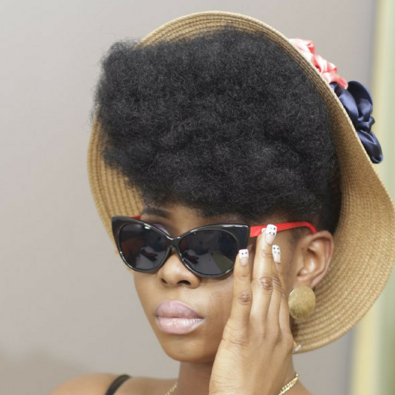

# 3 Hair Goals to set to become the next big hit Naturalista

[Natural Hair](https://estheradeniyi.com/category/natural-hair/)
# 3 Hair Goals to set to become the next big hit Naturalista

by [Esther Adeniyi](https://estheradeniyi.com/author/esther-adeniyi/)on [September 1, 2017May 25, 2018](https://estheradeniyi.com/3-hair-goals-to-set-to-become-next-big/)[Leave a Comment on 3 Hair Goals to set to become the next big hit Naturalista](https://estheradeniyi.com/3-hair-goals-to-set-to-become-next-big/#respond)

Sharing is caring!

- [0](https://www.facebook.com/sharer/sharer.php?u=https%3A%2F%2Festheradeniyi.com%2F3-hair-goals-to-set-to-become-next-big%2F&amp;t=3%20Hair%20Goals%20to%20set%20to%20become%20the%20next%20big%20hit%20Naturalista)
- [0](https://twitter.com/intent/tweet?text=3%20Hair%20Goals%20to%20set%20to%20become%20the%20next%20big%20hit%20Naturalista&amp;url=https%3A%2F%2Festheradeniyi.com%2F3-hair-goals-to-set-to-become-next-big%2F)
- [0](#)

0shares

#Hairgoals has been the trending hashtag on social media for a while now, &#xA0;but do we really have [hair goals](http://lifestyle.ynaija.com/hair-goals-maintaining-growing-natural-hair-like-yemi-alade/)? What steps are we taking to bring our goals to realization?

Growing natural hair is just like a handling a project and every project must have a goal target. Let&#x2019;s look at some of the goals we can have for our natural hair and ways we can reach those girls.

*Hair length

It is not everyone that wants a long hair, really. But for we that do, here are some of the things we can do to achieve it

&#x2013; Use a hair lengthening DIY mask seasonally
 &#x2013; Make hairstyles that promote hair growth and avoid styles that cause breakage
 &#x2013; Apply [lemon on hair](https://www.estheradeniyi.com/diy-lemon-fruit-mask-for-hair-and-skin-1) regularly
 For short hair length, hair should be trimmed regularly to desired length

* Soft hair

 It&#x2019;s a joyful thing to have a soft natural hair. Stubborn hair is quite difficult to manage. To get soft hair
 &#x2013; oil your hair as often as possible
 &#x2013; use a hair softening DIY hair mask. ( I&#x2019;ll recommend banana because it worked wonders on my hair)
 -deep condition your hair frequently

*Break-free hair

Natural hair is more prone to [breakage](https://www.estheradeniyi.com/hair-breakage-easy-ways-to-avoid-this) than relaxed hair. &#xA0;To gain strength for your hair

&#x2013; Oil hair regularly
 &#x2013; Avoid washing made hair
 &#x2013; Use an anti-breakage DIY hair mask
 &#x2013; Trim hair regularly
 &#x2013; Avoid washing hair with very hot water

These are just a few of the several goals we can set for our hair as naturalists if we&#x2019;re going to have be a successful one. It&#x2019;s possible to fail in an attempt to go natural if the right things are not done.
 Make your natural hair the light that will draw others to become naturalist today?

Sharing is caring!

- [0](https://www.facebook.com/sharer/sharer.php?u=https%3A%2F%2Festheradeniyi.com%2F3-hair-goals-to-set-to-become-next-big%2F&amp;t=3%20Hair%20Goals%20to%20set%20to%20become%20the%20next%20big%20hit%20Naturalista)
- [0](https://twitter.com/intent/tweet?text=3%20Hair%20Goals%20to%20set%20to%20become%20the%20next%20big%20hit%20Naturalista&amp;url=https%3A%2F%2Festheradeniyi.com%2F3-hair-goals-to-set-to-become-next-big%2F)
- [0](#)

0shares

Tags:[Hair](https://estheradeniyi.com/tag/hair/)[Hair and beauty](https://estheradeniyi.com/tag/hair-and-beauty/)[Natural Hair](https://estheradeniyi.com/tag/natural-hair/)