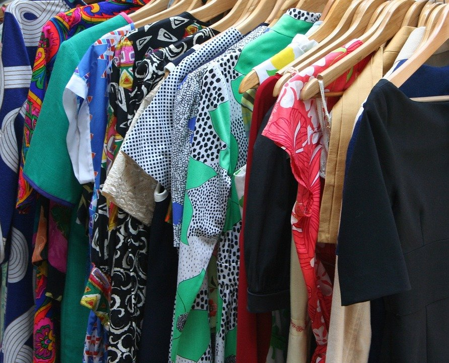

# 5 Easy Ways to make your cheap clothes look expensive

[Uncategorized](https://estheradeniyi.com/category/uncategorized/)
# 5 Easy Ways to make your cheap clothes look expensive

by [Esther Adeniyi](https://estheradeniyi.com/author/esther-adeniyi/)on [July 6, 2017April 27, 2018](https://estheradeniyi.com/5-easy-ways-to-make-your-cheap-clothes/)[2 Comments on 5 Easy Ways to make your cheap clothes look expensive](https://estheradeniyi.com/5-easy-ways-to-make-your-cheap-clothes/#comments)

Sharing is caring!

- [0](https://www.facebook.com/sharer/sharer.php?u=https%3A%2F%2Festheradeniyi.com%2F5-easy-ways-to-make-your-cheap-clothes%2F&amp;t=5%20Easy%20Ways%20to%20make%20your%20cheap%20clothes%20look%20expensive)
- [0](https://twitter.com/intent/tweet?text=5%20Easy%20Ways%20to%20make%20your%20cheap%20clothes%20look%20expensive&amp;url=https%3A%2F%2Festheradeniyi.com%2F5-easy-ways-to-make-your-cheap-clothes%2F)
- [0](#)

0shares

 Living on a budget is never such a bad idea. In the mean time, you can look as glamorous on cheap clothes as you would like to on expensive clothes. Many times you really don&#x2019;t need expensive clothes, what you need most of the time are clothes that are just proper for whatever occasion you are going to.

A dash and spice of expensive clothes here and there is not bad, who doesn&#x2019;t want treats once in a while but excessive binging on these because you know no other way can drain your cash and make you money dumb.

These are times to save what we have. Assets last more than consumables and fashion. What&#x2019;s trendy will fade and if you don&#x2019;t have a grip of your wardrobe budget, it&#x2019;s going to be a terrible portion of your spending. So, how can you make cheap clothes look more expensive?

1. Get them to fit you

Fitting is everything! Never trade fitting for anything flimsy. The most expensive ill-fitting cloth is as bad as a cheap cloth. Get a tailor to help you adjust places that don&#x2019;t accentuate your positives. Have a sense of style that diminishes less attractive parts of your body and emphasizes your body strengths.

2. Invest in basics

Don&#x2019;t buy purple if you don&#x2019;t have a black already. It is going to give you away easily. Shopping on a budget requires that you buy what you need and not otherwise. People can scarcely distinguish between an expensive and cheap simple, straight black skirts. As long as they fit you, you can rock them like a fashionista.

3. Wash and iron properly

Wash your clothes properly. Let your whites sparkle. Cut down on how much you squeeze clothes that are likely to expand. Be careful of over-washing coloured items. Just treat your clothes accordingly and iron them well. Never wear cheap and rumpled outfits. It is such a bad combination.

4. Accessorize

Invest in a few statement pieces to pimp up some of your basic, cheap clothes. You can make your accessories add more colour and fun to your closet. If you are a high heel person, it is going to totally change your overall outlook. Heels are distracting if you can walk well in them. Get quality neck pieces to cover up for your cheap clothes and have a fabulous outfit overall.

5. Be confident

Walk and talk with confidence. An expensive outfit with a bad carriage is as bad as a cheap outfit. Wear your neat, well-fitting cheap clothes with a confidence that goes way before you. Walk straight up, sit straight, don&#x2019;t slouch and talk like a woman of style and poise.

P.S &#x2013; Would you do us a small favour? Please share this blog post on your social media network. Thank you.

Sharing is caring!

- [0](https://www.facebook.com/sharer/sharer.php?u=https%3A%2F%2Festheradeniyi.com%2F5-easy-ways-to-make-your-cheap-clothes%2F&amp;t=5%20Easy%20Ways%20to%20make%20your%20cheap%20clothes%20look%20expensive)
- [0](https://twitter.com/intent/tweet?text=5%20Easy%20Ways%20to%20make%20your%20cheap%20clothes%20look%20expensive&amp;url=https%3A%2F%2Festheradeniyi.com%2F5-easy-ways-to-make-your-cheap-clothes%2F)
- [0](#)

0shares

Tags:[Featured](https://estheradeniyi.com/tag/featured/)[Style](https://estheradeniyi.com/tag/style/)