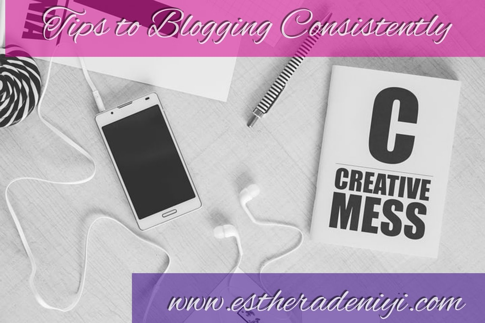

# 5 Important Tips to Blogging Consistently

[Uncategorized](https://estheradeniyi.com/category/uncategorized/)
# 5 Important Tips to Blogging Consistently

by [Esther Adeniyi](https://estheradeniyi.com/author/esther-adeniyi/)on [December 10, 2016April 27, 2018](https://estheradeniyi.com/5-important-tips-to-blogging/)[2 Comments on 5 Important Tips to Blogging Consistently](https://estheradeniyi.com/5-important-tips-to-blogging/#comments)

Sharing is caring!

- [0](https://www.facebook.com/sharer/sharer.php?u=https%3A%2F%2Festheradeniyi.com%2F5-important-tips-to-blogging%2F&amp;t=5%20Important%20Tips%20to%20Blogging%20Consistently)
- [0](https://twitter.com/intent/tweet?text=5%20Important%20Tips%20to%20Blogging%20Consistently&amp;url=https%3A%2F%2Festheradeniyi.com%2F5-important-tips-to-blogging%2F)
- [0](#)

0shares

 Hey, fellow blogger, this one is for you. How&#x2019;s been blogging so far? I decided to write this post based on the many complaints I have heard from my blogger friends. There are so many challenges in blogging and I make bold to say that every single one of them can be surmounted if you are willing and spot ready. Out of the many challenges complained about, consistency seems to be the most popular.

Who wouldn&#x2019;t want to be a consistent blogger? Especially if blogging is serious business?

Lack of consistency drives readers away. &#xA0;It discourages your blog subscribers and quickly, they lose interest in your blog. Lack of blogging consistency also puts you out as unserious and that is honestly not a good place to be for a blogger. Let&#x2019;s read on to discover tips on how to blog consistently.

1. Have an editorial calendar

There are many blog planners out there right now. They are to make blogging easier and better. Decide how you want to make your posts and the frequency. Say, you want to post thrice weekly, have the days of those weeks for the next two to three months outlined and list beside those days, &#xA0;topics you want to write on.

2. Have many backup posts

These are posts that save you when you have the writer&#x2019;s block or are too busy. Inasmuch as we dread these down times, they come. I am usually very afraid of these times but I don&#x2019;t only entertain fear, I take action. I prepare ahead. These back up posts are your posts in queue and you will always have to replace them as soon as you use them. So, &#xA0;make sure you are writing something as soon as the inspiration comes.

3. Have a realistic post frequency

This is one important step to blogging consistency. To avoid burnout, you have to decide how frequently you want to blog and then stick by it. I used to blog everyday at some point, I had a lot of time on my hands to write and brainstorm. It&#x2019;s no more the same and I had to be realistic with myself. If you are part of my newsletters, you&#x2019;d remember I told you I would have to reduce from everyday to four times per week to help me keep churning out quality instead of just quantity. I like to provide value so I would not sacrifice that on the altar of quantity. This has also helped me blog consistently.

4. Schedule posts ahead

To be a consistent blogger, it&#x2019;s also a good idea to schedule posts ahead. This is usually good if you post very frequently. Say, &#xA0;everyday or many times a day. &#xA0;To keep your readers satisfied, you might have to schedule posts ahead so you don&#x2019;t miss them when they come visiting your blog. It will help to reduce pressure also.

5. Always be inspired

Yes, &#xA0;this is where many bloggers have issues, especially bloggers who develop content on their own or brainstorm ideas on what to write about. What keeps you writing? What keeps your ideas flowing? How do you unfreeze? You can [read my post on how to get over the writer&#x2019;s block here. ](https://www.estheradeniyi.com/lifestyle-blogging-5-ways-to-unfreeze?m=1)Do you have to be at certain places, do some certain things to keep flowing in ideas? I, personally, like to read and watch movies. They inspire me to write. That way I write and keep these articles in my drafts folder until I need them for my blog.

How do you stay consistent in your blogging?

Do you like my blog post(s), &#xA0;please, share with your friends. Do not also leave without subscribing to my blog. Just scroll down a little bit and you&#x2019;ll find the widget &#x2018;subscribe to my blog&#x2019;.

Thank you. Enjoy.

Sharing is caring!

- [0](https://www.facebook.com/sharer/sharer.php?u=https%3A%2F%2Festheradeniyi.com%2F5-important-tips-to-blogging%2F&amp;t=5%20Important%20Tips%20to%20Blogging%20Consistently)
- [0](https://twitter.com/intent/tweet?text=5%20Important%20Tips%20to%20Blogging%20Consistently&amp;url=https%3A%2F%2Festheradeniyi.com%2F5-important-tips-to-blogging%2F)
- [0](#)

0shares

Tags:[Blogging](https://estheradeniyi.com/tag/blogging/)