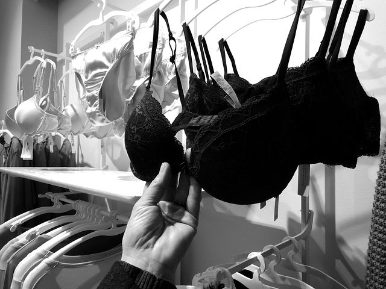

# 5 Ways to Know Your Bra Doesn’t Fit

[Uncategorized](https://estheradeniyi.com/category/uncategorized/)
# 5 Ways to Know Your Bra Doesn&#x2019;t Fit

by [Esther Adeniyi](https://estheradeniyi.com/author/esther-adeniyi/)on [March 27, 2017April 27, 2018](https://estheradeniyi.com/5-ways-to-know-your-bra-doesnt-fi/)[4 Comments on 5 Ways to Know Your Bra Doesn&#x2019;t Fit](https://estheradeniyi.com/5-ways-to-know-your-bra-doesnt-fi/#comments)

Sharing is caring!

- [0](https://www.facebook.com/sharer/sharer.php?u=https%3A%2F%2Festheradeniyi.com%2F5-ways-to-know-your-bra-doesnt-fi%2F&amp;t=5%20Ways%20to%20Know%20Your%20Bra%20Doesn%27t%20Fit)
- [0](https://twitter.com/intent/tweet?text=5%20Ways%20to%20Know%20Your%20Bra%20Doesn%27t%20Fit&amp;url=https%3A%2F%2Festheradeniyi.com%2F5-ways-to-know-your-bra-doesnt-fi%2F)
- [0](#)

0shares

 You know this uncomfortable, less-confident feeling you have when you are wearing the wrong bra size right? I have been really unfortunate with bras and perfect fits. It&#x2019;s been a lot of trial and errors for me. I just recently decided to go for the right size at a go. No more guessing and wishing and hoping? My next bra shopping is going to be pinpoint accurate, I promise myself that because I am so tired of the adjusting et al.

Do you know if you are also using the wrong bras? Let me tell you how to know for sure that your [bra does not fit you well](http://www.seventeen.com/fashion/style-advice/tips/a30030/signs-youre-wearing-the-wrong-size-bra/).

1. The back of the band is riding up

Many of us know this. As soon as I began wearing bras, mumsi would watch out for the back of the band. When it is riding up she would give the disapproving look and it wouldn&#x2019;t matter how much she bought it o, she would just ask me to dump it. I don&#x2019;t know why that pointer was that serious to her. Hihihihihihihihihihi. So, when your band rides up at the back of your bra, it doesn&#x2019;t fit your boobs.

2. Your bra straps are digging into your shoulders

Your bra is too tight if the straps are digging into your shoulders even when it is completely released. Wearing bra doesn&#x2019;t have to be punishment biko. Hia! Shey that&#x2019;s why some girls don&#x2019;t like wearing bras. All their lives, they have unfortunately bought those that digged into their shoulders. For busty girls, it might be tricky because of the weight of the boobs but no matter what, there should not be great discomfort at the shoulders. Go a size smaller.

3. The underwire is sitting away from your chest wall

It doesn&#x2019;t matter how nice other indicators are, if the base of your bra is sitting away from your chest wall, it doesn&#x2019;t fit. It is because the band is too wide. Sometimes this is usually accompanied with it riding up at the back. Sometimes it doesn&#x2019;t ride up at the back but as long as it doesn&#x2019;t sir well, it isn&#x2019;t your size.

4. Your boobs are bulging out at the sides

Many of us know how uncomfortable this can be. Na so so ugly shat go kon be. See the way body hugs usually look on these bras, very ugly and embarrassing.

5. Your [boobs](https://www.estheradeniyi.com/why-do-my-breasts-hurt) are sagging even under the bra

This one is a no no, no argument. Even with a bra, your boobs are still sagging, maka why? Hihihihihihihihihihi&#x2026;.. Your bra should lift your boobs up and make them firm. Same for push up bras too, they are too off your size if they cannot even lift up your boobs.

Which of these do you frequently find yourself experiencing with your bras?

Sharing is caring!

- [0](https://www.facebook.com/sharer/sharer.php?u=https%3A%2F%2Festheradeniyi.com%2F5-ways-to-know-your-bra-doesnt-fi%2F&amp;t=5%20Ways%20to%20Know%20Your%20Bra%20Doesn%27t%20Fit)
- [0](https://twitter.com/intent/tweet?text=5%20Ways%20to%20Know%20Your%20Bra%20Doesn%27t%20Fit&amp;url=https%3A%2F%2Festheradeniyi.com%2F5-ways-to-know-your-bra-doesnt-fi%2F)
- [0](#)

0shares

Tags:[Featured](https://estheradeniyi.com/tag/featured/)[Style](https://estheradeniyi.com/tag/style/)