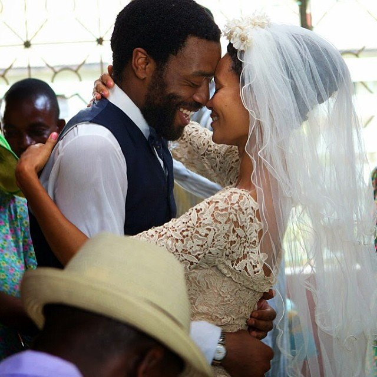

# A guide to winning a man’s heart and getting his attention

[Guest Posts](https://estheradeniyi.com/category/guest-posts/)
# A guide to winning a man&#x2019;s heart and getting his attention

by [Esther Adeniyi](https://estheradeniyi.com/author/esther-adeniyi/)on [October 6, 2017May 25, 2018](https://estheradeniyi.com/a-guide-to-winning-mans-heart-and/)[Leave a Comment on A guide to winning a man&#x2019;s heart and getting his attention](https://estheradeniyi.com/a-guide-to-winning-mans-heart-and/#respond)

Sharing is caring!

- [0](https://www.facebook.com/sharer/sharer.php?u=https%3A%2F%2Festheradeniyi.com%2Fa-guide-to-winning-mans-heart-and%2F&amp;t=A%20guide%20to%20winning%20a%20man%27s%20heart%20and%20getting%20his%20attention)
- [0](https://twitter.com/intent/tweet?text=A%20guide%20to%20winning%20a%20man%27s%20heart%20and%20getting%20his%20attention&amp;url=https%3A%2F%2Festheradeniyi.com%2Fa-guide-to-winning-mans-heart-and%2F)
- [0](#)

0shares

&#xA0;

#### &#x201C;A guide to winning a man&#x2019;s heart and getting his attention&#x201D; is a guest Post by Amohuni Fred Jatto

Many women often go some extra miles to impress that particular guy they desire, but lot of times they go about it in the wrong way and give up mid-way. Have you ever been in this position before?

If Yes! You will agree with me that it can be very frustrating. It is not that difficult to get the attention of a guy you desire in your heart. You know, one thing is getting the attention of a guy and another is getting the right guy&#x2019;s attention. A popular adage says: &#x201C;You are addressed the way you dress&#x201D;.

Every guy has his type. Some like &#x2018;a plus size&#x2019; woman, while others like &#x2018;a thick&#x2019; woman. Still, others like the &#x2018;slim&#x2019; ones. So whichever category you fall, there&#x2019;s this one guy out there who is seeking your love. Get to know him, then initiate appropriate friendship.

This doesn&#x2019;t mean that you should be careless with the way you look. Do adequate exercise, eat healthy meals so that you can keep fit. It is your responsibility to find out what the guy&#x2019;s type is, then work towards getting and sustaining his attention and love, if you are that type.

The way you compose and comport yourself also matter. Be respectful and smart looking. You can earn a meagre salary, yet manage to look good and attractive all the time. Keep your hair clean and neat. Use cool colours, not colours that announce you the moment you step out. Your nails should be properly manicured and well kept. Smell nice, dress and walk smartly always. The way young ladies dress and walk these days &#x2013; God have mercy! Ooze out fresh breath all the time, especially when you&#x2019;re fasting.

Another very important clue is that you should develop yourself. Babes, no guy will stick to a dunce who has the opportunity, but refuses to develop herself. Read useful materials which can help you develop intellectually. Join good clubs and associate with friends and people who will enhance your personality, add to your value and knowledge.

Be hard working, studious, skillful and diligent in all you do. Keep doing what you know best. Don&#x2019;t try hard to impress anybody, but be your natural self and you will be surprised how people will be impressed and automatically get attracted to you. I can guarantee that within a short time you&#x2019;ll be the focus of many. He, in particular, will not only long for you, but will fall head over heels for you.

For those of you who have already won your man&#x2019;s heart and attention, you can easily lose him if you stop to do those things that won his heart to you. A man can be likened to a baby that you have to carefully study and understand, in other to make him happy. Firstly, you must know that you can&#x2019;t change a man.

Some go into relationships with the mind to change your man. My dear, you can&#x2019;t change them. Give up your futile efforts. If they change, they do so, because they want to, not because of your efforts. If they change, due to your physical efforts, it may be to get something from you. Something you will regret later in future.

If however, you go regularly on your knees for your man, you can pray him into the person you desire him to be, as long as your heart desire for him is to conform to what God has in stock for him.

Surprise him by taking him out once in a while. Pick up the bills when you go on dates, Help him out when he needs you most, though men generally hardly make such request from ladies. Identify with what he loves doing. If he&#x2019;s a football fan, watch football with him, as much as possible and learn to enjoy the fun together. Talk about his work and be deeply concerned, when he expresses any fear. Let him receive encouragement from you all the time.

Be there for him in his moment of challenges. Don&#x2019;t try to build attention around yourself alone, focus your attention on him too. Prepare and serve him his best meals, shop for him and let him know that he&#x2019;s very special to you. Go to social gatherings together. Be proud of him and don&#x2019;t be ashamed to introduce him to your friends.

A guy sticks to a woman he knows will always get his back always. Above all, be a praying woman. Always remember to be persistent in prayer until something good happens in his life and in your life too.

Men want to know that there&#x2019;s someone there whom they can fall back on whenever they are physically and spiritually weak.

> &#xA0;

Sharing is caring!

- [0](https://www.facebook.com/sharer/sharer.php?u=https%3A%2F%2Festheradeniyi.com%2Fa-guide-to-winning-mans-heart-and%2F&amp;t=A%20guide%20to%20winning%20a%20man%27s%20heart%20and%20getting%20his%20attention)
- [0](https://twitter.com/intent/tweet?text=A%20guide%20to%20winning%20a%20man%27s%20heart%20and%20getting%20his%20attention&amp;url=https%3A%2F%2Festheradeniyi.com%2Fa-guide-to-winning-mans-heart-and%2F)
- [0](#)

0shares

Tags:[Guest post](https://estheradeniyi.com/tag/guest-post/)[Relationships](https://estheradeniyi.com/tag/relationships/)