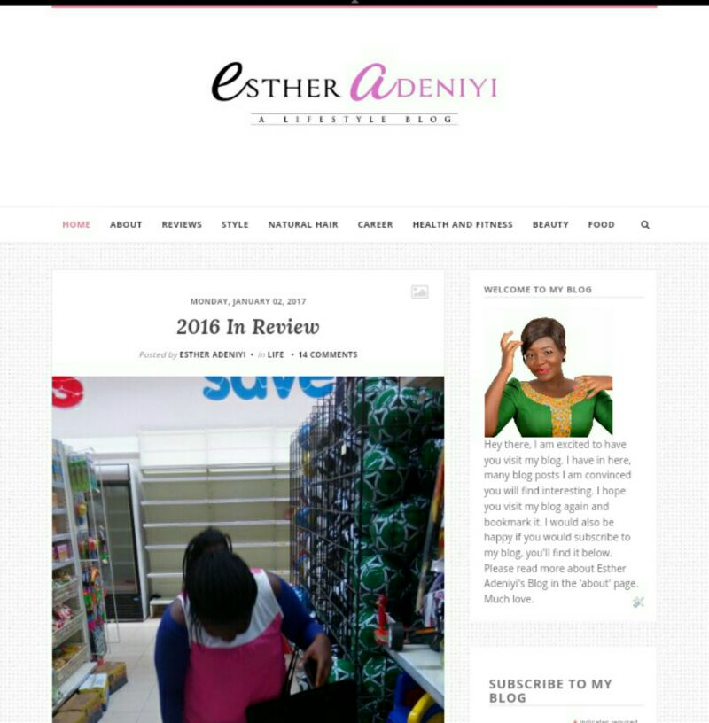

# About Esther Adeniyi’s Blog – A Lifestyle Blog

[Uncategorized](https://estheradeniyi.com/category/uncategorized/)
# About Esther Adeniyi&#x2019;s Blog &#x2013; A Lifestyle Blog

by [Esther Adeniyi](https://estheradeniyi.com/author/esther-adeniyi/)on [January 4, 2017April 27, 2018](https://estheradeniyi.com/about-esther-adeniyis-blog-lifestyle/)[2 Comments on About Esther Adeniyi&#x2019;s Blog &#x2013; A Lifestyle Blog](https://estheradeniyi.com/about-esther-adeniyis-blog-lifestyle/#comments)

Sharing is caring!

- [0](https://www.facebook.com/sharer/sharer.php?u=https%3A%2F%2Festheradeniyi.com%2Fabout-esther-adeniyis-blog-lifestyle%2F&amp;t=About%20Esther%20Adeniyi%27s%20Blog%20-%20A%20Lifestyle%20Blog)
- [0](https://twitter.com/intent/tweet?text=About%20Esther%20Adeniyi%27s%20Blog%20-%20A%20Lifestyle%20Blog&amp;url=https%3A%2F%2Festheradeniyi.com%2Fabout-esther-adeniyis-blog-lifestyle%2F)
- [0](#)

0shares

 Hey there. How is the week moving? It&#x2019;s been moving on pretty well for me. I launched Facebook post boost &#xA0;yesterday and I am beginning to see results as per daily page views. I am excited.

Today&#x2019;s blog post is going to be about my blog. I know that not every blog reader gets to open my &#x2018;About&#x2019; page. I decided that bringing it up as a blog post will intimate you with it and most especially let you know about the frequency of my blog posting. I would also want you to know why I have chosen this career path, why I love blogging and how far I have come.

Read below:

Esther Adeniyi: A Lifestyle Blog launched in March 2013 and was borne out of the desire to connect with other young women all over the world, beginning with my home country of Nigeria. This lifestyle blog cuts across many life topics including natural hair management tips, career, health and fitness and whatever life in general.

As you may have guessed, my name is Esther. I turned 24 on the 6th of September, 2016. I have a bachelor&#x2019;s degree in Chemistry from the University of Ilorin, and a master&#x2019;s degree in Organic Chemistry from the same school. While I scout for jobs, I&#x2019;m a full-time blogger and a social media enthusiast. During my free time I read (mostly books on relationships and lifestyle) and watch movies (I love any genre, as long as the movie is captivating and interesting enough to keep me glued).

I first started blogging when I was 18 years old. I wanted to write but there just wasn&#x2019;t any platform I had found perfect for me. I launched &#x2018;The Nigerian Student&#x2019; under Blogger when blogging was not yet as popular in Nigeria as it is now (that blog is now history). I then launched this blog and I&#x2019;m grateful for such a platform. With Esther Adeniyi: A Lifestyle Blog, I work to provide value to you and share my experiences at the same time. I also work with guest writers who bring fresh perspectives to the blog and help me keep the blog running with utmost efficiency. If you like reading articles that&#x2019;ll improve your life, you&#x2019;ll be comfortable here.

If you&#x2019;re new to this blog, make sure to check out the articles here. You&#x2019;ll be inspired and motivated, encouraged and informed, entertained and blessed. I update Esther Adeniyi&#x2019;s Blog four times in a week &#x2013; Mondays, Wednesdays, Fridays and Saturdays.

I would be very glad if you subscribed to my blog before leaving: I send weekly newsletters to my blog subscribers. In the newsletter I share freebies, giveaways, links to giveaways and also give a recap of my blog posts during the week. I promise not to bug you or be in your face all the time!

Thank you for being a part of this family. I hope to see you here again&#x2014;you should bookmark this blog so you don&#x2019;t lose your way! Please don&#x2019;t hesitate to write comments on posts that you like. Also, feel free to share this piece of the Web with your friends. I hope you have a wonderful time here.

Much love!

Sharing is caring!

- [0](https://www.facebook.com/sharer/sharer.php?u=https%3A%2F%2Festheradeniyi.com%2Fabout-esther-adeniyis-blog-lifestyle%2F&amp;t=About%20Esther%20Adeniyi%27s%20Blog%20-%20A%20Lifestyle%20Blog)
- [0](https://twitter.com/intent/tweet?text=About%20Esther%20Adeniyi%27s%20Blog%20-%20A%20Lifestyle%20Blog&amp;url=https%3A%2F%2Festheradeniyi.com%2Fabout-esther-adeniyis-blog-lifestyle%2F)
- [0](#)

0shares

Tags:[Blogging](https://estheradeniyi.com/tag/blogging/)