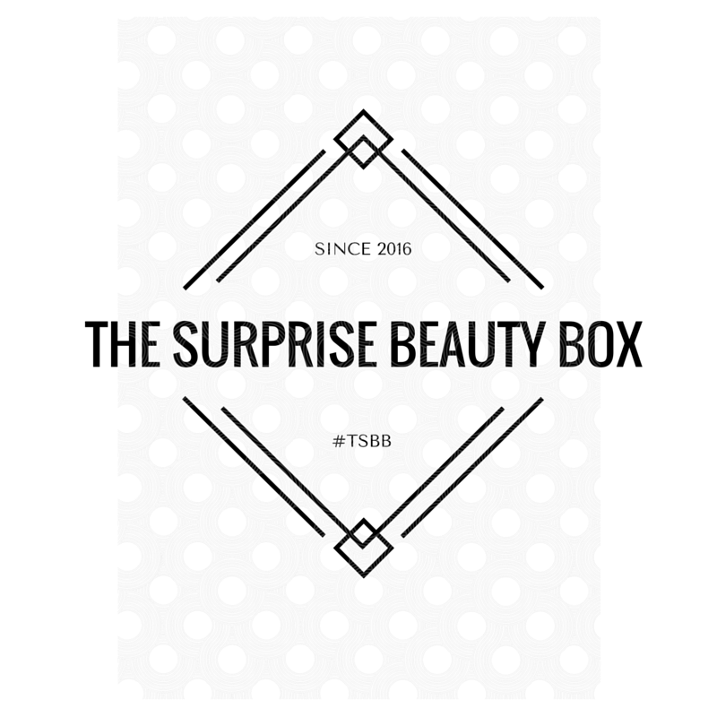
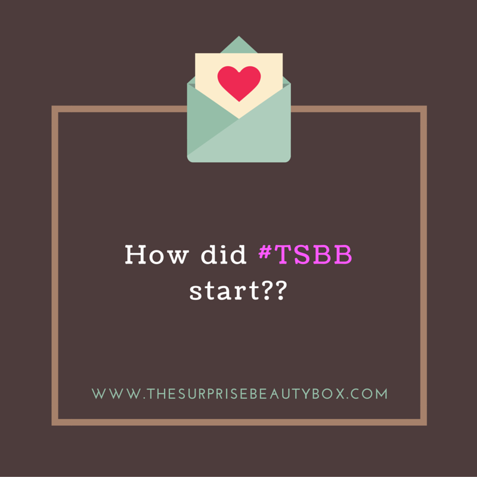
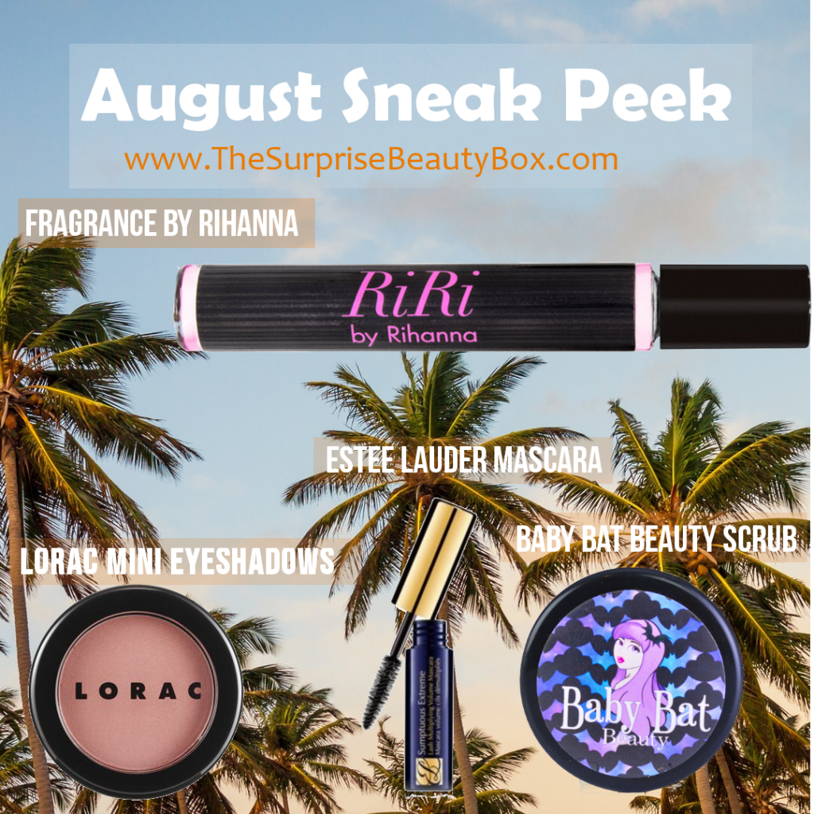

# An Interview with Zubda Khokhar,  CEO of The Surprise Beauty Box

[Interviews](https://estheradeniyi.com/category/interviews/)
# An Interview with Zubda Khokhar,  CEO of The Surprise Beauty Box

by [Esther Adeniyi](https://estheradeniyi.com/author/esther-adeniyi/)on [August 3, 2016May 25, 2018](https://estheradeniyi.com/an-interview-with-zubda-khokhar-ceo-of/)[Leave a Comment on An Interview with Zubda Khokhar,  CEO of The Surprise Beauty Box](https://estheradeniyi.com/an-interview-with-zubda-khokhar-ceo-of/#respond)

Sharing is caring!

- [0](https://www.facebook.com/sharer/sharer.php?u=https%3A%2F%2Festheradeniyi.com%2Fan-interview-with-zubda-khokhar-ceo-of%2F&amp;t=An%20Interview%20with%20Zubda%20Khokhar%2C%20%20CEO%20of%20The%20Surprise%20Beauty%20Box)
- [0](https://twitter.com/intent/tweet?text=An%20Interview%20with%20Zubda%20Khokhar%2C%20%20CEO%20of%20The%20Surprise%20Beauty%20Box&amp;url=https%3A%2F%2Festheradeniyi.com%2Fan-interview-with-zubda-khokhar-ceo-of%2F)
- [0](#)

0shares

Zubda Khokhar is the CEO of The Surprise Beauty Box, &#xA0;a subscription based beauty box. Read our interview with her.

Contents

- [1 Esther : So Zubda, what inspired you to launch a subscription based beauty box?](#Esther_So_Zubda_what_inspired_you_to_launch_a_subscription_based_beauty_box)
- [2 Esther: Tell us a little bit about The Surprise Beauty Box and why anyone should take this seriously.](#Esther_Tell_us_a_little_bit_about_The_Surprise_Beauty_Box_and_why_anyone_should_take_this_seriously)
- [3 What are your major setbacks presently?](#What_are_your_major_setbacks_presently)
- [4 Esther : How do you see competition? Does it make you shiver a little?](#Esther_How_do_you_see_competition_Does_it_make_you_shiver_a_little)
- [5 Esther : The market is a little bit competitive out there, are there any plans to build a brand that&#x2019;ll stand out and be above the noise?](#Esther_The_market_is_a_little_bit_competitive_out_there_are_there_any_plans_to_build_a_brand_that8217ll_stand_out_and_be_above_the_noise)
- [6 Esther :Where do you see TSSB in 5 years from now?](#Esther_Where_do_you_see_TSSB_in_5_years_from_now)
- [7 How have you been able to strike a balance with school for now? Starting up something this cool can be a little bit challenging you know? Any co-worker(s) or team?](#How_have_you_been_able_to_strike_a_balance_with_school_for_now_Starting_up_something_this_cool_can_be_a_little_bit_challenging_you_know_Any_co-workers_or_team)
- [8 Esther : What is your course of study in the University?](#Esther_What_is_your_course_of_study_in_the_University)
- [9 As of now, what brands do you currently have in your Surprise Beauty Box?](#As_of_now_what_brands_do_you_currently_have_in_your_Surprise_Beauty_Box)
- [10 Esther : Starting up can be daunting, keeping up can be more daunting, &#xA0;what drives you still?](#Esther_Starting_up_can_be_daunting_keeping_up_can_be_more_daunting_what_drives_you_still)
- [11 Esther : Do you have any plans to team up with some other organizations? &#xA0;Any brand you are looking forward to get sponsorship from?](#Esther_Do_you_have_any_plans_to_team_up_with_some_other_organizations_Any_brand_you_are_looking_forward_to_get_sponsorship_from)

## Esther : So Zubda, what inspired you to launch a subscription based beauty box?

Zubda : I want to start by thanking you for taking the time to interview, I am so grateful. To be honest, there isn&#x2019;t only one thing that inspired me to launch my own box rather a culmination of things. I&#x2019;ve always been obsessed with makeup ever since I was a little girl; I would break into my mom makeup drawers and play around with her makeup. Eventually I was able to get my own makeup kit when I was in the seventh grade and that&#x2019;s where it all started.

After that, I would watch hours of Youtube videos on how to apply makeup and was obsessed with beauty and fashion. A year ago I was able to become a beauty advisor at a department store and I would give customers little makeovers and I LOVED it, I would always joke about how I would love to give makeover for the rest of my life. I realized a lot of people didn&#x2019;t want to spend tons of money on products they had never tried before and since I was able to play with the makeup, I knew how great it was but not everyone had the same chances to use the makeup before buying it.

So that in culmination with my passion for makeup, I decided I was going to create my own sampler box. I&#x2019;ve always been a huge advocate for helping women and I knew I wanted to do something that gave back so I teamed up with the Women&#x2019;s Care Shelter of Pittsburgh and asked them how I could help them. They gave me a list of things they needed and I decided I was going to donate a percentage of my box sales to them and run food/toiletries drives for them! I just completed my first food drive and my second will be started on 7/22!

## Esther: Tell us a little bit about The Surprise Beauty Box and why anyone should take this seriously.

Zubda : Originally I thought my age would be an obstacle when starting my beauty box but I realized it has only helped me: I&#x2019;ve been able to relate to young people much more easily! A lot of major companies have realized this as well and they are eager to work with me. My box is up to the same standards as all other major boxes, I carry both high end brands and indie brands so I don&#x2019;t see any issues as not being taken seriously.

I didn&#x2019;t start my company to become the next millionaire, I started my company as a way help young people get into makeup while helping small businesses. I love the idea of supporting indie brands that make amazing products while pairing them with name brands. This allows customers to know they are getting a great range of products. I believe that through education, we can help break the cycle of poverty, I eventually want to start a scholarship aimed at young women in financial hardships, I want to make the world a better place and I&#x2019;m using my company as a platform to do that.

## What are your major setbacks presently?

The biggest hurdle I&#x2019;ve seen is getting people to try my box, I know I offer great value, the standard boxes value at over $40 at least, but learning to effectively market my brand has been a learning curve.

## Esther : How do you see competition? Does it make you shiver a little?

Zubda: I have a different mission than the current boxes that are offered so I don&#x2019;t mind the competition. I know a lot about beaut, I&#x2019;ve been following trends for a long time so I want to share my knowledge with others. All the products that I include in my box are products that I personally believe to be amazing and I want to share that. Supporting small businesses is a core value of mine, and I didn&#x2019;t like how the major boxes don&#x2019;t focus on that, I like how my box is different.

## Esther : The market is a little bit competitive out there, are there any plans to build a brand that&#x2019;ll stand out and be above the noise?

Zubda :Of course! I&#x2019;ve started a blog recently that I plan to write for weekly, posts will range from beauty, fashion, and even some lifestyle posts. I want to know what my audience wants to hear about and I will write accordingly.

I am a fan of The Surprise Beauty Box and I must say here and now that you are doing a great job. Teaming up with organizations and companies to get them to sponsor some of your donations is a huge step, has this process posed any challenges? If they did, how did you get to convince them to work with you?

The donations have been the easiest part, 100% of the donations will be taken the WCS, I&#x2019;ve been waiting to have enough donations that will entirely fill my SUV and then make a trip to the shelter. I believe there are other good people in this world that, they like what I am doing and I am so grateful for their support.

## Esther :Where do you see TSSB in 5 years from now?

Zubda : There are SO many things I want to do with my brand, I&#x2019;m working on increasing my subscribers for the beauty box and my blog and after that I will move on to other things. I would love to create an online magazine, start my own makeup line, and possibly a few years down, and start my own TSBB Beauty Convention!

## How have you been able to strike a balance with school for now? Starting up something this cool can be a little bit challenging you know? Any co-worker(s) or team?

I&#x2019;ve always been a hard worker and once I find something I&#x2019;m passionate about, I don&#x2019;t stop until I&#x2019;m done. Even in the summer I&#x2019;m taking 16 credits, working another job, and managing my company. This leaves for little free time and I&#x2019;m busy all the time, but I love what I&#x2019;m doing so I don&#x2019;t view it as another job. I make sure to do everything efficiently, I&#x2019;ve gotten a lot help from my parents, and they&#x2019;ve taught me a lot!

&#xA0;

## Esther : What is your course of study in the University?

Zubda : Originally I was part of an early acceptance program with a local medical school, but I recently changed my career paths. I&#x2019;m still finishing my degree in biology but I&#x2019;m adding a business administration minor and an entrepreneurship certificate.

Your beauty boxes sell for only $15, &#xA0;shipping included, &#xA0;how have you made that possible, &#xA0;given that these boxes are worth well over $40?

Luckily, most beauty companies are familiar with beauty boxes; they understand that if a customer tries and likes their product, they are willing to purchase it. This has allowed me to work with a range of companies and distributors.

## As of now, what brands do you currently have in your Surprise Beauty Box?

Estee Lauder, Lancome, Elizabeth Arden, Britney Spears, Amuse, Juicy Couture, Niffer&#x2019;s All Naturals, QUA &#xA0;Organic Hair Care, Honey Kissed Cosmetics, Voodoo Herbals &#xA0;and many more

## Esther : Starting up can be daunting, keeping up can be more daunting, &#xA0;what drives you still?

Zubda : It&#x2019;s been almost a month, but I&#x2019;ve a little bit of success and growth every day. Whether it&#x2019;s more followers on my social media, companies sending me products to review, a new subscriber, words of encouragement, or even a local organization starting a toiletries/food drive, I&#x2019;ve learned so much through starting TSBB. Each day is different and I&#x2019;ve loved every bit of it.

&#xA0;

## Esther : Do you have any plans to team up with some other organizations? &#xA0;Any brand you are looking forward to get sponsorship from?

Zubda : I would love to team up with other blogs and online magazines to spread the word about what I&#x2019;m doing. I feel like my company has allowed me to create a small community of people that all work together.

To be quite honest, I&#x2019;m not really sure which brand I would like a sponsorship from, until yesterday I never realized I would be someone a company would even consider sponsoring but as long as I personally agree with their values, I would be open to trying new things.

You can find TSSB on Instagram @surprisebeautybox.

Sharing is caring!

- [0](https://www.facebook.com/sharer/sharer.php?u=https%3A%2F%2Festheradeniyi.com%2Fan-interview-with-zubda-khokhar-ceo-of%2F&amp;t=An%20Interview%20with%20Zubda%20Khokhar%2C%20%20CEO%20of%20The%20Surprise%20Beauty%20Box)
- [0](https://twitter.com/intent/tweet?text=An%20Interview%20with%20Zubda%20Khokhar%2C%20%20CEO%20of%20The%20Surprise%20Beauty%20Box&amp;url=https%3A%2F%2Festheradeniyi.com%2Fan-interview-with-zubda-khokhar-ceo-of%2F)
- [0](#)

0shares

Tags:[Celebrating Women](https://estheradeniyi.com/tag/celebrating-women/)[Collaborations](https://estheradeniyi.com/tag/collaborations/)[Interviews](https://estheradeniyi.com/tag/interviews/)