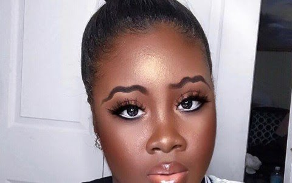

# Are Squiggly Brows the New Trend?

[Beauty](https://estheradeniyi.com/category/beauty/)
# Are Squiggly Brows the New Trend?

by [Esther Adeniyi](https://estheradeniyi.com/author/esther-adeniyi/)on [September 1, 2017May 25, 2018](https://estheradeniyi.com/are-squiggly-brows-new-trend/)[12 Comments on Are Squiggly Brows the New Trend?](https://estheradeniyi.com/are-squiggly-brows-new-trend/#comments)

Sharing is caring!

- [0](https://www.facebook.com/sharer/sharer.php?u=https%3A%2F%2Festheradeniyi.com%2Fare-squiggly-brows-new-trend%2F&amp;t=Are%20Squiggly%20Brows%20the%20New%20Trend%3F)
- [0](https://twitter.com/intent/tweet?text=Are%20Squiggly%20Brows%20the%20New%20Trend%3F&amp;url=https%3A%2F%2Festheradeniyi.com%2Fare-squiggly-brows-new-trend%2F)
- [0](#)

0shares

My people, my people. How is the holiday going? Okay, let&#x2019;s just dive in and not keep you waiting because I know that you have seen the title, and the photo. So&#x2026;. Now, you must have seen [sq](http://www.goodhousekeeping.com/beauty/news/a45876/squiggly-brows/)[uiggly brows](http://www.goodhousekeeping.com/beauty/news/a45876/squiggly-brows/) all over the Internet. I am guessing that you are not living in a hole. I hope to God that I am not wrong.

The question today isn&#x2019;t whether you are going to rock squiggly brows or not. It isn&#x2019;t whether you like it on other people or not. In fact, it isn&#x2019;t whether these tiny snakes on your face look appealing or not. This is the question for this week- are Squiggly brows the new trend? Do you think this will stay? This is just forecasting, fashion forcasting lol.

[How to pull off the all natural look](https://www.estheradeniyi.com/how-to-pull-off-all-natural-look?m=1)

I know how y&#x2019;all were about the inverted Nike brows o, ehn ehn. So another one has come, you people will say you are not doing. Next thing, we will see squiggly brows on your faces. Before we know it, you are already learning how to draw it on other girls o. ?.

Okay, so what do you think about this new trend? Here to stay or will soon disappear?

Sharing is caring!

- [0](https://www.facebook.com/sharer/sharer.php?u=https%3A%2F%2Festheradeniyi.com%2Fare-squiggly-brows-new-trend%2F&amp;t=Are%20Squiggly%20Brows%20the%20New%20Trend%3F)
- [0](https://twitter.com/intent/tweet?text=Are%20Squiggly%20Brows%20the%20New%20Trend%3F&amp;url=https%3A%2F%2Festheradeniyi.com%2Fare-squiggly-brows-new-trend%2F)
- [0](#)

0shares

Tags:[Question of the Week](https://estheradeniyi.com/tag/question-of-the-week/)