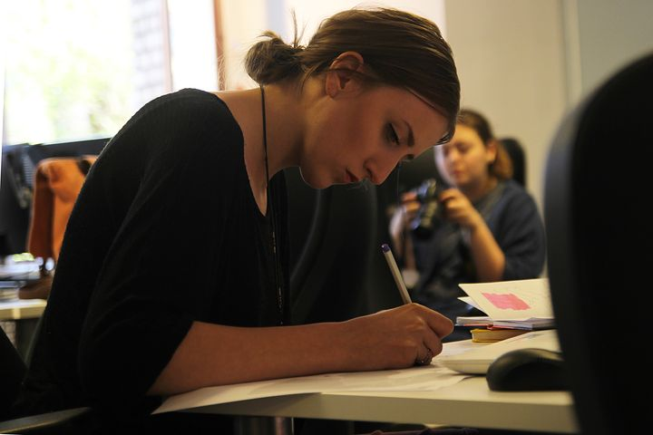

# Are you Currently Burned Out? Pause.

[Uncategorized](https://estheradeniyi.com/category/uncategorized/)
# Are you Currently Burned Out? Pause.

by [Esther Adeniyi](https://estheradeniyi.com/author/esther-adeniyi/)on [April 19, 2017April 27, 2018](https://estheradeniyi.com/are-you-currently-burned-out-pause/)[Leave a Comment on Are you Currently Burned Out? Pause.](https://estheradeniyi.com/are-you-currently-burned-out-pause/#respond)

Sharing is caring!

- [0](https://www.facebook.com/sharer/sharer.php?u=https%3A%2F%2Festheradeniyi.com%2Fare-you-currently-burned-out-pause%2F&amp;t=Are%20you%20Currently%20Burned%20Out%3F%20Pause.)
- [0](https://twitter.com/intent/tweet?text=Are%20you%20Currently%20Burned%20Out%3F%20Pause.&amp;url=https%3A%2F%2Festheradeniyi.com%2Fare-you-currently-burned-out-pause%2F)
- [0](#)

0shares

 You are going to be discouraged, several times. You will sigh and become bad tempered for some days. Yes, you will be frustrated. You will ask questions and wonder if moving on in that project, commitment, resolution is even worth it anymore. You will be exhausted and exasperated. I say this because you will.

There is always a point before the breaking point and that is the dusk before dawn. This is the period of despair just before you hit gold and guess what, this one will take you down to your lowest ebb. Understanding that the vibe with which you started out isn&#x2019;t going to be constant all through is preparing for the inevitable.

Never mind what&#x2019;s hitting or threatening to hit. Okay, mind a little bit because it will shake you up a little but here is what I promise, if you hold on just a little bit more, you will overcome this one. You might take a break, pause, reassess and do the necessary to stay off what you are pursuing for a while. This will give you time to reignite and resume powerfully. Don&#x2019;t continue blindly else you burn out.

[Then come back up](https://www.estheradeniyi.com/how-to-be-persistent-in-life-during)with all you&#x2019;ve got. Strategize and plan better this time. Delegate if you have to. Ask for help if you have to. Be back and better.

Are you currently burned out? Give this a little more time and you will be fine. I am not even trying to sound motivational.

Sharing is caring!

- [0](https://www.facebook.com/sharer/sharer.php?u=https%3A%2F%2Festheradeniyi.com%2Fare-you-currently-burned-out-pause%2F&amp;t=Are%20you%20Currently%20Burned%20Out%3F%20Pause.)
- [0](https://twitter.com/intent/tweet?text=Are%20you%20Currently%20Burned%20Out%3F%20Pause.&amp;url=https%3A%2F%2Festheradeniyi.com%2Fare-you-currently-burned-out-pause%2F)
- [0](#)

0shares

Tags:[Life](https://estheradeniyi.com/tag/life/)