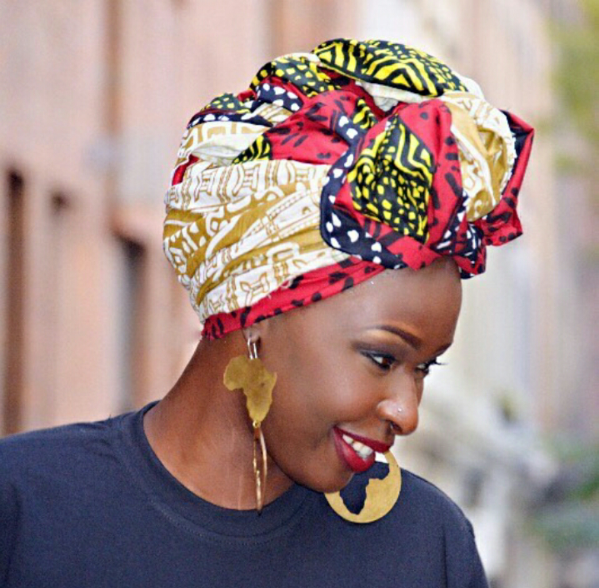
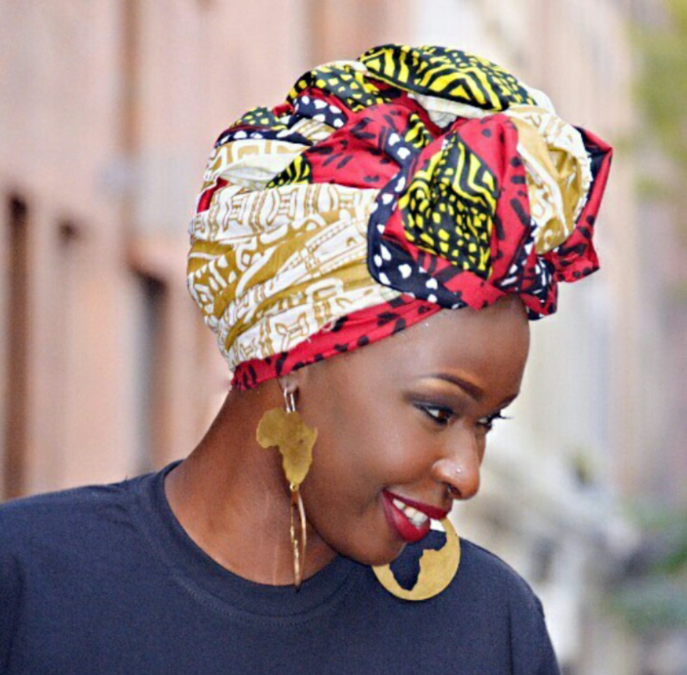

# …because we are good women, we will #BeBoldForChange

[Uncategorized](https://estheradeniyi.com/category/uncategorized/)
# &#x2026;because we are good women, we will #BeBoldForChange

by [Esther Adeniyi](https://estheradeniyi.com/author/esther-adeniyi/)on [March 9, 2017April 27, 2018](https://estheradeniyi.com/because-we-are-good-women-we-wi/)[4 Comments on &#x2026;because we are good women, we will #BeBoldForChange](https://estheradeniyi.com/because-we-are-good-women-we-wi/#comments)

Sharing is caring!

- [0](https://www.facebook.com/sharer/sharer.php?u=https%3A%2F%2Festheradeniyi.com%2Fbecause-we-are-good-women-we-wi%2F&amp;t=...because%20we%20are%20good%20women%2C%20we%20will%20%23BeBoldForChange)
- [0](https://twitter.com/intent/tweet?text=...because%20we%20are%20good%20women%2C%20we%20will%20%23BeBoldForChange&amp;url=https%3A%2F%2Festheradeniyi.com%2Fbecause-we-are-good-women-we-wi%2F)
- [0](#)

0shares

Photo via @adoch
 &#x2026; because we are deliberate women, we won&#x2019;t forget so easily what we learned all over Social media yesterday.

&#x2026;because we will #beboldforchange we will stop killing other women behind their backs, we will stop hating on another woman just because she is beautiful, smart or busy fulfilling purpose.

We will stop making other women&#x2019;s lives miserable because of our hormones.

We will uphold each other and tell the truth, no matter how hard to our faces.

We will support and hold each other during dry times.

We will not condemn, judge or look the other way when a weaker woman is in trouble.

We will not be quick to expose each other flaws because we understand that the combination of strengths and weaknesses is what makes each woman unique.

We will on our own strive for excellence and remember that we can be more, that we can do more, that it is never enough.

We will never be afraid to be first to break barriers.

We will not leave another woman in the middle of her journey because we are tired of her tears.

We will not pretend to be who we are not.

We will not write and tuck our goals under our pillows.

We will not give up on chasing our dreams because we found love.

We will be beautiful women inside and out.

We will be bold to stand up for righteousness and integrity.

We will support all the men in our lives because we are nurturers.

We will be positive about our abilities and capabilities.

We will be optimistic about our nations and not only hope but make it a better place for the tiny little ones that will come from in between our loins.

We will #BeBoldForChange

Sharing is caring!

- [0](https://www.facebook.com/sharer/sharer.php?u=https%3A%2F%2Festheradeniyi.com%2Fbecause-we-are-good-women-we-wi%2F&amp;t=...because%20we%20are%20good%20women%2C%20we%20will%20%23BeBoldForChange)
- [0](https://twitter.com/intent/tweet?text=...because%20we%20are%20good%20women%2C%20we%20will%20%23BeBoldForChange&amp;url=https%3A%2F%2Festheradeniyi.com%2Fbecause-we-are-good-women-we-wi%2F)
- [0](#)

0shares

Tags:[Celebrating Women](https://estheradeniyi.com/tag/celebrating-women/)