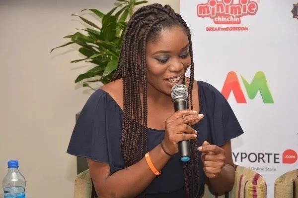

# Bella Naija Interviews first runner up BBNaija and ONE Ambassador, Bisola Aiyeola. Read….

[News](https://estheradeniyi.com/category/news/)
# Bella Naija Interviews first runner up BBNaija and ONE Ambassador, Bisola Aiyeola. Read&#x2026;.

by [Esther Adeniyi](https://estheradeniyi.com/author/esther-adeniyi/)on [October 11, 2017May 25, 2018](https://estheradeniyi.com/bella-naija-interviews-first-runner-up/)[Leave a Comment on Bella Naija Interviews first runner up BBNaija and ONE Ambassador, Bisola Aiyeola. Read&#x2026;.](https://estheradeniyi.com/bella-naija-interviews-first-runner-up/#respond)

Sharing is caring!

- [0](https://www.facebook.com/sharer/sharer.php?u=https%3A%2F%2Festheradeniyi.com%2Fbella-naija-interviews-first-runner-up%2F&amp;t=Bella%20Naija%20Interviews%20first%20runner%20up%20BBNaija%20and%20ONE%20Ambassador%2C%20Bisola%20Aiyeola.%20Read....)
- [0](https://twitter.com/intent/tweet?text=Bella%20Naija%20Interviews%20first%20runner%20up%20BBNaija%20and%20ONE%20Ambassador%2C%20Bisola%20Aiyeola.%20Read....&amp;url=https%3A%2F%2Festheradeniyi.com%2Fbella-naija-interviews-first-runner-up%2F)
- [0](#)

0shares

#### As we celebrate the [International Day of the Girl Child](http://www.unwomen.org/en/news/in-focus/girl-child) today, we are privileged to read the exclusive interview [Bella Naija](https://www.bellanaija.com/2017/10/bisola-aiyeola-bellanaija-one-ambassador/?utm_medium=push%20notification&amp;utm_source=website&amp;utm_campaign=push%20notification%20clciks&amp;utm_content=from%20push%20notification) had with Bisola Aiyeola. We get to love Bisola more after this interview. Read the interview below:

Bella Naija: We could not help but feel a swell of pride when we saw you
 in New York during 72nd Session of the UN General Assembly (UNGA 72) and then
 at the Bill and Melinda Gates Foundation Goalkeepers event where you spoke up
 for Girls Education.

Bisola: It was a very enlightening experience I must say. I got to
 listen to Barack Obama, Bill and Melinda Gates, PM Justin Trudeau and other
 individuals around the globe who are putting in lots of efforts to make the
 world a better place and I am happy that I am part of ONE.org and we are
 lending our voice to help educate all girls. With [ONE](https://www.one.org/africa/) #GirlsCount campaign that
 advocates for young girls getting a quality education, would you say your
 personal story is pushing you to do more?

Yes, my personal story is pushing me and also the fact that
 I have a daughter. By advocating for girl&#x2019;s education we are helping to raise a
 generation of people who know the importance of education and who will use
 education to empower themselves and their communities.

Bella Naija : Globally 130 million girls are out of school, with over 50
 million of them in Africa. ONE is launching a report on October 11
 (International Day of the Girl Child), which highlights the toughest countries
 for a girl to get an education and the huge barriers girls face to getting the
 education they deserve, especially in Africa. The issue of girls education is
 predominantly faced in Northern Nigeria. Why is this campaign very important to you and how can we
 also do better?

Bisola: Nine out of the ten worst countries are in Africa. Over 50
 million girls are out of school in Africa &#x2013; that&#x2019;s over 50 million potential
 engineers, entrepreneurs and politicians whose leadership the world is missing
 out on. It&#x2019;s a continental crisis that perpetuates poverty. ONE calls on
 African and world leaders to make a bold action to tackle the global education
 emergency.

It starts with committing to work towards delivering 20
 percent of national budgets to education. You too can get involved by showing
 your support by posting a video or a picture encouraging our leaders to invest
 in girls education.

Bella Naija : We know you were selected as ONE Ambassador during [BBNaija](http://bigbrothernaija.ng/).
 We will love to know more&#x2026;

Bisola : My primary role as ONE ambassador is to advocate for basic
 education for the girl child all the way up to secondary school. Every girl
 child globally should have at least primary school education rather than no
 education at all. In the BBNaija house, you bravely opened up about not
 graduating from university and being a single mum. That really endeared a lot
 of people to you and also inspired others. Seeing as the norm in Africa is to
 shy away from discussions like those, what inspired your candour?

[Related : An interview with CEO, Surprise Beauty Box](https://www.estheradeniyi.com/an-interview-with-zubda-khokhar-ceo-of)

Too many people are silent about issues like this because
 they have been mocked and shamed. I am proud to be a mother and times are
 changing. Silence has done more harm than good to a lot of people, so what
 inspired me to speak was my journey in life, my ups and my hope that my journey
 would encourage others.

What has been the biggest difference for you, in terms of
 your career, before and after BBNaija?

The growth. My career still requires a lot of hard work but
 I&#x2019;m in a good place. I work with an amazing management team, The Temple
 Company. I am able to help people more but some friends feel I don&#x2019;t have time
 for them anymore. I just try to make them understand that I&#x2019;m still trying to
 adjust my work and family to this new phase of my life and if they want to
 still be part of this journey they should come on board.

Bella Naija : Will your character, Didi in &#x201C;Skinny Girl in Transit&#x201D; get
 her own &#x201C;Mide&#x201D;?

Bisola : Lips sealed, you just have to watch this season unfold every
 Friday. I pray Didi gets her own Mide too. But anyway, we will see.

Bella Naija : Talking about romance, is dating easier or more difficult
 now that you are THE Bisola Aiyeola and is love a priority?

Bisola : About dating, it&#x2019;s like there&#x2019;s a thick cloak covering my
 dating sensors because there are no dates *laughs*. I don&#x2019;t know if it&#x2019;s easier
 or more difficult. I guess I&#x2019;ve just been more occupied with work. Love is not
 a priority. Work and family & my activism take priority.

We know you have a new single out now.

Music is definitely taking focus now because I never really
 put my all into it but now I have the Temple Company and Temple Music. I will
 roll out more music for sure.

[Related: Cisco empowers 4000 women](https://www.estheradeniyi.com/cisco-connected-women-ccw-cisco)

Bella Naija : Do you consider yourself a comedian? We miss your skits on
 Instagram! Bella Naija

Bisola : I haven&#x2019;t considered myself a comedian but people always
 call me that. I also miss those Instagram skits *laughs*. So I have a few that
 will be out soon. I&#x2019;m not giving up on those skits.

You have been on the grind in the entertainment industry for
 many years and now you are a star. Many people can relate to striving so hard
 to make it in their chosen professions or businesses and it seems like they
 can&#x2019;t &#x201C;catch a break&#x201D;. What advice do you have for them?

My advice will be &#x201C;don&#x2019;t stop&#x201D;. It&#x2019;s been a long tough
 journey for me and I am not even started yet. So what I&#x2019;ll tell anybody is
 consistency is your friend. Keep pushing, one day the breakthrough will come.

Bella Naija : What does the future hold for Bisola

&#xA0;

Bisola : With God on my side, with good health, long life, family and
 friends and a sound mind, I see greatness. More music, more movies and more
 giving back to society.

What do you think of this interview? Share your thoughts in the comments section.

Sharing is caring!

- [0](https://www.facebook.com/sharer/sharer.php?u=https%3A%2F%2Festheradeniyi.com%2Fbella-naija-interviews-first-runner-up%2F&amp;t=Bella%20Naija%20Interviews%20first%20runner%20up%20BBNaija%20and%20ONE%20Ambassador%2C%20Bisola%20Aiyeola.%20Read....)
- [0](https://twitter.com/intent/tweet?text=Bella%20Naija%20Interviews%20first%20runner%20up%20BBNaija%20and%20ONE%20Ambassador%2C%20Bisola%20Aiyeola.%20Read....&amp;url=https%3A%2F%2Festheradeniyi.com%2Fbella-naija-interviews-first-runner-up%2F)
- [0](#)

0shares

Tags:[BBNaija](https://estheradeniyi.com/tag/bbnaija/)[Bella Naija](https://estheradeniyi.com/tag/bella-naija/)[Bisola](https://estheradeniyi.com/tag/bisola/)[Interviews](https://estheradeniyi.com/tag/interviews/)[News](https://estheradeniyi.com/tag/news/)[ONE ambassador](https://estheradeniyi.com/tag/one-ambassador/)