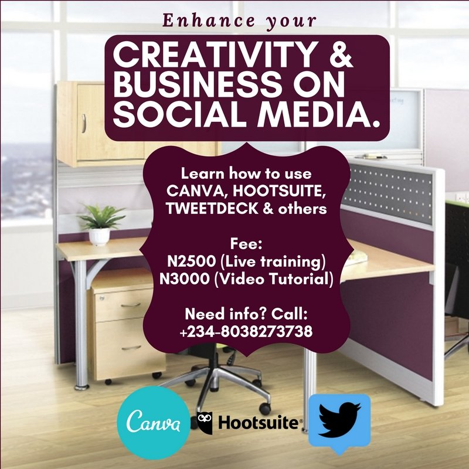

# Enhance and boost your brand’s social media presence now!

[Social Media](https://estheradeniyi.com/category/social-media/)
# Enhance and boost your brand&#x2019;s social media presence now!

by [Esther Adeniyi](https://estheradeniyi.com/author/esther-adeniyi/)on [March 15, 2018April 27, 2018](https://estheradeniyi.com/boost-social-media-marketing/)[Leave a Comment on Enhance and boost your brand&#x2019;s social media presence now!](https://estheradeniyi.com/boost-social-media-marketing/#respond)

Sharing is caring!

- [0](https://www.facebook.com/sharer/sharer.php?u=https%3A%2F%2Festheradeniyi.com%2Fboost-social-media-marketing%2F&amp;t=Enhance%20and%20boost%20your%20brand%27s%20social%20media%20presence%20now%21)
- [0](https://twitter.com/intent/tweet?text=Enhance%20and%20boost%20your%20brand%27s%20social%20media%20presence%20now%21&amp;url=https%3A%2F%2Festheradeniyi.com%2Fboost-social-media-marketing%2F)
- [0](#)

0shares

There is no gainsaying the fact that Social Media has become a viable and all important market place that you cannot ignore in this age.

There is a need for flexibility and inventiveness in the way businesses are promoted, which in turn affects how customers or potential customers respond. [Instagram](https://www.estheradeniyi.com/how-to-build-cohesive-instagram-feed-by), Facebook, Twitter, mention it, are fast becoming the platforms businesses would rather push their brands on.

To make this happen, you need some social marketing tools to help you achieve your objectives. And interestingly, some of these tools are easy to use, and very affordable, especially for small businesses looking to grow.

Here&#x2019;s a list of 5 of the most important social media marketing tools.

Contents

- [1 1. Buffer/Hootsuite](#1_BufferHootsuite)
- [2 2. Social Clout](#2_Social_Clout)
- [3 3. Tweetdeck](#3_Tweetdeck)
- [4 4. Crowdfire](#4_Crowdfire)
- [5 5. Canva](#5_Canva)

## 1. Buffer/Hootsuite

They are two different apps, but perform the same function of helping you schedule your social media content ahead, and save you time to face other things. With Buffer and Hootsuite, you can schedule messages to all the major social media sites from one dashboard and even track them. Good thing is that they both have free versions every small business can use.

## 2. Social Clout

This is a social media analytics tool you can use for tracking engagement and calculate social media ROI (Returns on Investment). Social Clout shows you which demographics have the best [social engagement](https://www.estheradeniyi.com/drive-engagement-on-instagram) and which platforms convert the best, at what times, among many other things. It&#x2019;s a tool that will help guide what kind of content to post to achieve best results. It has a free and paid version, but is generally affordable for small businesses.

## 3. Tweetdeck

Tweetdeck is an all important tool for you if your business is on twitter, or you use twitter for social media monitoring to understand what&#x2019;s trending and which conversations are building up. Tweetdeck helps you manage every aspect of twitter from one dashboard. You can see your timeline, mentions, notifications, messages, trends, and hashtag tracking in one view! And guess what? It&#x2019;s totally free!

## 4. Crowdfire

This is like a capable marketing assistant which tries to understand your social media goals and recommends things you can do to reach your goals (such as grow a following, drive traffic to your blog, or sell your products).

You can also schedule posts and set up automations for your social media accounts. Crowdfire provides a personalized service depending on your goals. For example, if you connect your business store and add a new product to your store, Crowdfire will create and suggest a social media post about the product for you to share. The sweet thing about this tool is that it is totally FREE!

## 5. Canva

Canva is a VERY important tool for you if you do not have the money to engage graphics designers for your business online. With this tool, you can create your own designs without necessarily needing to be a design expert. I use this tool to design all my blog materials on [www.glowville.net](http://www.glowville.net/). With this tool, creating images is so easy even a total newbie could do it. Using its multiple templates, fonts and colors, all you need to do is drag image elements around and drop them into place.

If you can learn to use this tool, you&#x2019;d be saving yourself a lot of stress and money.

To help those who are interested in learning how to EFFECTIVELY use these tools, there is a training I have put together. The training is to teach you how to use social media tools like Hootsuite, Canva, Tweetdeck and others to manage your online business.

The [Social Media](https://www.estheradeniyi.com/top-social-media-apps-in-nigeria) Tools training is scheduled for Saturday March 31, 2018 for those attending from Lagos.

Venue: Realty Place &#x2013; 3, Olaide Benson Street, (Opposite Deeper Life Church), Onigbongbo, Maryland, Lagos.

The Live Training is N2500.

But those outside Lagos will get a tutorial video which costs N3000. If you attend the live training and also want the video, you&#x2019;d pay N3500.

To register, please pay to:

0037277885 (GTB)
 Odeyemi Olumide Lawrence.

Sharing is caring!

- [0](https://www.facebook.com/sharer/sharer.php?u=https%3A%2F%2Festheradeniyi.com%2Fboost-social-media-marketing%2F&amp;t=Enhance%20and%20boost%20your%20brand%27s%20social%20media%20presence%20now%21)
- [0](https://twitter.com/intent/tweet?text=Enhance%20and%20boost%20your%20brand%27s%20social%20media%20presence%20now%21&amp;url=https%3A%2F%2Festheradeniyi.com%2Fboost-social-media-marketing%2F)
- [0](#)

0shares

Tags:[social media](https://estheradeniyi.com/tag/social-media/)[sponsored posts](https://estheradeniyi.com/tag/sponsored-posts/)