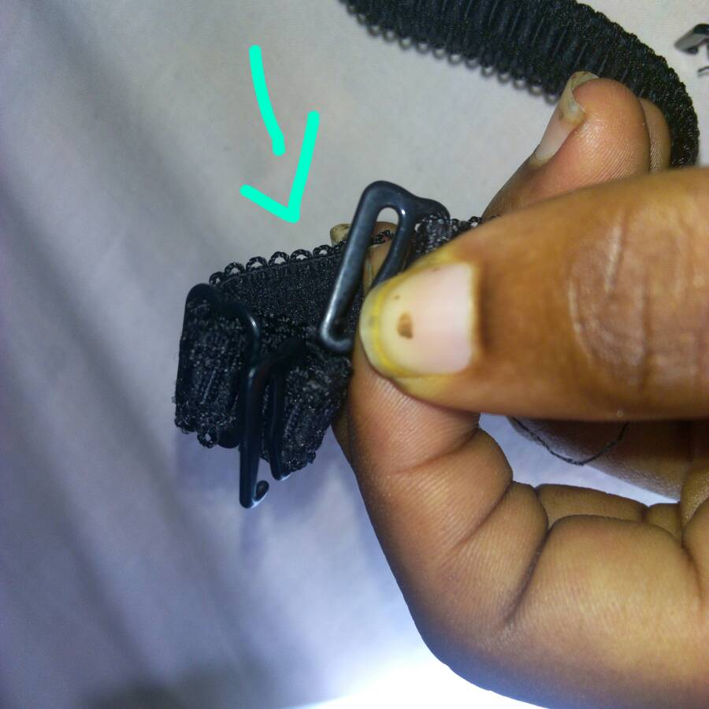

# Bra strap hack : hold your Natural Hair firm

[Uncategorized](https://estheradeniyi.com/category/uncategorized/)
# Bra strap hack : hold your Natural Hair firm

by [Esther Adeniyi](https://estheradeniyi.com/author/esther-adeniyi/)on [May 31, 2017April 27, 2018](https://estheradeniyi.com/bra-strap-hack-hold-your-natural-hair/)[2 Comments on Bra strap hack : hold your Natural Hair firm](https://estheradeniyi.com/bra-strap-hack-hold-your-natural-hair/#comments)

Sharing is caring!

- [0](https://www.facebook.com/sharer/sharer.php?u=https%3A%2F%2Festheradeniyi.com%2Fbra-strap-hack-hold-your-natural-hair%2F&amp;t=Bra%20strap%20hack%20%3A%20hold%20your%20Natural%20Hair%20firm)
- [0](https://twitter.com/intent/tweet?text=Bra%20strap%20hack%20%3A%20hold%20your%20Natural%20Hair%20firm&amp;url=https%3A%2F%2Festheradeniyi.com%2Fbra-strap-hack-hold-your-natural-hair%2F)
- [0](#)

0shares

 Good morning lovely Naturalistas. Happy holidays. OK just one day holiday?

I find it super amazing that wearing my natural hair in a bun, pineapple, side bun and so on has been a way to get off the salon for weeks where schedules are choking.

I used elastic band (rubber band) in holding my hair before now, you know, just expand and roll in. It holds well until the bands &#x201C;suck&#x201D; oil from my hair and it snaps?. I&#x2019;m not a scarf person with my natural hair, it wasn&#x2019;t an option, till I stumbled on the bra strap hack and boom?

So, this is it. Bra straps come in varying sizes (talking about width), from the tiniest being 0.25inch (the type in breast tubes) and well, the biggest I have seen is about 2 inches.

The way you like it is strictly your choice and you can also have them bejeweled. I usually do the 0.25 to half an inch. They can be as long as 15 inches.

You can use this strap in two ways.

 1. &#xA0;By joining both side of the hook together. I.e. you tuck the hook at both ends and voil&#xE0;, you have your hair band

2.

This is for those with small head circumference or a slacked strap. Move the control of the strap backwards till you reach your desired width. (As you adjust the strap, it doubles, thereby creating a double strap held in place by the hook). Clip the hook on the single strap to the body of the packer to the left, move the straying hook to the meeting point and hook it down too. Dazall.

Holds hair all day long.

Give a try and let us see.

P.S- Have you subscribed to this blog yet? Please check below (mobile) or the side bar (desktop) to subscribe to weekly newsletters. Thank you for being a part of this web space.

Sharing is caring!

- [0](https://www.facebook.com/sharer/sharer.php?u=https%3A%2F%2Festheradeniyi.com%2Fbra-strap-hack-hold-your-natural-hair%2F&amp;t=Bra%20strap%20hack%20%3A%20hold%20your%20Natural%20Hair%20firm)
- [0](https://twitter.com/intent/tweet?text=Bra%20strap%20hack%20%3A%20hold%20your%20Natural%20Hair%20firm&amp;url=https%3A%2F%2Festheradeniyi.com%2Fbra-strap-hack-hold-your-natural-hair%2F)
- [0](#)

0shares

Tags:[Natural Hair](https://estheradeniyi.com/tag/natural-hair/)