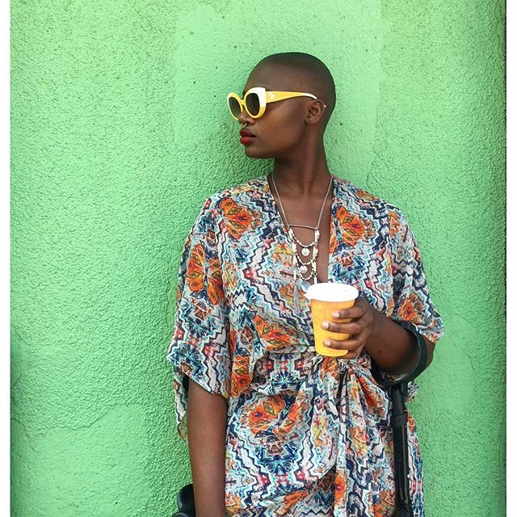
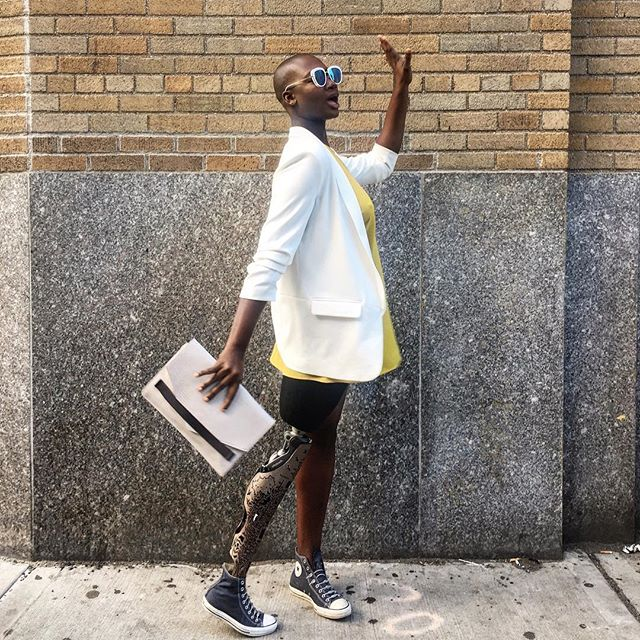
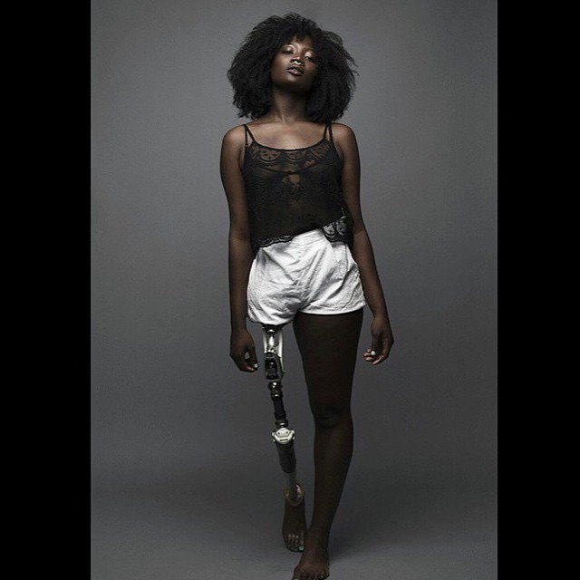
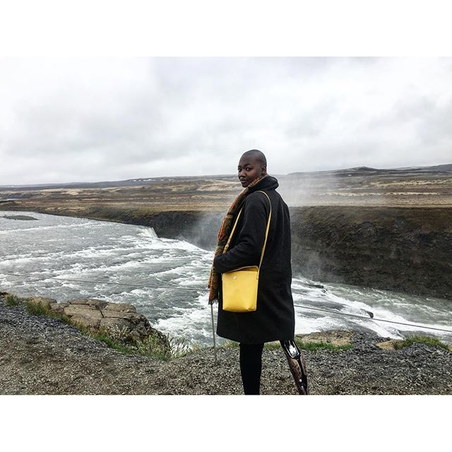

# Celebrating Cacsmy Brutus a.k.a Mama Cax

[Uncategorized](https://estheradeniyi.com/category/uncategorized/)
# Celebrating Cacsmy Brutus a.k.a Mama Cax

by [Esther Adeniyi](https://estheradeniyi.com/author/esther-adeniyi/)on [June 15, 2016April 27, 2018](https://estheradeniyi.com/celebrating-cacsmy-brutus/)[1 Comment on Celebrating Cacsmy Brutus a.k.a Mama Cax](https://estheradeniyi.com/celebrating-cacsmy-brutus/#comments)

Sharing is caring!

- [0](https://www.facebook.com/sharer/sharer.php?u=https%3A%2F%2Festheradeniyi.com%2Fcelebrating-cacsmy-brutus%2F&amp;t=Celebrating%20Cacsmy%20Brutus%20a.k.a%20Mama%20Cax)
- [0](https://twitter.com/intent/tweet?text=Celebrating%20Cacsmy%20Brutus%20a.k.a%20Mama%20Cax&amp;url=https%3A%2F%2Festheradeniyi.com%2Fcelebrating-cacsmy-brutus%2F)
- [0](#)

0shares

 This week on [Celebrating Women](https://www.estheradeniyi.com/search/label/Celebrating%20Women?max-results=6&amp;m=1), it will be more of something unusual. You will get a good glimpse as you read along. Ok, my mind is racing fast now. Let me calm down&#x2026;&#x2026;&#x2026;still calming down.

 Alright, let&#x2019;s journey together.

 I stumbled on this Haitian-born lady some weeks back and for a moment, I saw life through another person&#x2019;s eyes. No, I didn&#x2019;t feel sad. I saw strength, forte and enduringness. I have read and heard the rise-above-challenges line. This is as close as it can be.
Source: mamacax.com
 Cacsmy Brutus was diagnosed with lung and bone cancer &#x2013; Osteosacroma, at age 14 and was given just 3 weeks to live. Guess what? She is 26 years old now.&#xA0;

 While every challenge comes with a price, she wasn&#x2019;t any different. After pulling through cancer, she had to pay with her right leg. She walks with a prosthetic leg after the right leg amputation. A huge price to pay, especially for a lady.

 During her interview with [The Huffington Post](http://www.huffpost.com/), she narrated how her parents always told her she was beautiful. But as a teenager, she was faced with so many unfriendly gags from her peers. She was made fun of because of her leg and also due to the fact that she matured late, she was tagged &#x201C;the girl with the flat chest&#x201D;. Now, that is a sword across the heart.

 Despite having days where she feels the world is on top of her, she reversely gets to feel pretty and confident about herself once again. She learned to surround herself with people who make her feel appreciated and loved.

 Caxmee shares her fashion and world traveling on her[blog](http://mamacax.com/)&#xA0;and also works an ambassador for [Alleles Design Studio](http://www.alleles.ca/). Alleles makes fashion-forward prosthetic leg covers for men and women.

 There is nothing more enjoyable than being true to oneself every moment of the time. Like the [Chinese saying](https://www.estheradeniyi.com/what-chinese-dont-eat-by-xinran) that goes; &#x201C;Blessed are those who laugh at themselves, they shall forever be entertained.&#x201D;

 Aside laughing at oneself, loving oneself goes a long way in calming those negative nerves and ensuring that one truly appreciates himself or herself in ways no one else would.

 Caxmee had this to say:

 &#x201C;I haven&#x2019;t been too content about the nainstream imagery of beauty. I&#x2019;ve made it my personal mission to infiltrate the &#x2018;beauty industry&#x2019; &#x2013; walking down the street with crutches and a prosthetic leg, people often shout &#x201C;you go girl! You are still beautiful&#x201D; STILL? [I am beautiful](https://www.estheradeniyi.com/how-to-be-big-bold-and-beautiful) and I&#x2019;m here to show you how beautiful I am inside and out.&#x201D;

 Three words that describe her personal style are: Unpredictable, Afrocentric and Timeless.

 It is not too late to make a mark.
Related post : celebrating [Ibukun Awosika](https://www.estheradeniyi.com/celebrating-ibukun-awosika?m=1)

Sharing is caring!

- [0](https://www.facebook.com/sharer/sharer.php?u=https%3A%2F%2Festheradeniyi.com%2Fcelebrating-cacsmy-brutus%2F&amp;t=Celebrating%20Cacsmy%20Brutus%20a.k.a%20Mama%20Cax)
- [0](https://twitter.com/intent/tweet?text=Celebrating%20Cacsmy%20Brutus%20a.k.a%20Mama%20Cax&amp;url=https%3A%2F%2Festheradeniyi.com%2Fcelebrating-cacsmy-brutus%2F)
- [0](#)

0shares

Tags:[Celebrating Women](https://estheradeniyi.com/tag/celebrating-women/)