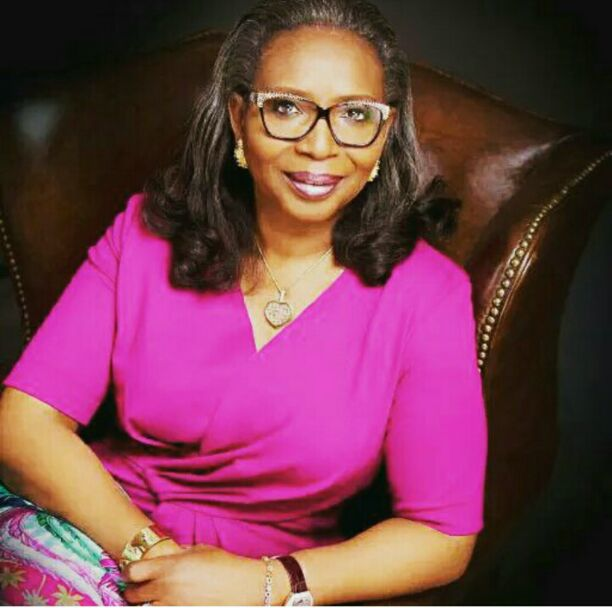
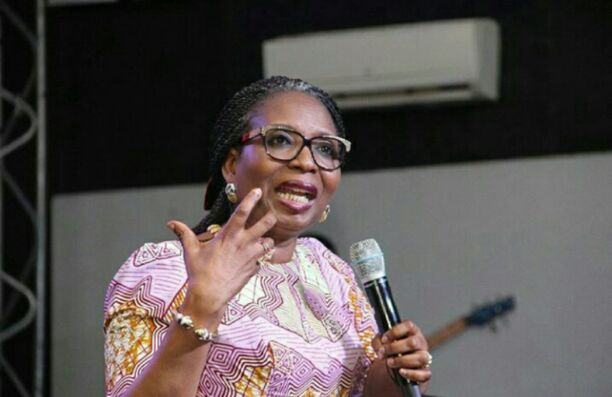

# Celebrating Ibukun Awosika

[Celebrating Women](https://estheradeniyi.com/category/celebrating-women/)
# Celebrating Ibukun Awosika

by [Esther Adeniyi](https://estheradeniyi.com/author/esther-adeniyi/)on [August 10, 2016May 25, 2018](https://estheradeniyi.com/celebrating-ibukun-awosika/)[Leave a Comment on Celebrating Ibukun Awosika](https://estheradeniyi.com/celebrating-ibukun-awosika/#respond)

Sharing is caring!

- [0](https://www.facebook.com/sharer/sharer.php?u=https%3A%2F%2Festheradeniyi.com%2Fcelebrating-ibukun-awosika%2F&amp;t=Celebrating%20Ibukun%20Awosika)
- [0](https://twitter.com/intent/tweet?text=Celebrating%20Ibukun%20Awosika&amp;url=https%3A%2F%2Festheradeniyi.com%2Fcelebrating-ibukun-awosika%2F)
- [0](#)

0shares

&#xA0;

Contents

- [1 Ibukun Awosika](#Ibukun_Awosika)
- [2 Ibukun Awosika biography](#Ibukun_Awosika_biography)
- [3 Ibukun Awosika&#x2019;s Career](#Ibukun_Awosika8217s_Career)

## Ibukun Awosika

From the heart of the ancient city of Ibadan, Oyo state,
 Nigeria, she grew up through the busy life of the Ibadan City. A business
 magnate, an author and a motivational speaker. She is one of the [leading women](https://www.estheradeniyi.com/happy-international-womens-day)
 in Nigeria business-wise.

Today we celebrate a gem, a woman who has defied all odds to
 become who she is today and in fact, respected among men. More often than not, some
 positions and class are seen as only for men. However, the current trend of
[gender equality](https://www.estheradeniyi.com/because-we-are-good-women-we-will) has paved way for few people, one of which she is.
## Ibukun Awosika biography

&#xA0;

Born Bilikisu Abiodun Omobolanle, Ibukun Awosika on December 24, 1962.

[She attended Methodist Girls&#x2019; High School](http://mghsyabalagosng.com/) and the University of Ife, Osun State Nigeria, where she studied
 Chemistry. She holds postgraduate and MBA Certificates from the Lagos Business
 School and IESE Business School.

She worked as an audit trainee during her one-year National
 Youth Service Corps. In her pursuance for independence, Ibukun established a
 furniture manufacturing company in 1989 known as Quebees Limited and SOKOA
 Chair Centre upon a venture meager with SOKOA S.A and Guaranty Trust Bank in
 2004.

&#xA0;

Ibukun is member of the Nigerian Economic Summit Group,
 member of the board of Nigerian Sovereign Wealth Fund, fellow of the African
 Leadership Initiative and Aspen Global Leadership Network and Board of Trustees
 of Women in Management, Business and Public Service.

As a passion driven person and her love for the Nigerian Youth,
 Ibukun co-founded the Afterschool Graduate Development Centre to tackle
 unemployment rate in Nigeria.

During her interview with Punch Newspapers earlier in the
 year, she had this to say;

&#x201C;[Seeing my drive as a young entrepreneur](https://www.estheradeniyi.com/dear-entrepreneur-know-these-50-things), my father used to
 say , &#x2018;I have given birth to this one&#x2019;, and if anything happened , he was
 always present to assist me even if it means selling his house to pay up any
 debts I may have incurred along the way. He never discouraged me.&#x201D;

As an advice to [business](https://www.estheradeniyi.com/15-essential-appstools-for-small) owners, she said; &#x201C;You must
 understand that you are not indispensable to your business because you are not
 God. You are not the most important person in your business, the guys who work
 for you are just as important as well. You must learn to respect them and the
 value they bring into your business. You can&#x2019;t pay them peanuts and pay
 yourself all the money.&#x201D;
## Ibukun Awosika&#x2019;s Career

Ibukun Awosika; wife and mother of three, who has indeed
 built a legacy in her business, is currently the Chairman of First Bank Nigeria
 Plc. Having bagged different awards both locally and internationally, she is
 the first Nigerian recipient of the [International Women Entrepreneurial](https://www.estheradeniyi.com/nnew-nigerian-women-entrepreneurship)
 Challenge Award as a nominee of the United States Department of State.

ibukunawosika.orgRelated : [Top women quotes to inspire you](https://www.estheradeniyi.com/top-25-best-women-quotes-to-inspire-you?m=1)

Sharing is caring!

- [0](https://www.facebook.com/sharer/sharer.php?u=https%3A%2F%2Festheradeniyi.com%2Fcelebrating-ibukun-awosika%2F&amp;t=Celebrating%20Ibukun%20Awosika)
- [0](https://twitter.com/intent/tweet?text=Celebrating%20Ibukun%20Awosika&amp;url=https%3A%2F%2Festheradeniyi.com%2Fcelebrating-ibukun-awosika%2F)
- [0](#)

0shares

Tags:[Celebrating Women](https://estheradeniyi.com/tag/celebrating-women/)[Ibukun Awosika](https://estheradeniyi.com/tag/ibukun-awosika/)