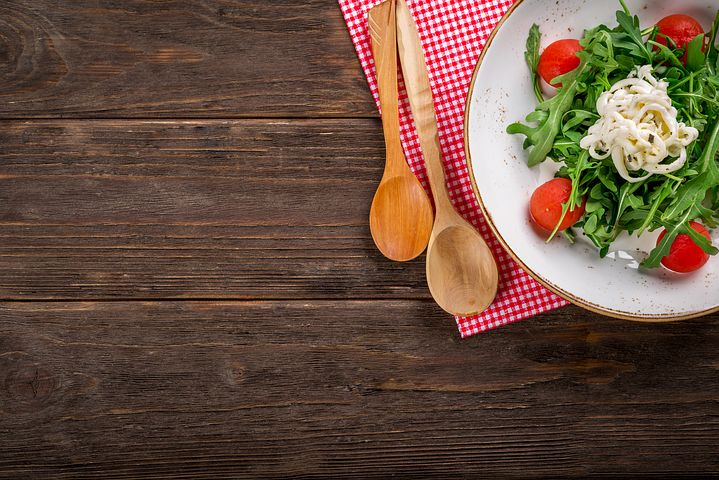

# Cheap Options for When You Have No Time to Cook

[Career](https://estheradeniyi.com/category/career/)
# Cheap Options for When You Have No Time to Cook

by [Esther Adeniyi](https://estheradeniyi.com/author/esther-adeniyi/)on [December 12, 2017April 27, 2018](https://estheradeniyi.com/cheap-options-for-when-you-have-no-time/)[4 Comments on Cheap Options for When You Have No Time to Cook](https://estheradeniyi.com/cheap-options-for-when-you-have-no-time/#comments)

Sharing is caring!

- [0](https://www.facebook.com/sharer/sharer.php?u=https%3A%2F%2Festheradeniyi.com%2Fcheap-options-for-when-you-have-no-time%2F&amp;t=Cheap%20Options%20for%20When%20You%20Have%20No%20Time%20to%20Cook)
- [0](https://twitter.com/intent/tweet?text=Cheap%20Options%20for%20When%20You%20Have%20No%20Time%20to%20Cook&amp;url=https%3A%2F%2Festheradeniyi.com%2Fcheap-options-for-when-you-have-no-time%2F)
- [1](#)

1shares

So, I remember when I was at the steady 9-5 job and I was practically left with no time for myself. I remember always having to leave by 5 on the dot because I had to quickly plan my evening for [Blogging](https://www.estheradeniyi.com/how-to-make-people-fall-hopelessly-in), my clients and social media scheduling. I used to be very harassed. It didn&#x2019;t matter that I used to get to work by 7 sometimes. That I was leaving by 5pm on the dot used to get my colleagues wondering what the heck I was going to do at home.

I had to sneak in time to eat and look after myself. Weekends weren&#x2019;t any better at all. I would be traveling back to Ogun state for the commitments I have in there. Compensation however was that I was at ease when it came to meals on weekends because I was always at home with my parents.

[Balancing my full time job with my side hustle](https://www.estheradeniyi.com/17-tips-to-help-you-balance-your-full) was so much of hard work. I practically had to fight to find the time to cook. I am not in the steady 9-5 job anymore, yet, I find myself busier than when I was in there. I am going to give you a full gist of the switch in a blog post soon, very soon. I know y&#x2019;all been asking and all but I need time to sort some things out first and then I come to talk about this. I will also talk about what I had to sort out.

I want to quickly sneak in a thank you here&#x2026;. Thank you for reading my blog. My posts travel so far these days and it&#x2019;s because of you. Thank you, thank you, thank yoooooooou.

Cooking is openly not one of my favorite things to do, everyone knows that. Adding this to lack of time is feeding disaster. I want to share with you cheap options to go for if you have no time to cook for yourself.

Contents

- [1 Batch cook ahead](#Batch_cook_ahead)
- [2 Stock on more dried food items](#Stock_on_more_dried_food_items)
- [3 Go on intermittent fasting](#Go_on_intermittent_fasting)
- [4 Opt for healthy fast meals](#Opt_for_healthy_fast_meals)
- [5 Invest in a pressure cooker](#Invest_in_a_pressure_cooker)
- [6 Do buka](#Do_buka)

#### Batch cook ahead

Many busy career women don&#x2019;t even need to be told, they practically survive on batch cooking. This is something you should consider if you find yourself in this position. Thankfully, batch cooking is very cost effective. You buy your groceries in bulk and never have to waste any if you properly plan your meals. This is where you need a deep freezer! Hopefully, you have steady electricity or a good generator.

#### Stock on more dried food items

Dried pepper, dried crayfish, stock fish, dried locust beans, [powdered beans](https://www.estheradeniyi.com/beans-powder-3-things-you-can-do-with-it) etc. These can help you quickly whip up something to eat. Don&#x2019;t worry about the thought of concoction. It can be as delicious and nutritious as you want it to be. This all depends on how innovative and cooking clever you are.

#### Go on intermittent fasting

Someone is going to shoot me on this blog post. Some folks just hate to hear &#x2018;fa&#x2026;&#x2019; I get. You know, intermittent fasting not only helps you plan lesser meals but is also healthy. This will double as a weight loss strategy if you are planning to lose weight. In fact, some nutritionists swear on intermittent fasting as one of the most effective ways to lose [weight and especially that stubborn belly fat.](https://www.estheradeniyi.com/sallys-weight-loss-and-tummy-flattening?m=1) I would have loved to really explain intermittent fasting and how I do mine but really, it will make this blog post too long. I will add a link for you to check out below. If you however still want me to talk about intermittent fasting, just indicate in the comments section.

[The beginner&#x2019;s guide to intermittent fasting](https://jamesclear.com/the-beginners-guide-to-intermittent-fasting)

#### Opt for healthy fast meals

It is at this point I will advise that you stock up on oatmeal, noodles, eggs, beverages, golden morn, cornflakes etc&#x2026;

If you get to discover other faster food options, invest in them so that you are not left incredibly hungry on evenings when you can&#x2019;t even bring yourself to think about food.

You may like my blog post on [how to eat healthy consistently](https://www.estheradeniyi.com/eat-healthy-consistently)

#### Invest in a pressure cooker

Well, you can go for this if you have to cook large quantity of meals. Family cooking definitely requires some pressure cooker. I don&#x2019;t even know how a &#x2018;fast&#x2019; family can survive cooking beans for example without a pressure cooker. That &#x2018;machine&#x2019; is such a life saver.

#### Do buka

Ehn nau, ah. Just do buka biko. Omg, see how I became razz at this point. Nor vex abeg. See ehn, there used to be a buka then that had good meals at 150 to 200 &#xA0;Naira. I would go there during my break at work. In fact, I did breakfast there sometimes.

You may argue that I am a lady and I therefore don&#x2019;t have to eat too much and all of that stuff but really&#x2026;with 300-400 Naira thereabout, you will have satisfying meals. I also know that cheap is relative. 1000 Naira might be cheap enough for you. Just look well, form bond with the gateman, company drivers or your house cleaners. If buka is an option, these people know where to look.

I will keep on updating this post when I discover other options or get leads to brands that provide cheap and easy options for people who don&#x2019;t have time to cook.

Till then, have a fabulous week. I love you gaaaaaaaan.

Sharing is caring!

- [0](https://www.facebook.com/sharer/sharer.php?u=https%3A%2F%2Festheradeniyi.com%2Fcheap-options-for-when-you-have-no-time%2F&amp;t=Cheap%20Options%20for%20When%20You%20Have%20No%20Time%20to%20Cook)
- [0](https://twitter.com/intent/tweet?text=Cheap%20Options%20for%20When%20You%20Have%20No%20Time%20to%20Cook&amp;url=https%3A%2F%2Festheradeniyi.com%2Fcheap-options-for-when-you-have-no-time%2F)
- [1](#)

1shares

Tags:[career](https://estheradeniyi.com/tag/career/)[Food](https://estheradeniyi.com/tag/food/)