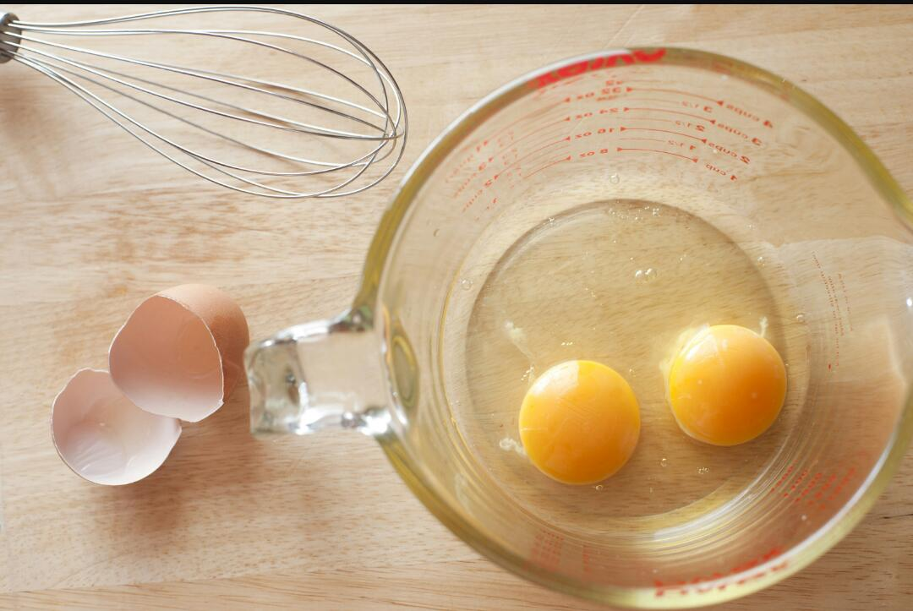
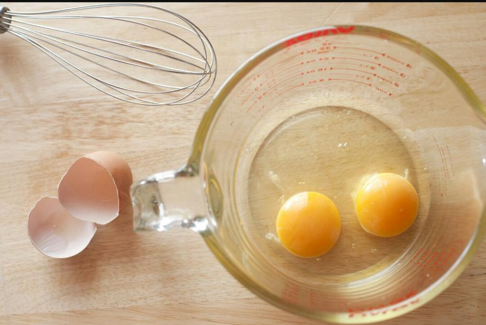

# Clearing Acne In 5 Days With Easy DIY Mask

[Uncategorized](https://estheradeniyi.com/category/uncategorized/)
# Clearing Acne In 5 Days With Easy DIY Mask

by [Esther Adeniyi](https://estheradeniyi.com/author/esther-adeniyi/)on [June 6, 2017April 27, 2018](https://estheradeniyi.com/clearing-acne-in-5-days-with-easy-diy/)[5 Comments on Clearing Acne In 5 Days With Easy DIY Mask](https://estheradeniyi.com/clearing-acne-in-5-days-with-easy-diy/#comments)

Sharing is caring!

- [0](https://www.facebook.com/sharer/sharer.php?u=https%3A%2F%2Festheradeniyi.com%2Fclearing-acne-in-5-days-with-easy-diy%2F&amp;t=Clearing%20Acne%20In%205%20Days%20With%20Easy%20DIY%20Mask)
- [0](https://twitter.com/intent/tweet?text=Clearing%20Acne%20In%205%20Days%20With%20Easy%20DIY%20Mask&amp;url=https%3A%2F%2Festheradeniyi.com%2Fclearing-acne-in-5-days-with-easy-diy%2F)
- [0](#)

0shares

 The struggle to look good and maintain a smooth face for those with naturally problematic face is hard. ?

Looking at my face in the mirror was a sad thing, selfies were a no?, it was a battle with numerous products that seem to compound my problem. Every soap was a hit, back to back, still acne no go, DIY mask ti take over. ?

 That said, I stumbled on a post via Facebook where a friend talked about her husband&#x2019;s face being problematic and all. It took them my kitchen recipes to mix in the mask and that was all. I was quite surprised. I didn&#x2019;t want to try it too because I was tired of using my face as a laboratory rat.

Well, it was a mixture of egg white, cinnamon powder and honey. That&#x2019;s all it takes.

&#xA0;Beat &#xBD; tablespoon of cinnamon into one egg white and a tablespoon of honey.
 Apply the mask on the face for 15mins morning and night, then wash off.
 The result is almost instant, in the sense that it opens up pores, dries up acne and regulates blood and oxygen flow on the face.

Naturally my face is an oil well, it helped in controlling my oils too, and my spots are greatly reduced.

I used this just for 5 days and I had results.

So, what do you think? You wanna try sometime? Please share your testimonials with us.

P.S- Have you subscribed to this blog yet? Please check below (mobile) or the side bar (desktop) to subscribe to weekly newsletters. Thank you for being a part of this web space.

Sharing is caring!

- [0](https://www.facebook.com/sharer/sharer.php?u=https%3A%2F%2Festheradeniyi.com%2Fclearing-acne-in-5-days-with-easy-diy%2F&amp;t=Clearing%20Acne%20In%205%20Days%20With%20Easy%20DIY%20Mask)
- [0](https://twitter.com/intent/tweet?text=Clearing%20Acne%20In%205%20Days%20With%20Easy%20DIY%20Mask&amp;url=https%3A%2F%2Festheradeniyi.com%2Fclearing-acne-in-5-days-with-easy-diy%2F)
- [0](#)

0shares

Tags:[Beauty](https://estheradeniyi.com/tag/beauty/)[DIY](https://estheradeniyi.com/tag/diy/)