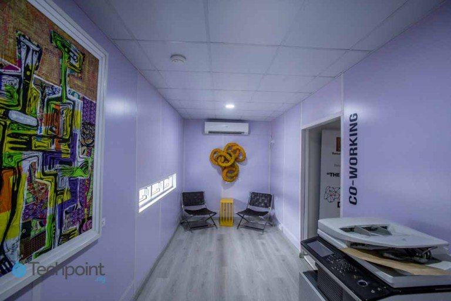
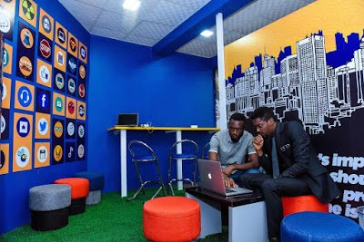
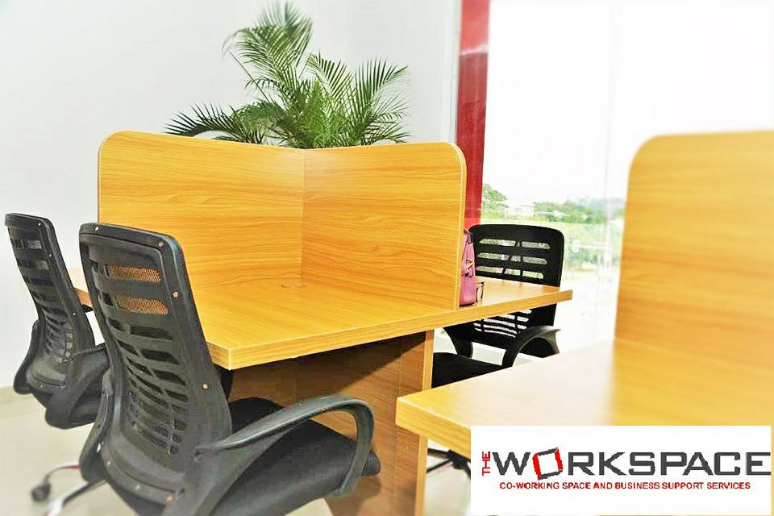

# Co-working spaces for Bloggers in Lagos and Abuja

[Career](https://estheradeniyi.com/category/career/)[Uncategorized](https://estheradeniyi.com/category/uncategorized/)
# Co-working spaces for Bloggers in Lagos and Abuja

by [Esther Adeniyi](https://estheradeniyi.com/author/esther-adeniyi/)on [March 24, 2018April 27, 2018](https://estheradeniyi.com/co-working-spaces-in-lagos-and-abuja/)[6 Comments on Co-working spaces for Bloggers in Lagos and Abuja](https://estheradeniyi.com/co-working-spaces-in-lagos-and-abuja/#comments)

Sharing is caring!

- [0](https://www.facebook.com/sharer/sharer.php?u=https%3A%2F%2Festheradeniyi.com%2Fco-working-spaces-in-lagos-and-abuja%2F&amp;t=Co-working%20spaces%20for%20Bloggers%20in%20Lagos%20and%20Abuja)
- [0](https://twitter.com/intent/tweet?text=Co-working%20spaces%20for%20Bloggers%20in%20Lagos%20and%20Abuja&amp;url=https%3A%2F%2Festheradeniyi.com%2Fco-working-spaces-in-lagos-and-abuja%2F)
- [0](#)

0shares

In the short period of time I did [full-time blogging](https://www.estheradeniyi.com/search/label/Blogging?max-results=6&amp;m=1), one very major challenge I faced was a functional workspace. I had no single idea that there were co-working spaces in Lagos and some other parts of Nigeria, namely, Abuja,&#xA0; majorly.

I had to suffer data issues, I spent so much money to subscribe to a data plan on MTN, electricity was flunctuating far too rapidly. I spent some days looking for where to plug in my system for work, the discomfort.As if to get me to the highest form of frustration (I was on borderline), my laptop decided to pack up. I tried all I could to manage it but it wasn&#x2019;t just going to work for me. All forces joined together to reduce my productivity. [I was finding it difficult to be efficient](https://www.estheradeniyi.com/how-to-be-efficient-at-work).

Another challenge I had was having a defined work space. I needed a comfortable table and a chair and an actual workspace. Working on my bed served it until I began to have back issues. I don&#x2019;t have a strong back, by the way.

Shortly before I went back into 9-5, I discovered [cchub](https://cchubnigeria.com/) but it was too late. I was going back in to gather some more momentum, save some more money and prepare for a more strategic transition.

A friend of mine had also called within that period to ask of how we could make this work. He was also in search of a co-working space in Lagos. He is from out of Nigeria and he was apparently surprised that there were no coffee shops or spaces where you could just work.

I have decided to compile a list of some co-working spaces in Lagos and Abuja for Bloggers who can&#x2019;t (obviously) afford to get an office space or [create an office at home](https://www.estheradeniyi.com/run-successful-home-office). You can check them out online or go sample their locations. If you are living in other areas of Nigeria, you can try to find out co-working spaces near you.

Contents

- [1 How to choose the best co-working space for you](#How_to_choose_the_best_co-working_space_for_you)
- [1.1 1. Check affordability](#1_Check_affordability)

- [2 2. &#x200E;Proximity to your residence](#2_Proximity_to_your_residence)
- [2.1 3. Check out basic co-working space provisions](#3_Check_out_basic_co-working_space_provisions)

- [3 Some Co-working spaces in Lagos](#Some_Co-working_spaces_in_Lagos)
- [3.1 1. Co-creation Hub (Cchub)](#1_Co-creation_Hub_Cchub)
- [3.2 2. Capital Square](#2_Capital_Square)
- [3.3 3. Cr8 Space](#3_Cr8_Space)
- [3.4 4. Stranger Lagos](#4_Stranger_Lagos)
- [3.5 5. LitCaf](#5_LitCaf)
- [3.6 6. Terrakulture](#6_Terrakulture)
- [3.7 7. Cranium One](#7_Cranium_One)
- [3.8 8. iDea Hub](#8_iDea_Hub)
- [3.9 9. Venia Business Hub](#9_Venia_Business_Hub)
- [3.10 10. Seedspace](#10_Seedspace)

- [4 11. Civic Hive Workstation](#11_Civic_Hive_Workstation)
- [5 More photos of Civic Hive (from blog reader)](#More_photos_of_Civic_Hive_from_blog_reader)
- [6 Some co-working spaces in Abuja](#Some_co-working_spaces_in_Abuja)
- [6.1 1. Ventures platform](#1_Ventures_platform)
- [6.2 2. Box office incubator](#2_Box_office_incubator)
- [6.3 3. Aiivon Hub](#3_Aiivon_Hub)
- [6.4 4. StoneBricks Hub](#4_StoneBricks_Hub)
- [6.5 5. The Ruby Workspace](#5_The_Ruby_Workspace)

## How to choose the best co-working space for you

### 1. Check affordability

&#x201C;Affordable&#x201D; is a very relative word. What appears to be affordable to some might not be to you, so check out prices before you commit to one. You can find a better deal. Co-working spaces in Lagos and Abuja come in different packages. Choose one that fits your pocket.

## 2. &#x200E;Proximity to your residence

You don&#x2019;t want to realize that you are spending so much money on transportation after paying for coworking space. This is why it is important that you sample round well. If you stay in Ikeja, you will definitely find co-working spaces in Ikeja. If you stay in Yaba, you will find co-working spaces in Yaba too.

### 3. Check out basic co-working space provisions

What is the co-working space offering? Is it commensurate with what you are paying. Is it enough to [make you productive as a Blogger](https://www.estheradeniyi.com/blogging-burnout-what-to-do-when-it-hits)? Do you have to pay for basic things like Wi-Fi separately? Uninterrupted supply of electricity, rest rooms,&#xA0; water, wiFi, decent work station, security, packing spaces etc&#x2026; Check to be sure of what they are offering you.

## Some Co-working spaces in Lagos

1. Co-creation hub
 2. &#x200E;Capital square
 3. &#x200E;Cr8 space
 4. &#x200E;Stranger Lagos
 5. &#x200E;LitCaf
 6. Terrakulture
 7. &#x200E;Cranium One
 8. &#x200E;idea Hub
 9. &#x200E;Venia Business Hub
 10. &#x200E;Seedspace
 11. Civic hive workstation

### 1. Co-creation Hub (Cchub)

Address: 294, Herbert Macaulay Way, Sabo, Yaba

### 2. Capital Square

&#xA0;

Address: The Garnet Building, Igbo Efon Roundabout, Lekki-Epe Express Road, Lekki

### 3. Cr8 Space

&#xA0;

&#xA0;

&#xA0;

Address: 6, Agoro Odiyan, Victoria Island.

### 4. Stranger Lagos

Address: &#xA0;3 Hakeem Dickson Street, Lekki Phase One

### 5. LitCaf

&#xA0;

Address: 1st Floor, E-Centre, 1-11 Commercial Avenue, Yaba.

### 6. Terrakulture

&#xA0;

Address: Plot 1376, Tiamiyu Savage, Off Ahmadu Bello Way, Victoria Island.

### 7. Cranium One

Address : &#xA0;1, Towry Close, off Idejo Street, Victoria Island.

### 8. iDea Hub

Address : 296, Herbert Macaulay Way, Sabo, Yaba.

### 9. Venia Business Hub

&#xA0;

Address 1: Plot 8, Providence Street (Samsung Building), Lekki Phase 1

Address 2:&#xA0;2nd floor, Providence House, Admiralty Way (Beside Tantalizers) Lekki Phase 1

### 10. Seedspace

&#xA0;

Address: 23 Agodogba Avenue, Ikoyi, Lagos, Nigeria
## 11. Civic Hive Workstation

&#xA0;

&#xA0;

&#xA0;

A blog reader just said it&#x2019;s the cheapest. The internet is superb and the place is very conducive. It is however available for only Civic start-ups (not-for-profit startups).

## More photos of Civic Hive (from blog reader)

&#xA0;

&#xA0;

Address :&#xA0;2nd&#xA0;Floor, 42 Montgomery Road, Yaba, Lagos, Nigeria

Pricing: N 10,000 per month.

## Some co-working spaces in Abuja

1. Ventures platform
 2. Box office incubator
 3. &#x200E;Aiivon hub
 4. &#x200E;StoneBricks Hub
 5. &#x200E;The Ruby Workspace

### 1. Ventures platform

&#xA0;

&#xA0;

&#xA0;

&#xA0;

Address: 29 Mambilla Street, Off Aso Drive, Maitama, FCT

### 2. Box office incubator

&#xA0;

Address 1: Discovery Mall, 215 Adetokunbo Ademola Crescent,&#xA0;Wuse II Abuja

Address 2:&#xA0; Plot 1018 Cadastral Zone B18, Off Oladipo Diya Way, Gudu District Abuja

### 3. Aiivon Hub

&#xA0;

&#xA0;

&#xA0;

&#xA0;

Address : 167 Adetokumbo Ademola Crescent, Wuse 2, Abuja

### 4. StoneBricks Hub

&#xA0;

Address: 10 Danube Close, Off Danube Street, Off IBB Boulevard, Maitama

### 5. The Ruby Workspace

&#xA0;

&#xA0;

Address: Plot 762, Aminu Kano Crescent, Wuse 2, Abuja FCT

Are there other [co-working spaces](https://www.coworker.com/) I have missed and you know about? Please drop them in the comments section. It&#x2019;ll help make this compilation more resourceful. Thank you.

&#xA0;

Sharing is caring!

- [0](https://www.facebook.com/sharer/sharer.php?u=https%3A%2F%2Festheradeniyi.com%2Fco-working-spaces-in-lagos-and-abuja%2F&amp;t=Co-working%20spaces%20for%20Bloggers%20in%20Lagos%20and%20Abuja)
- [0](https://twitter.com/intent/tweet?text=Co-working%20spaces%20for%20Bloggers%20in%20Lagos%20and%20Abuja&amp;url=https%3A%2F%2Festheradeniyi.com%2Fco-working-spaces-in-lagos-and-abuja%2F)
- [0](#)

0shares

Tags:[career](https://estheradeniyi.com/tag/career/)