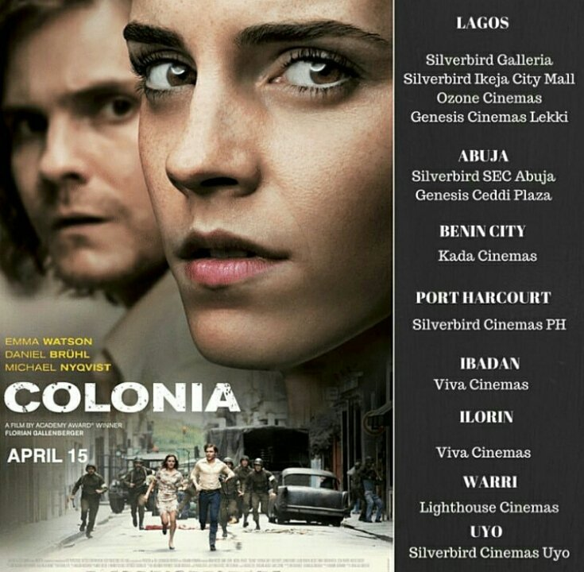

# Colonia(2016)  : 4 Life Lessons

[Movies](https://estheradeniyi.com/category/movies/)
# Colonia(2016)  : 4 Life Lessons

by [Esther Adeniyi](https://estheradeniyi.com/author/esther-adeniyi/)on [April 18, 2016May 25, 2018](https://estheradeniyi.com/colonia2015-4-life-lessons/)[Leave a Comment on Colonia(2016)  : 4 Life Lessons](https://estheradeniyi.com/colonia2015-4-life-lessons/#respond)

Sharing is caring!

- [0](https://www.facebook.com/sharer/sharer.php?u=https%3A%2F%2Festheradeniyi.com%2Fcolonia2015-4-life-lessons%2F&amp;t=Colonia%282016%29%20%20%3A%204%20Life%20Lessons)
- [0](https://twitter.com/intent/tweet?text=Colonia%282016%29%20%20%3A%204%20Life%20Lessons&amp;url=https%3A%2F%2Festheradeniyi.com%2Fcolonia2015-4-life-lessons%2F)
- [0](#)

0shares

Intro:&#xA0;Colonia is an adaptation of true life events that occurred in Chile during the Pinochet coup in 1973. The two main characters, &#xA0;Lena and Daniel are fictitious. Some movie critics say that the movie &#xA0;&#x201C;somehow manages to feel more like a Hallmark Channel romance than like a serious film.&#x201D; ~New York times.

My weekend was a little bit spicy. I had the chance to get away for a second from working on my project proposal. I did a little bit of shopping; I am so tired of my wardrobe already. I hope to do more of this, &#xA0;I should get myself more tops and trendy gowns, I need a good pair of heels too. I also decided to watch a movie at [Viva Cinemas, Kwara mall](https://www.estheradeniyi.com/fun-places-to-visit-in-ilorin).

I was going to pick randomly and so I chose Colonia (release date :April 15, 2016). The movie description caught my attention, &#xA0;I started watching the movie only to realize that it was a very wrong movie description.

Also read: [Lessons from Passengers Movie](https://www.estheradeniyi.com/passengers-2016-movie-10-lessons-i)

Viva Cinemas no try at all. That was very annoying. I noticed that they use IMDb&#x2019;s movie description and they must have copied and pasted one from another movie. &#xA0;I am happy however that the movie turned out to be cool. I enjoyed it so much that I thought to myself: I should blog about this.

Colonia is an adaptation of true life events that occurred in Chile during the Pinochet coup in 1973. The two main characters, &#xA0;Lena and Daniel are fictitious. Some movie critics say that the movie &#xA0;&#x201C;somehow manages to feel more like a Hallmark Channel romance than like a serious film.&#x201D; ~New York times.

Negative criticism is much more than &#xA0;the positive and that&#x2019;s because critics argue that the movie trivialized the gruesome acts that occurred at the time. &#xA0;I am taking to the positive side of the drama because I did not only learn, &#xA0;I enjoyed a fair share of suspense. My heart beat fast and I liked it. &#xA0;It especially raced when the pilot was torn in between the decision to take off against superior instructions or not to. His decision would either save the entwined couple&#x2019;s lives or not.

Contents

- [1 Colonia Lessons](#Colonia_Lessons)
- [2 1. &#xA0;True love can be sacrificial, &#xA0;courageous and sometimes stupid.](#1_True_love_can_be_sacrificial_courageous_and_sometimes_stupid)
- [3 2. Make friends and strong relationships everywhere you find yourself.](#2_Make_friends_and_strong_relationships_everywhere_you_find_yourself)
- [4 3. There is usually a snitch in every setting, &#xA0;no matter how formal.](#3_There_is_usually_a_snitch_in_every_setting_no_matter_how_formal)
- [5 4. Your talent(s) can pave the way for you.](#4_Your_talents_can_pave_the_way_for_you)

## Colonia Lessons

&#xA0;

## 1. &#xA0;True love can be sacrificial, &#xA0;courageous and sometimes stupid.

Lena&#x2019;s decision to move into the &#x2018;den of evil&#x2019; to save her lover, &#xA0;Daniel was very courageous. I can only imagine what life she would have lived her whole life if they didn&#x2019;t escape.

## 2. Make friends and strong relationships everywhere you find yourself.

The pilot was someone Lena could quickly give a call when it all seemed as if their plans would be crashing. I remember watching Vacation (all my friends don&#x2019;t like it), Rusty &#xA0;was able to squeeze in his wife and himself because he had connections. Build connections everywhere.

&#xA0;

## 3. There is usually a snitch in every setting, &#xA0;no matter how formal.

There is this one over ambitious member of the staff who is so overzealous that s/he would do anything to win the boss over even if it includes providing false information.

## 4. Your talent(s) can pave the way for you.

Daniel&#x2019;s photography talent even though landed him in trouble, &#xA0;caused him to have enough strong evidence against the illegal cult in Colonia. His abduction was a result of his daring photography stunts but without it Colonia Dignidad would remain a secret forever.

Have a fabulous week ahead, &#xA0;you deserve it.

Related: [The finest hours movie](https://www.estheradeniyi.com/The-Finest-Hours-movie)

Sharing is caring!

- [0](https://www.facebook.com/sharer/sharer.php?u=https%3A%2F%2Festheradeniyi.com%2Fcolonia2015-4-life-lessons%2F&amp;t=Colonia%282016%29%20%20%3A%204%20Life%20Lessons)
- [0](https://twitter.com/intent/tweet?text=Colonia%282016%29%20%20%3A%204%20Life%20Lessons&amp;url=https%3A%2F%2Festheradeniyi.com%2Fcolonia2015-4-life-lessons%2F)
- [0](#)

0shares

Tags:[Movies](https://estheradeniyi.com/tag/movies/)