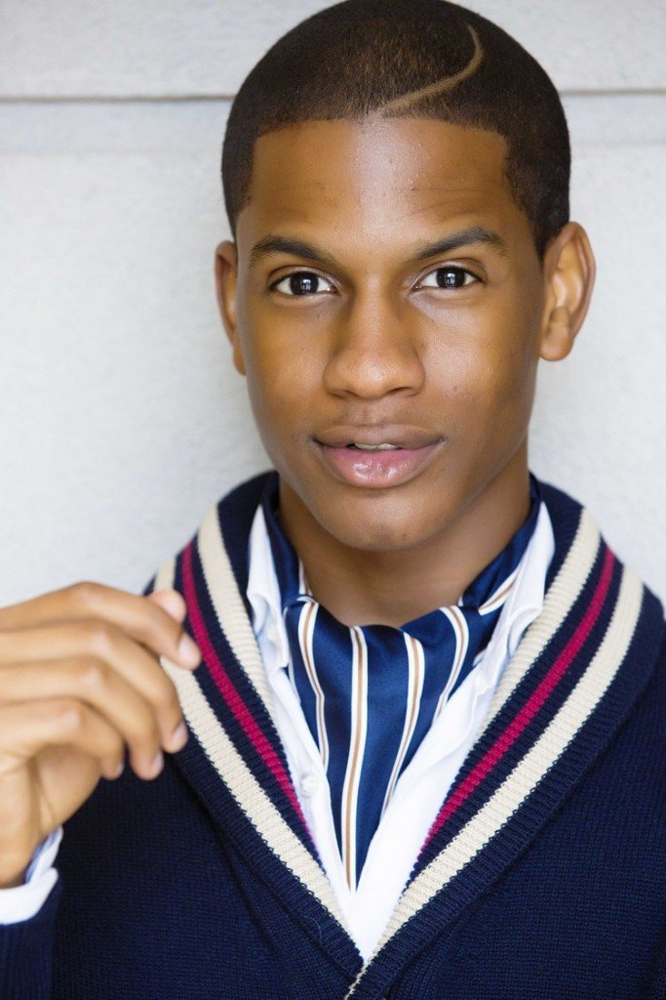

# Denola Grey: Nigerian Prince of Style

[Fashion](https://estheradeniyi.com/category/fashion/)
# Denola Grey: Nigerian Prince of Style

by [Esther Adeniyi](https://estheradeniyi.com/author/esther-adeniyi/)on [May 5, 2018May 5, 2018](https://estheradeniyi.com/denola-grey-biography-style/)[Leave a Comment on Denola Grey: Nigerian Prince of Style](https://estheradeniyi.com/denola-grey-biography-style/#respond)

Sharing is caring!

- [0](https://www.facebook.com/sharer/sharer.php?u=https%3A%2F%2Festheradeniyi.com%2Fdenola-grey-biography-style%2F&amp;t=Denola%20Grey%3A%20Nigerian%20Prince%20of%20Style)
- [0](https://twitter.com/intent/tweet?text=Denola%20Grey%3A%20Nigerian%20Prince%20of%20Style&amp;url=https%3A%2F%2Festheradeniyi.com%2Fdenola-grey-biography-style%2F)
- [1](#)

1shares

**Denola Grey** is a Media Presenter and a fashion writer. Because of his very fond flair and vast knowledge, he is a fashion consultant and style blogger. He is in Lagos Nigeria. Denola Grey is a guy who strongly believes in self expression with the aid of fashion. This is evident in his individuality and show of personal style.

Also read: [What style is and not](https://estheradeniyi.com/what-style-is-and-no/)

He is a graduate of Media Business from&#xA0;Baylor University, Texas. He has had some experience working in New York as a Fashion PR after which he moved to Nigeria for his [NYSC](https://estheradeniyi.com/how-to-make-payments-on-nysc-portal/).

On [Debonair](http://debonairafrik.com/exclusive-interview-with-denola-grey/), he was asked what year and when he got his big break. In his own words, &#x201C;I would definitely say 2014, the year I launched my website. I teamed up Toyosi Kekere-Ekun and we shot some pictures for my website (www.denolagrey.com&#xA0;) In June of that year, the launch was very well-received and I started writing for Bella Naija. I got my first TV offer with Ebony Life in November of that year and also went to some events, which gave me some great red carpet moments.&#x201D;

## Denola Grey&#x2019;s Style

Denola Grey says that his favorite designers are&#xA0;Tom Ford, Dolce and Gabbana, Louis Leeman and Orange Culture.

Denola Grey began his fashion career at only 18 and gained immense success. He progressed in his career as a media consultant and has exponentially catapulted his fashion career under the Grey Brand to heights unimaginable. One peculiar thing about him is how very little of his personal life the public knows.

Sharing is caring!

- [0](https://www.facebook.com/sharer/sharer.php?u=https%3A%2F%2Festheradeniyi.com%2Fdenola-grey-biography-style%2F&amp;t=Denola%20Grey%3A%20Nigerian%20Prince%20of%20Style)
- [0](https://twitter.com/intent/tweet?text=Denola%20Grey%3A%20Nigerian%20Prince%20of%20Style&amp;url=https%3A%2F%2Festheradeniyi.com%2Fdenola-grey-biography-style%2F)
- [1](#)

1shares

Tags:[Denola Grey](https://estheradeniyi.com/tag/denola-grey/)[Fashion](https://estheradeniyi.com/tag/fashion/)