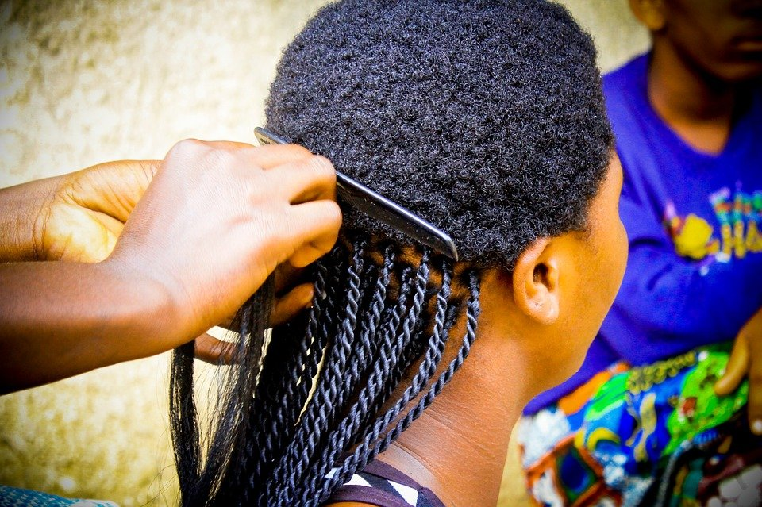

# Different hairstyles to consider for your Natural Hair

[Uncategorized](https://estheradeniyi.com/category/uncategorized/)
# Different hairstyles to consider for your Natural Hair

by [Esther Adeniyi](https://estheradeniyi.com/author/esther-adeniyi/)on [July 5, 2017April 27, 2018](https://estheradeniyi.com/different-hairstyles-to-consider-for/)[2 Comments on Different hairstyles to consider for your Natural Hair](https://estheradeniyi.com/different-hairstyles-to-consider-for/#comments)

Sharing is caring!

- [0](https://www.facebook.com/sharer/sharer.php?u=https%3A%2F%2Festheradeniyi.com%2Fdifferent-hairstyles-to-consider-for%2F&amp;t=Different%20hairstyles%20to%20consider%20for%20your%20Natural%20Hair)
- [0](https://twitter.com/intent/tweet?text=Different%20hairstyles%20to%20consider%20for%20your%20Natural%20Hair&amp;url=https%3A%2F%2Festheradeniyi.com%2Fdifferent-hairstyles-to-consider-for%2F)
- [0](#)

0shares

 Natural hair usually doesn&#x2019;t have the smooth, even texture that relaxed hair has and because of that some hairdo do not last on them. You might have therefore been stuck on different hairstyles to consider for your Natural Hair.

Read: [what to do after the big chop](https://www.estheradeniyi.com/what-to-do-after-big-chop)

As naturalistas, let&#x2019;s see some of the hairdo we should do, and the ones we shouldn&#x2019;t too.

Contents

- [1 *FIXING](#FIXING)
- [2 *BRAIDS](#BRAIDS)
- [3 *TWISTS](#TWISTS)
- [4 *TIE TIE?](#TIE_TIE)
- [5 *PICK AND DROP](#PICK_AND_DROP)
- [6 *WEAVES/GHANA WEAVES](#WEAVESGHANA_WEAVES)
- [7 *KINKI/DREADLOCK](#KINKIDREADLOCK)
- [8 *NATURAL TWISTS](#NATURAL_TWISTS)

##  *FIXING

 Any weavon fixing will definitely work on natural hair as the hair will be totally covered.

##  *BRAIDS

 Braiding with attachment is very okay. Braiding with wool however will not be as neat, especially if the person braiding is not a pro. So if we&#x2019;re doing braids attachment is more advisable. We can even try [Yele&#x2019;s method of keeping braids neat](https://www.estheradeniyi.com/2017/06/how-to-keep-your-braids-neat-and-last_22.html) using oil sheen as said in one of her previous posts.

##  *TWISTS

 Twisting will also be neat if done with attachment. But I really haven&#x2019;t seen a long-lasted wool twists because the hair strands will be coming out here and there in like a week&#x2019;s time. But there&#x2019;s something my sister did for me. She made tie tie (sorry I don&#x2019;t really remember the real name) up to the length of my hair then she twisted the remaining part. It helped my put my hair in place so it lasted longer. This might not work with long hair sha.

Also read: [stretch out your natural hair without heat](https://www.estheradeniyi.com/stretch-out-your-natural-hair-without)

##  *TIE TIE?

 The hair is good for naturalists. Whether you&#x2019;re using the rubber hair thread or you&#x2019;re using wool. It helps in hair growth too, although some scalp reacts to it.

##  *PICK AND DROP

 Let&#x2019;s not even go there ??

##  *WEAVES/GHANA WEAVES

 We can either weave our hair without adding extensions or do Ghana weave and maybe also apply oil sheen.

##  *KINKI/DREADLOCK

 Some people call it kinki while others call it dreadlock. Whichever way sha.
 You can either twist it- what we call cocaine in my side, or yo do the sewing/fixing style. I love this hairdo. It lasts long and it&#x2019;s also the older, the finer. I&#x2019;ve even tried tonging the twist once when I made it. It was fine!!

##  *NATURAL TWISTS

 Omo! This hair is everywhere, plus its crazy. The feeling I get when I twist my short natural hair especially when it stands and looks all spiky. I love it gan?

These are some of the hairdo we can rock wella as naturalists. So when next you&#x2019;re going to get your hair done you won&#x2019;t have stress finding a good hairdo that&#x2019;ll last for you.

Stay beautiful?

P.S &#x2013; Would you please do us a small favour? Please share this blog post on your social media network. Thank you.

Related: [Braid styles on Instagram](https://www.estheradeniyi.com/10-braid-styles-i-am-loving-on-instagram)

Sharing is caring!

- [0](https://www.facebook.com/sharer/sharer.php?u=https%3A%2F%2Festheradeniyi.com%2Fdifferent-hairstyles-to-consider-for%2F&amp;t=Different%20hairstyles%20to%20consider%20for%20your%20Natural%20Hair)
- [0](https://twitter.com/intent/tweet?text=Different%20hairstyles%20to%20consider%20for%20your%20Natural%20Hair&amp;url=https%3A%2F%2Festheradeniyi.com%2Fdifferent-hairstyles-to-consider-for%2F)
- [0](#)

0shares

Tags:[Natural Hair](https://estheradeniyi.com/tag/natural-hair/)