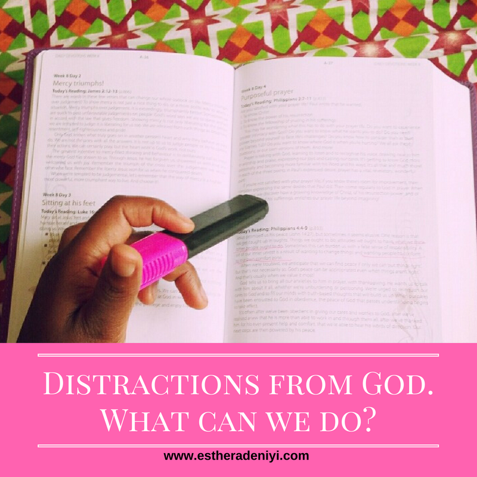

# Distractions from God. What can we do?

[Faith](https://estheradeniyi.com/category/faith/)
# Distractions from God. What can we do?

by [Esther Adeniyi](https://estheradeniyi.com/author/esther-adeniyi/)on [December 10, 2017April 27, 2018](https://estheradeniyi.com/distractions-from-god-what-can-we-do/)[4 Comments on Distractions from God. What can we do?](https://estheradeniyi.com/distractions-from-god-what-can-we-do/#comments)

Sharing is caring!

- [0](https://www.facebook.com/sharer/sharer.php?u=https%3A%2F%2Festheradeniyi.com%2Fdistractions-from-god-what-can-we-do%2F&amp;t=Distractions%20from%20God.%20What%20can%20we%20do%3F)
- [0](https://twitter.com/intent/tweet?text=Distractions%20from%20God.%20What%20can%20we%20do%3F&amp;url=https%3A%2F%2Festheradeniyi.com%2Fdistractions-from-god-what-can-we-do%2F)
- [0](#)

0shares

Christians are at war. We fight everyday to keep our faith. Everywhere we turn to, we find opportunities to doubt the word of God. We find reasons to doubt even God&#x2019;s existence. We are almost outnumbered. Many of us thirst for God, we yearn for a deeper relationship with God. We don&#x2019;t want to be on and off everytime. We want to be steady and steadfast but it&#x2019;s such a struggle.

One time you read the news and there you see that an helpless person was murdered. You are angry and sad and asking questions, God why? Where were you? We momentarily lose faith and fight to be renewed again.

[Tips to maintaining a constant quiet time](https://www.estheradeniyi.com/tips-to-maintaining-constant-quiet-time?m=1)

If we don&#x2019;t listen to news, we may have become social media addicts. There is so much of noise in this space I tell you. The noise in here is deafening. It can make you lose sight of God! So many distractions (1 Corinthians 7: 35 ; Mark 4: 19) and calls to leave the tenets of Christianity. Many of these calls are subtly wrapped in earthly wisdom. We struggle to stay above the noise. Quiet time has become a struggle for some of us, we have completely lost it.

Many of us are on a path to restoration every time. I love God, he puts things in our way and lives to bring us back to him when we stray. It is an awesome privilege to have a constantly loving father.

One of the ways to keep above these distractions and noise is to be constantly diligent (Pro 13:4). You need to purpose in your heart to give your whole being to God. Then, you gotta ask God to strengthen your faith in this era we are in. You have to ask God to help you discern what is worth digesting and worth discarding (1 John 4: 1).

Thirdly, frequently occupy your mind with the word of God (Joshua 1: 8). Anyhow, anywhere you can chew the word of God. Through music, messages, your bible. (Eph 5:19). The word of God is powerful to nullify the day&#x2019;s evil.

What have you been experiencing as regards [distractions in the place of devotion](http://livingforjesus.com/10-things-that-can-distract-us-during-our-walk-with-god/) to God?

&#xA0;

Sharing is caring!

- [0](https://www.facebook.com/sharer/sharer.php?u=https%3A%2F%2Festheradeniyi.com%2Fdistractions-from-god-what-can-we-do%2F&amp;t=Distractions%20from%20God.%20What%20can%20we%20do%3F)
- [0](https://twitter.com/intent/tweet?text=Distractions%20from%20God.%20What%20can%20we%20do%3F&amp;url=https%3A%2F%2Festheradeniyi.com%2Fdistractions-from-god-what-can-we-do%2F)
- [0](#)

0shares

Tags:[Faith](https://estheradeniyi.com/tag/faith/)[God](https://estheradeniyi.com/tag/god/)