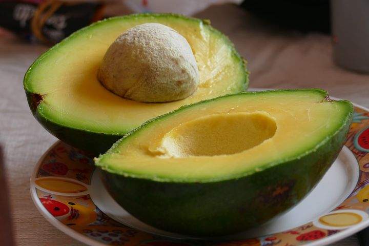

# DIY Avocado mask for natural hair and skin

[Uncategorized](https://estheradeniyi.com/category/uncategorized/)
# DIY Avocado mask for natural hair and skin

by [Esther Adeniyi](https://estheradeniyi.com/author/esther-adeniyi/)on [June 27, 2017April 27, 2018](https://estheradeniyi.com/diy-avocado-mask-for-natural-hair-and/)[Leave a Comment on DIY Avocado mask for natural hair and skin](https://estheradeniyi.com/diy-avocado-mask-for-natural-hair-and/#respond)

Sharing is caring!

- [0](https://www.facebook.com/sharer/sharer.php?u=https%3A%2F%2Festheradeniyi.com%2Fdiy-avocado-mask-for-natural-hair-and%2F&amp;t=DIY%20Avocado%20mask%20for%20natural%20hair%20and%20skin)
- [0](https://twitter.com/intent/tweet?text=DIY%20Avocado%20mask%20for%20natural%20hair%20and%20skin&amp;url=https%3A%2F%2Festheradeniyi.com%2Fdiy-avocado-mask-for-natural-hair-and%2F)
- [0](#)

0shares

 AVOCADO!!!

 I love this avocado. Apart from its very nutritional values for the body, &#xA0;it also is a good [fruit mask](https://www.estheradeniyi.com/diy-fruit-smoothie-hair-condition) for hair treatment.

Let&#x2019;s look at some of its values and masques preparation.

Contents

- [1 Avocado mask as hair moisturizer&#xA0;](#Avocado_mask_as_hair_moisturizernbsp)
- [2 Avocado mask to promote hair growth&#xA0;](#Avocado_mask_to_promote_hair_growthnbsp)
- [3 To prevent dandruff&#xA0;](#To_prevent_dandruffnbsp)
- [4 Avocado mask to revitalize hair](#Avocado_mask_to_revitalize_hair)

##  Avocado mask as hair moisturizer&#xA0;

 INGREDIENTS

12 ripe avocado
 1 tbsp raw honey
 1 whole egg
 Essential oil

whisk egg as if you want to scramble it.
 In a separate bowl, mash avocado and mix in honey and essential oil.
 Apply to hair and cover with plastic shower cap for 15-20mins
 Rinse with lukewarm water.

Nb: don&#x2019;t use hot water to avoid having cooked eggs on your hair?
[Shampoo and condition](https://www.estheradeniyi.com/2016/06/my-hair-washing-routine_8.html?m=1) as normal

##  Avocado mask to promote hair growth&#xA0;

 INGREDIENTS
 12 &#xA0;overripe avocado
 1 egg yolk

Whisk egg yolk until it turns a frothy liquid.
 Blend the avocado finely and combine with egg yolk and mix well.
 Apply to wet hair, from scalp to hair ends. 
 Massage for 5 mins
 Rinse with warm water
 Shampoo and condition as normal

##  To prevent dandruff&#xA0;

 INGREDIENTS
 1 ripe avocado
 10 drops of Argan oil
 2 tbsp honey
 1-3 drops of tea tree oil

Mash avocado till there are no large chunk
 Add argan oil, honey and tea tree oil. Add a drop at a time of the tea tree oil. Stir until mixture is smooth and creamy
 Using gloves, &#xA0;apply directly on scalp
 Press in and massage gently using finger tips
[Leave avocado mask in](https://www.allure.com/story/diy-avocado-hair-mask) for 10-20 mins then rinse thoroughly.
 Shampoo and condition as normal

##  Avocado mask to revitalize hair

 INGREDIENTS
 I ripe avocado
 I ripe banana
 1 tbsp olive oil
 A few drops of any essential oil

Mash [banana](https://www.estheradeniyi.com/bananas-and-weight-gain) and avocado together well
 Add oil and continue to mix.
 Apply &#xA0;mixture and cover with shower cap for 15-20mis
 Rinse thoroughly
 Shampoo and condition as normal.

So y&#x2019;all, you are going to try this out? Let us know what you think in the comments section below.

Also check out: [Lemon fruit mask](https://www.estheradeniyi.com/diy-lemon-fruit-mask-for-hair-and-skin-1?m=1)

Sharing is caring!

- [0](https://www.facebook.com/sharer/sharer.php?u=https%3A%2F%2Festheradeniyi.com%2Fdiy-avocado-mask-for-natural-hair-and%2F&amp;t=DIY%20Avocado%20mask%20for%20natural%20hair%20and%20skin)
- [0](https://twitter.com/intent/tweet?text=DIY%20Avocado%20mask%20for%20natural%20hair%20and%20skin&amp;url=https%3A%2F%2Festheradeniyi.com%2Fdiy-avocado-mask-for-natural-hair-and%2F)
- [0](#)

0shares

Tags:[Beauty](https://estheradeniyi.com/tag/beauty/)[DIY](https://estheradeniyi.com/tag/diy/)[Natural Hair](https://estheradeniyi.com/tag/natural-hair/)