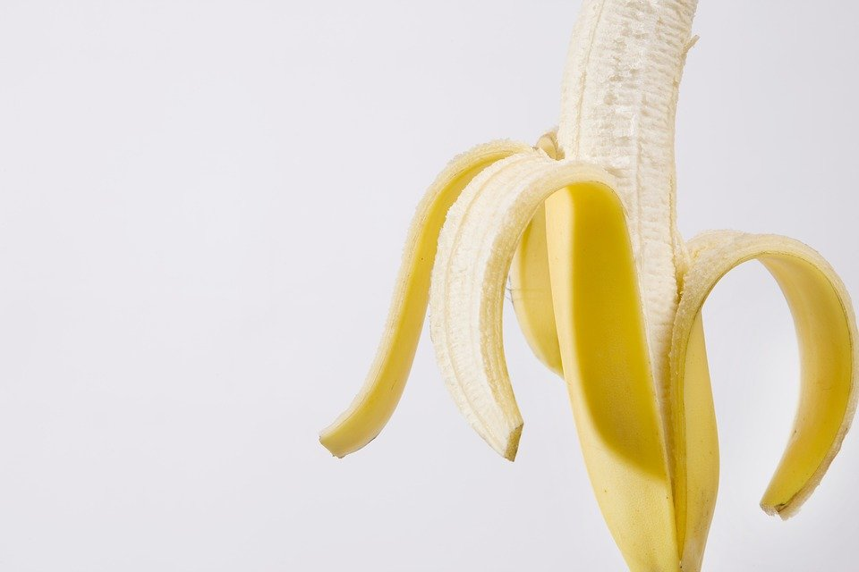

# DIY Banana Mask for hair and skin

[Uncategorized](https://estheradeniyi.com/category/uncategorized/)
# DIY Banana Mask for hair and skin

by [Esther Adeniyi](https://estheradeniyi.com/author/esther-adeniyi/)on [July 4, 2017April 27, 2018](https://estheradeniyi.com/diy-banana-mask-for-hair-and-skin/)[Leave a Comment on DIY Banana Mask for hair and skin](https://estheradeniyi.com/diy-banana-mask-for-hair-and-skin/#respond)

Sharing is caring!

- [0](https://www.facebook.com/sharer/sharer.php?u=https%3A%2F%2Festheradeniyi.com%2Fdiy-banana-mask-for-hair-and-skin%2F&amp;t=DIY%20Banana%20Mask%20for%20hair%20and%20skin)
- [0](https://twitter.com/intent/tweet?text=DIY%20Banana%20Mask%20for%20hair%20and%20skin&amp;url=https%3A%2F%2Festheradeniyi.com%2Fdiy-banana-mask-for-hair-and-skin%2F)
- [0](#)

0shares

 This week we will be looking at DIY Banana mask for hair and skin. Banana is an all season fruits rich in carbohydrates and vitamin C. We are going to learn how we can use it on our hair and skin.

We will focus on these:

- HOW DOES BANANA HELP OUR NATURAL HAIR
- BANANA PEELS FOR SKIN
- BANANA FACIAL MASK
- BANANA MASK FOR MANAGEABILITY
- BANANA MASK FOR RADIANT HAIR
- BANANA MASK FOR DRY HAIR

Oya, leggo

How Banana helps the hair

- It soften our hair
- It helps loosen curls
- It helps reduce shrinkage
- It strengthens weak, dry or damaged hair
- It restores heat-damaged hair

[Read DIY Avocado mask for natural hair and skin](https://www.estheradeniyi.com/diy-avocado-mask-for-natural-hair-and)

DIY Banana peels for skin

It&#x2019;s exciting to know that even banana skin is useful
 So don&#x2019;t throw away that banana skin again except you don&#x2019;t have any of this things to do with it.
 It heals skin irritation, acne, allergies, mosquito bites, bruises etc

Application

Place banana peel on affected area for 30 mins everyday until totally healed

DIY Banana Facial Mask

1 ripe banana
 1tbsp vit E
 1 tbsp&#xA0;yogurt

Blend all&#xA0;ingredients together.&#xA0;Apply to damp face&#xA0;for 20mins. &#xA0;Rinse&#xA0;with&#xA0;lukewarm water and then&#xA0;with cold water.

You can also read [DIY lemon fruit mask for hair and skin](https://www.estheradeniyi.com/diy-lemon-fruit-mask-for-hair-and-skin-1)

DIY Banana Mask for Manageability

1 large overripe banana(sliced)
 4tbsp extra virgin oil
 2tbsp pure&#xA0;vegetable&#xA0;glycerin
 2 tbsp pure&#xA0;honey

Blend&#xA0;ingredient&#xA0;thoroughly&#xA0;until no&#xA0;bit or&#xA0;lump is left.&#xA0;Apply to hair and let sit for 30-45 mins &#xA0;under a shower cap. &#xA0;Detangle, rinse&#xA0;thoroughly and style as usual.

DIY Banana Mask for Radiant Hair

1 mashed&#xA0;banana
 1 egg
 3 tbsp honey
 3 tbsp milk
 5 tbsp olive&#xA0;oil

Mix&#xA0;ingredients&#xA0;together in a bowl. Use a&#xA0;wide toothed comb&#xA0;to&#xA0;apply&#xA0;from roots to ends. Leave in for 15-30 mins. Rinse with cold water. &#xA0;Shampoo and condition as usual.

DIY Banana Mask for Dry Hair

1 ripe banana or 2 if your hair is long
 2tbsp olive/coconut oil
 1/2 cup full fat milk ( you can use coconut milk or yogurt)
 1tbsp butter(optional)

Blend banana then add honey, coconut/olive oil and milk. Blend thoroughly. Apply from roots to hair ends. Make sure every bit of hair and scalp is covered. Put on shower cap or wrap with towel. Leave on for about 30mins. Rinse hair thoroughly and shampoo as usual. You might not need to condition your hair again, depending on how it feels.

So ladies, when next you buy a bunch of bananas don&#x2019;t just eat it. Give your hair some too. And experience that hair glow. ??

Sharing is caring!

- [0](https://www.facebook.com/sharer/sharer.php?u=https%3A%2F%2Festheradeniyi.com%2Fdiy-banana-mask-for-hair-and-skin%2F&amp;t=DIY%20Banana%20Mask%20for%20hair%20and%20skin)
- [0](https://twitter.com/intent/tweet?text=DIY%20Banana%20Mask%20for%20hair%20and%20skin&amp;url=https%3A%2F%2Festheradeniyi.com%2Fdiy-banana-mask-for-hair-and-skin%2F)
- [0](#)

0shares

Tags:[Beauty](https://estheradeniyi.com/tag/beauty/)[DIY](https://estheradeniyi.com/tag/diy/)[Hair](https://estheradeniyi.com/tag/hair/)