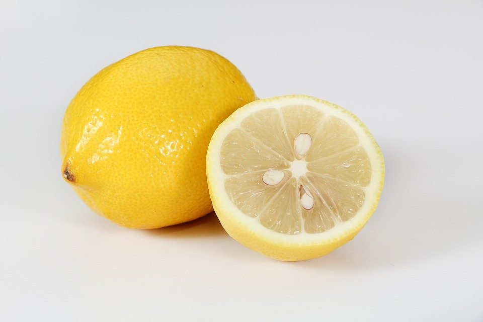

# DIY (lemon) fruit mask for hair and skin (1)

[Uncategorized](https://estheradeniyi.com/category/uncategorized/)
# DIY (lemon) fruit mask for hair and skin (1)

by [Esther Adeniyi](https://estheradeniyi.com/author/esther-adeniyi/)on [June 20, 2017April 27, 2018](https://estheradeniyi.com/diy-lemon-fruit-mask-for-hair-and-skin-1/)[Leave a Comment on DIY (lemon) fruit mask for hair and skin (1)](https://estheradeniyi.com/diy-lemon-fruit-mask-for-hair-and-skin-1/#respond)

Sharing is caring!

- [0](https://www.facebook.com/sharer/sharer.php?u=https%3A%2F%2Festheradeniyi.com%2Fdiy-lemon-fruit-mask-for-hair-and-skin-1%2F&amp;t=DIY%20%28lemon%29%20fruit%20mask%20for%20hair%20and%20skin%20%281%29)
- [0](https://twitter.com/intent/tweet?text=DIY%20%28lemon%29%20fruit%20mask%20for%20hair%20and%20skin%20%281%29&amp;url=https%3A%2F%2Festheradeniyi.com%2Fdiy-lemon-fruit-mask-for-hair-and-skin-1%2F)
- [1](#)

1shares

 I decided to do a post on DIY fruit mask for hair and skin, then I got to realize that if I write everything at once it might be difficult to take in. So, I&#x2019;ve broken it down. I&#x2019;ll do a post, a fruit. It will run for sometime, I hope to cover as many fruits as possible. Today, we&#x2019;ll look at LEMON

 &#xA0; &#xA0; &#xA0; &#xA0; HIGHLIGHTS

- Importance of lemon to the hair
- Lemon for dandruff
- Lemon for hair growth
- Lemon for the skin

 IMPORTANCE OF LEMON TO THE HAIR

- It boosts hair shine and growth
- It helps clear dandruff
- It helps hair loss problems
- It seals cuticle layer so locks in moisture, reduces frizz and define curls

 LEMON FOR DANDRUFF

 Massage 2 tbsp of fresh lemon juice on hair and rinse out with water. Stir 1tsp of fresh lemon juice into 1 cup of water and rinse hair with it. Do it everyday tills there&#x2019;s no more dandruff.

 LEMON FOR HAIR GROWTH

 Mix 1/4 cup of fresh coconut water with 1 tbsp of lemon juice. Apply and massage on scalp for 5mins.

 LEMON FOR SKIN

- Get a slice of lemon. Squeeze directly on face to clear acne and black spots.
- Mix fresh lemon juice in bath water to deodorize the body.
- Rub lemon on spots like the knee,elbow, heels and palms to make them softer.

 Let&#x2019;s try this out and send in testimonies and complains.

 I&#x2019;m on it too?

Sharing is caring!

- [0](https://www.facebook.com/sharer/sharer.php?u=https%3A%2F%2Festheradeniyi.com%2Fdiy-lemon-fruit-mask-for-hair-and-skin-1%2F&amp;t=DIY%20%28lemon%29%20fruit%20mask%20for%20hair%20and%20skin%20%281%29)
- [0](https://twitter.com/intent/tweet?text=DIY%20%28lemon%29%20fruit%20mask%20for%20hair%20and%20skin%20%281%29&amp;url=https%3A%2F%2Festheradeniyi.com%2Fdiy-lemon-fruit-mask-for-hair-and-skin-1%2F)
- [1](#)

1shares

Tags:[Beauty](https://estheradeniyi.com/tag/beauty/)[DIY](https://estheradeniyi.com/tag/diy/)[Hair](https://estheradeniyi.com/tag/hair/)[Hair and beauty](https://estheradeniyi.com/tag/hair-and-beauty/)