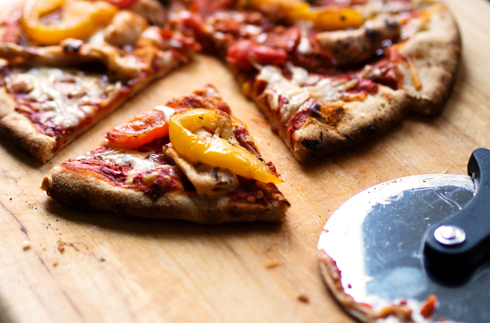
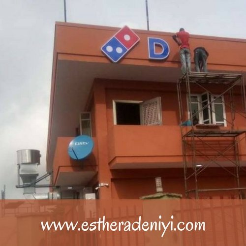

# Surprise!  Domino’s Pizza now in Abeokuta!

[Reviews](https://estheradeniyi.com/category/reviews/)
# Surprise!  Domino&#x2019;s Pizza now in Abeokuta!

by [Esther Adeniyi](https://estheradeniyi.com/author/esther-adeniyi/)on [April 5, 2018May 2, 2018](https://estheradeniyi.com/dominos-pizza-is-coming-to-abeokuta/)[12 Comments on Surprise!  Domino&#x2019;s Pizza now in Abeokuta!](https://estheradeniyi.com/dominos-pizza-is-coming-to-abeokuta/#comments)

Sharing is caring!

- [1](https://www.facebook.com/sharer/sharer.php?u=https%3A%2F%2Festheradeniyi.com%2Fdominos-pizza-is-coming-to-abeokuta%2F&amp;t=Surprise%21%20%20Domino%27s%20Pizza%20now%20in%20Abeokuta%21)
- [0](https://twitter.com/intent/tweet?text=Surprise%21%20%20Domino%27s%20Pizza%20now%20in%20Abeokuta%21&amp;url=https%3A%2F%2Festheradeniyi.com%2Fdominos-pizza-is-coming-to-abeokuta%2F)
- [0](#)

1shares

If they said **Domino&#x2019;s Pizza** would be in Abeokuta,&#xA0; Ogun state, in 2018, I bet you would express utter disbelief. This was what happened when [Shoprite showed up in Ota, Ogun state](https://www.estheradeniyi.com/shoprite-opens-in-ogun-state?m=1). Y&#x2019;all were vexed it wasn&#x2019;t in Abeokuta, I can remember vividly.

Do you know that till now, when I check my blog&#x2019;s analytics, I still see searchers searching for &#x201C;Shoprite in Abeokuta&#x201D; and I am like, seriously! Sorry to burst your bubble o, it&#x2019;s in Ota. Thank you.

Abeokuta, Ogun state&#x2019;s capital, recently, has been taking new shapes and looks.

The recent expansion of roads has given Abeokuta a refined look, thus, opening doors of opportunities for more investors to improve the economy of the state.

## Domino&#x2019;s Pizza, Abeokuta Address

Well, In addition to the catering and relaxation center in the state capital is the on going construction of Domino&#x2019;s Pizza and Cold Stone at Ibara (former Kings Hall and Super Foods Building).

Yaga!!!

[Omotomi Lola](https://www.facebook.com/omotomilolao), also known as the Village Girl in her #VillageGirlDairy on Facebook brought this to our notice. She made a video too, my friends are in there serving her the haters jest. She also dashed me pictures.

She said,

&#x201C;This is an awesome move. Abeokuta is gradually coming into limelight. Sales already began&#x201D;

By the way,&#xA0; Omotomi Lola is a Radio Host & Freelance Writer. You can find her on all her social media handles as Omotomi Lola.

Abeokuta peeps, y&#x2019;all can feel free to come and represent. Shoprite can stay in Ota, you can enjoy your Domino&#x2019;s pizza in Abeokuta.

Related: [Fun places to visit in Ilorin](https://www.estheradeniyi.com/fun-places-to-visit-in-ilorin?m=1)

Sharing is caring!

- [1](https://www.facebook.com/sharer/sharer.php?u=https%3A%2F%2Festheradeniyi.com%2Fdominos-pizza-is-coming-to-abeokuta%2F&amp;t=Surprise%21%20%20Domino%27s%20Pizza%20now%20in%20Abeokuta%21)
- [0](https://twitter.com/intent/tweet?text=Surprise%21%20%20Domino%27s%20Pizza%20now%20in%20Abeokuta%21&amp;url=https%3A%2F%2Festheradeniyi.com%2Fdominos-pizza-is-coming-to-abeokuta%2F)
- [0](#)

1shares

Tags:[Food](https://estheradeniyi.com/tag/food/)[places review](https://estheradeniyi.com/tag/places-review/)[Reviews](https://estheradeniyi.com/tag/reviews/)