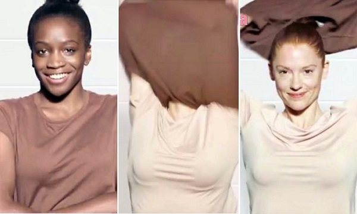

# Dove Controversial Advert: Lola Ogunyemi, the Black Model Speaks up

[Beauty](https://estheradeniyi.com/category/beauty/)
# Dove Controversial Advert: Lola Ogunyemi, the Black Model Speaks up

by [Esther Adeniyi](https://estheradeniyi.com/author/esther-adeniyi/)on [September 6, 2017May 25, 2018](https://estheradeniyi.com/dove-controversial-advert-lola-ogunyemi/)[Leave a Comment on Dove Controversial Advert: Lola Ogunyemi, the Black Model Speaks up](https://estheradeniyi.com/dove-controversial-advert-lola-ogunyemi/#respond)

Sharing is caring!

- [0](https://www.facebook.com/sharer/sharer.php?u=https%3A%2F%2Festheradeniyi.com%2Fdove-controversial-advert-lola-ogunyemi%2F&amp;t=Dove%20Controversial%20Advert%3A%20Lola%20Ogunyemi%2C%20the%20Black%20Model%20Speaks%20up)
- [0](https://twitter.com/intent/tweet?text=Dove%20Controversial%20Advert%3A%20Lola%20Ogunyemi%2C%20the%20Black%20Model%20Speaks%20up&amp;url=https%3A%2F%2Festheradeniyi.com%2Fdove-controversial-advert-lola-ogunyemi%2F)
- [0](#)

0shares

Dove, owned by Unilever was heavily criticized as people descended on them over the campaign they ran on Facebook. Apparently people found this Dove Controversial Advert a racist one.

&#xA0;

[WomanNg](http://woman.ng/2017/10/i-went-online-and-discovered-i-had-become-the-unwitting-poster-child-for-racist-advertising-lola-ogunyemi-speaks-on-being-the-black-model-in-the-controversial-dove-ad/) reports that the Dove Controversial ad, which shows a black woman becoming white after using
 the brand&#x2019;s lotion, has come under heavy backlash and the company has
 apologized for the offense.

However, in an opinion piece on Guardian UK, titled, &#x201C;I am
 the woman in the &#x2018;racist Dove ad&#x2019;. I am not a victim,&#x201D; Lola Ogunyemi, the black
 woman featured in the ad shared her views about her role in the advert.

She explained that her reason for taking up the chance to be
 the face of a new body wash by Dove was because she wanted to change the
 narrative that has so long existed in the society that dark people needed to be
 lighter to look better.

&#x201C;Having the opportunity to represent my dark-skinned sisters
 in a global beauty brand felt like the perfect way for me to remind the world
 that we are here, we are beautiful, and more importantly, we are valued,&#x201D; she
 said.

Sadly, Lola said, she woke up one morning only to discover
 that she had become &#x201C;the unwitting poster child for racist advertising.&#x201D;

Even though she had a great time with other models during
 the shoot of the advert, she explained that she would have declined the offer
 if she had known how people were going to perceive it.

&#x201C;If I had even the slightest inclination that I would be
 portrayed as inferior, or as the &#x201C;before&#x201D; in a before and after shot, I would
 have been the first to say an emphatic &#x201C;no&#x201D;. I would have (un)happily walked
 right off set and out of the door. That is something that goes against
 everything I stand for.&#x201D;

Noting how Dove had been criticised for the same thing in
 the past, Lola said that &#x201C;the narrative has been written without giving
 consumers context on which to base an informed opinion.&#x201D;

According to [The Guardian](https://www.theguardian.com/commentisfree/2017/oct/10/i-am-woman-racist-dove-ad-not-a-victim), she had said, &#x201C;However, the experience I had with the Dove team was
 positive. I had an amazing time on set. All of the women in the shoot
 understood the concept and overarching objective &#x2013; to use our differences to
 highlight the fact that all skin deserves gentleness.

I remember all of us being excited at the idea of wearing
 nude T-shirts and turning into one another. We weren&#x2019;t sure how the final edit
 was going to look, nor which of us would actually be featured in it, but
 everyone seemed to be in great spirits during filming, including me.

Then the first Facebook ad was released: a 13-second video
 clip featuring me, a white woman, and an Asian woman removing our nude tops and
 changing into each other. I loved it. My friends and family loved it. People
 congratulated me for being the first to appear, for looking fabulous, and for
 representing Black Girl Magic. I was proud.[You might want to read on how to choose the right foundation for your skin](https://www.estheradeniyi.com/a-complete-guide-to-choosing-right)

Then, the full, 30-second TV commercial was released in the
 US, and I was over the moon again. There were seven of us in the full version,
 different races and ages, each of us answering the same question: &#x201C;If your skin
 were a wash label, what would it say?&#x201D;

Again, I was the first model to appear in the ad, describing
 my skin as &#x201C;20% dry, 80% glowing&#x201D;, and appearing again at the end. I loved it,
 and everyone around me seemed to as well. I think the full TV edit does a much
 better job of making the campaign&#x2019;s message loud and clear.

There is definitely something to be said here about how
 advertisers need to look beyond the surface and consider the impact their
 images may have, specifically when it comes to marginalized groups of women. It
 is important to examine whether your content shows that your consumer&#x2019;s voice
 is not only heard, but also valued.

&#xA0;

I can see how the snapshots that are circulating the web
 have been misinterpreted, considering the fact that Dove has faced a backlash in
 the past for the exact same issue. There is a lack of trust here, and I feel
 the public was justified in their initial outrage. Having said that, I can also
 see that a lot has been left out. The narrative has been written without giving
 consumers context on which to base an informed opinion.[Vaseline beauty hacks that will make you hoard Vaseline](https://www.estheradeniyi.com/these-vaseline-beauty-hacks-will-make)

While I agree with Dove&#x2019;s response to unequivocally
 apologise for any offense caused, they could have also defended their creative
 vision, and their choice to include me, an unequivocally dark-skinned black
 woman, as a face of their campaign. I am not just some silent victim of a
 mistaken beauty campaign. I am strong, I am beautiful, and I will not be
 erased.

Even though Lola, a US-born Nigerian, agrees with Dove&#x2019;s
 apologies, she feels that they could have also defended their creative vision,
 and their choice to include her, an undeniably dark-skinned black woman, as a
 face of their campaign.

&#x201C;I am not just some silent victim of a mistaken beauty
 campaign. I am strong, I am beautiful, and I will not be erased,&#x201D; she says. &#x201C;News sources: WomanNG, The Guardian

Sharing is caring!

- [0](https://www.facebook.com/sharer/sharer.php?u=https%3A%2F%2Festheradeniyi.com%2Fdove-controversial-advert-lola-ogunyemi%2F&amp;t=Dove%20Controversial%20Advert%3A%20Lola%20Ogunyemi%2C%20the%20Black%20Model%20Speaks%20up)
- [0](https://twitter.com/intent/tweet?text=Dove%20Controversial%20Advert%3A%20Lola%20Ogunyemi%2C%20the%20Black%20Model%20Speaks%20up&amp;url=https%3A%2F%2Festheradeniyi.com%2Fdove-controversial-advert-lola-ogunyemi%2F)
- [0](#)

0shares

Tags:[News](https://estheradeniyi.com/tag/news/)