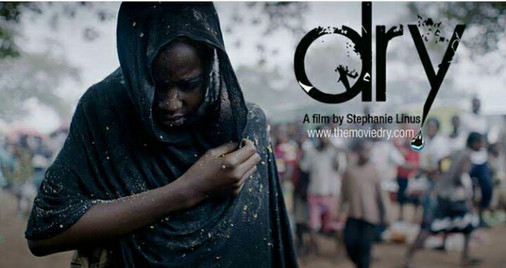

# Dry (2014 Movie) by Stephanie Linus Review

[Uncategorized](https://estheradeniyi.com/category/uncategorized/)
# Dry (2014 Movie) by Stephanie Linus Review

by [Esther Adeniyi](https://estheradeniyi.com/author/esther-adeniyi/)on [October 5, 2016April 27, 2018](https://estheradeniyi.com/dry-2014-movie-review-by-stephanie-linus/)[3 Comments on Dry (2014 Movie) by Stephanie Linus Review](https://estheradeniyi.com/dry-2014-movie-review-by-stephanie-linus/#comments)

Sharing is caring!

- [0](https://www.facebook.com/sharer/sharer.php?u=https%3A%2F%2Festheradeniyi.com%2Fdry-2014-movie-review-by-stephanie-linus%2F&amp;t=Dry%20%282014%20Movie%29%20by%20Stephanie%20Linus%20Review)
- [0](https://twitter.com/intent/tweet?text=Dry%20%282014%20Movie%29%20by%20Stephanie%20Linus%20Review&amp;url=https%3A%2F%2Festheradeniyi.com%2Fdry-2014-movie-review-by-stephanie-linus%2F)
- [0](#)

0shares

 &#x2018;Dry&#x2019; is a message, a call, &#xA0;a challenge, a push, a nudge, a beautiful movie.

##  Dry movie cast

 Stephanie Okereke as Dr Zara
 Liz Benson as Matron
 Zubaida Ibrahim Fagge as Halima
 William McNamara as Dr Brown
 Darwin Shaw as Dr Alex
 Olu Jacobs as Speaker
 Rahama Hassan as Fatima
 Hauwa Maina as Hadiza
 Rekiya Attah as Sani&#x2019;s Mother
 Hakeem Hassan as Honourable Musa
 Tijjani Faraga as Sani
 Klint D Drunk as Dr Mutanga
 the message went out as smooth as it really should.

Also read: [hidden figures](https://www.estheradeniyi.com/my-number-one-lesson-from-hidden)

I saw it last night and as I dabbed my eyes over and over again I pondered on the state of some maltreated children in some parts of Africa, Northern Nigeria expecially-the stripping of their childhood, the forceful marital obligations, the insensitivity of elderly men, the helplessness of their mothers, the subjection of women to objects, the inhumanity, the maltreatment.

Stephanie Linus has put so much effort into opening the eyes of the ignorant and sensitizing the careless. Events center around Halima, a 13 year old girl who is married off to a 60 year old man with three wives. She struggles with childbirth and later loses the child. &#xA0;Halima suffers Vesicovaginal Fistula (VVF) after child delivery and is later sent away by her husband. She is ostracized from the community and is left to fend for her survival with a little help from one of the wives and her mother. She gives up when her physical condition gets worse and dies in the hands of her real mother ( Dr Zara) after much effort to keep her alive.

According to Stephanie Linus, &#x201C;the issue might seem controversial, but if it will set one girl free and open the minds of the people, and also instruct different bodies and individuals to take action, then the movie would have served its purpose&#x201D;.

It is a must-watch for every single person &#x2013; man or woman, boy or girl. Sometimes we have no idea how much of ignorance we are dealing with until we see it on the screen.

The return of Liz Benson as Matron was epic. I liked her role execution. Klint D Drunk brought so much life to the movie. Overall, it&#x2019;s worth anybody&#x2019;s time.

#Childnotbride

Related: [the finest hours movie review](https://www.estheradeniyi.com/The-Finest-Hours-movie)

Sharing is caring!

- [0](https://www.facebook.com/sharer/sharer.php?u=https%3A%2F%2Festheradeniyi.com%2Fdry-2014-movie-review-by-stephanie-linus%2F&amp;t=Dry%20%282014%20Movie%29%20by%20Stephanie%20Linus%20Review)
- [0](https://twitter.com/intent/tweet?text=Dry%20%282014%20Movie%29%20by%20Stephanie%20Linus%20Review&amp;url=https%3A%2F%2Festheradeniyi.com%2Fdry-2014-movie-review-by-stephanie-linus%2F)
- [0](#)

0shares

Tags:[Movies](https://estheradeniyi.com/tag/movies/)