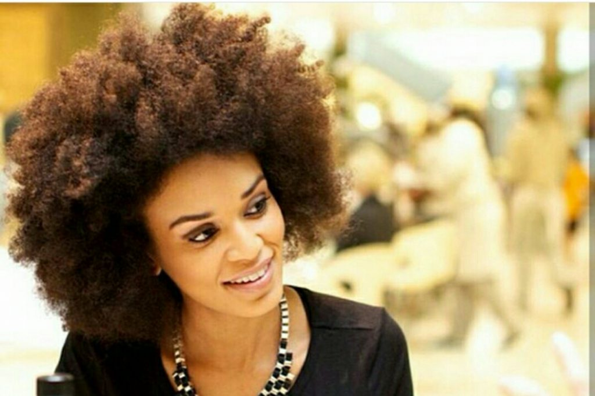

# Dry Natural Hair? See How to Fix That in 7 Simple Ways!

[Natural Hair](https://estheradeniyi.com/category/natural-hair/)
# Dry Natural Hair? See How to Fix That in 7 Simple Ways!

by [Esther Adeniyi](https://estheradeniyi.com/author/esther-adeniyi/)on [June 22, 2016May 25, 2018](https://estheradeniyi.com/dry-natural-hair-solution/)[Leave a Comment on Dry Natural Hair? See How to Fix That in 7 Simple Ways!](https://estheradeniyi.com/dry-natural-hair-solution/#respond)

Sharing is caring!

- [0](https://www.facebook.com/sharer/sharer.php?u=https%3A%2F%2Festheradeniyi.com%2Fdry-natural-hair-solution%2F&amp;t=Dry%20Natural%20Hair%3F%20See%20How%20to%20Fix%20That%20in%207%20Simple%20Ways%21)
- [0](https://twitter.com/intent/tweet?text=Dry%20Natural%20Hair%3F%20See%20How%20to%20Fix%20That%20in%207%20Simple%20Ways%21&amp;url=https%3A%2F%2Festheradeniyi.com%2Fdry-natural-hair-solution%2F)
- [0](#)

0shares

&#xA0;
Photo via @crowning.glory
There are days and there are days when the totality of my natural hair just gets me annoyed. Heck yeah! One of the problems I face the most is dryness and that&#x2019;s about almost every Naturalista&#x2019;s problem. Dealing with dry natural hair is one of the reasons many naturalistas rescinded on the decison to go natural I have an oily skin and that extends to my scalp. This naturally rules out the probable cause- scalp not producing enough oil.

Reasons why our natural hair dries out are lack of adequate oil production from the scalp or escape of the hair moisture. There are therefore several ways to trap in moisture and also moisturise the hair.

Use hydrating or moisturising shampoos

Whenever you are shopping for shampoos in the market, check out for &#x2018;hydrating&#x2019; or moisturising&#x2019;. It will help to replenish lost moisture as you wash. Avoid using shampoos that contain alcohol or sulfates, &#xA0;they are a no no for you. Also be sure to detangle with your hands or a wide tooth comb when your hair is still wet.

Stop over-shampooing

There is a common mistake we make and that&#x2019;s shampooing too frequently. I used to be like that until my hair started becoming too crispy. Crispy Crispy isn&#x2019;t nice at all, &#xA0;you know. If you must shampoo frequently, &#xA0;an alternative is to co-wash. Co-washing is using rinse off conditioners instead of shampoos.

Tone down the heat

Too much of heat denatures hair protein. It also results in dry natural afro hair. If you must apply heat to set your hair, &#xA0;it&#x2019;s wise to go on low heat. Better still,&#xA0; air dry your natural hair. Hot curling irons and hot hair straighteners are major problems; use less of these.

Deep condition over the night

This helps to replenish your roots with nutrients. As a result, &#xA0;you wake up with softer, &#xA0;silky hair. Apply a good deep conditioner. I use extra virgin olive oil hair mayonnaise for my own hair, it is one of the best leave in conditioner for dry natural hair. Cover or wrap it up and then style in the morning. You &#xA0;can do this once a week.

Apply some oil

[Coconut oil ](https://www.estheradeniyi.com/5-steps-to-deep-condition-your-hair)has been my best oil for fixing dry natural hair. Olive oil, &#xA0;jojoba oil etc. are also good alternatives. Oils help to seal in moisture. I particularly like the [LOC method of hair care](https://www.estheradeniyi.com/natural-hair-what-is-loc-method).

Sleep in satin scarves or pillows

This helps to retain moisture in your hair. Other materials absorb oil from the hair. You can get satin scarves or pillows to keep oil from getting off your hair.

Eat healthy

Dry and brittle hair can be a sign of lack of vitamins. Eat balanced diet. Proteins are especially good for your hair.

So, &#xA0;this is basically it! &#xA0;Do you have any other methods you use to fix dry natural hair? Would you share with us? Tell us if you are planning to incorporate any of the above mentioned tips into your hair care routine.

Sharing is caring!

- [0](https://www.facebook.com/sharer/sharer.php?u=https%3A%2F%2Festheradeniyi.com%2Fdry-natural-hair-solution%2F&amp;t=Dry%20Natural%20Hair%3F%20See%20How%20to%20Fix%20That%20in%207%20Simple%20Ways%21)
- [0](https://twitter.com/intent/tweet?text=Dry%20Natural%20Hair%3F%20See%20How%20to%20Fix%20That%20in%207%20Simple%20Ways%21&amp;url=https%3A%2F%2Festheradeniyi.com%2Fdry-natural-hair-solution%2F)
- [0](#)

0shares

Tags:[Natural Hair](https://estheradeniyi.com/tag/natural-hair/)