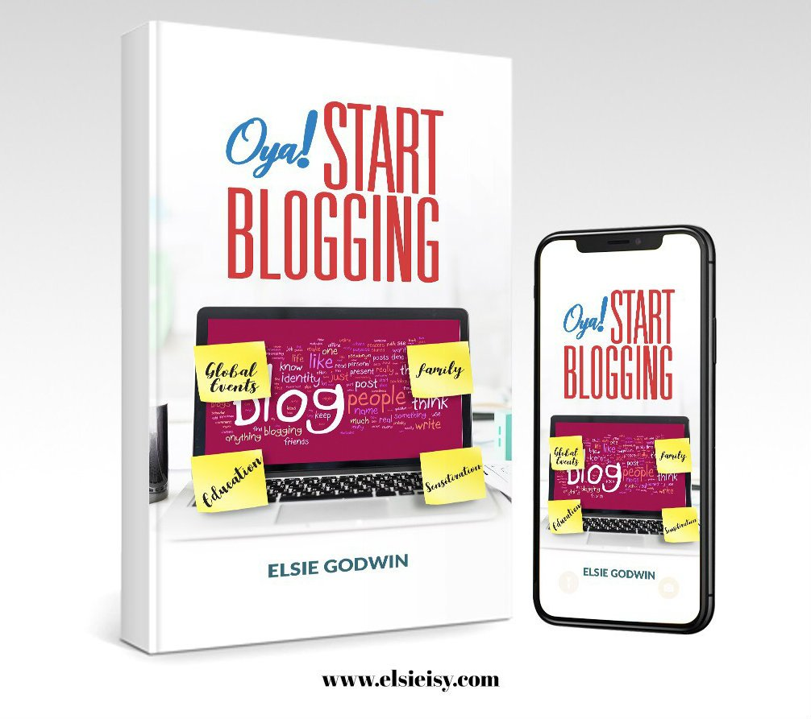

# Elsie Godwin Launches Her Book Titled Oya Start Blogging

[Blogging Resources](https://estheradeniyi.com/category/blogging-resources/)
# Elsie Godwin Launches Her Book Titled Oya Start Blogging

by [Esther Adeniyi](https://estheradeniyi.com/author/esther-adeniyi/)on [April 13, 2018May 4, 2018](https://estheradeniyi.com/elsie-godwin-oya-start-blogging/)[Leave a Comment on Elsie Godwin Launches Her Book Titled Oya Start Blogging](https://estheradeniyi.com/elsie-godwin-oya-start-blogging/#respond)

Sharing is caring!

- [0](https://www.facebook.com/sharer/sharer.php?u=https%3A%2F%2Festheradeniyi.com%2Felsie-godwin-oya-start-blogging%2F&amp;t=Elsie%20Godwin%20Launches%20Her%20Book%20Titled%20Oya%20Start%20Blogging)
- [0](https://twitter.com/intent/tweet?text=Elsie%20Godwin%20Launches%20Her%20Book%20Titled%20Oya%20Start%20Blogging&amp;url=https%3A%2F%2Festheradeniyi.com%2Felsie-godwin-oya-start-blogging%2F)
- [0](#)

0shares

Popular Relationship Blogger, Elsie Godwin launches her book titled; Oya Start Blogging in Lagos, Nigeria.

The book which teaches both the young and old about
 the intricacies of blogging and how to go into it has eight chapters of
 insightful wisdom and knowledge which are timely and quite contemporary.

In her words, &#x201C;the aim of writing this book is
 to get more people blogging beyond the bounds of mere gossip. I want them to
 embrace blogging as a tool for change.&#x201D;

&#x201C;There is a great need to pass on this
 knowledge about the blogosphere especially where there are lots of heresies
 about blogging from several quarters.&#x201D;

Elsie who has won several awards globally was
 featured in the Top 20 Relationship Blogs across the globe in 2017.

**Oya
 Start Blogging** is a carefully crafted body of&#xA0; work by **Elsie Godwin**, detailed and rich
 with information that are positioned not only to right the wrong perception
 created by a few about blogging in the eyes of the right thinking world, but to
 inspire even more creative, conscious and capable minded that have thoughts
 about becoming bloggers, writers or any other form of literary connoisseur in
 Nigeria to pick up their pen and bleed the ink on the papers for the world to
 embrace, enjoy and be informed.

The 31 page book has already started gaining global
 attention as top bloggers across the globe are said to have requested a copy of
 the book.

She further encouraged Nigerians to promote the
 reading culture among the citizens, stating that there is a need to look into
 the books and guides to succeed in life.

To celebrate her birthday, the book can be
 downloaded for free for the next 7 days via [HERE](https://www.elsieisy.com/oya-start-blogging-elsie-godwin/) ([https://www.elsieisy.com/oya-start-blogging-elsie-godwin/](https://www.elsieisy.com/oya-start-blogging-elsie-godwin/) )

Elsie Godwin is an On-Air-Personality, social media
 consultant, influencer, Transcriber and blogger behind the award-winning
 Literary, Lifestyle and Relationship blog ELSiEiSY.COM, and the TV show &#x2013; Crux
 of the Matter. She also has a corner on Guardian Life Nigeria where she writes
 her opinion on Relationships and Lifestyle related matters. She also co-hosts
 HeartMatters on Lagos Traffic Radio (96.1FM).

She is passionate about raising awareness on the
 fight against Rape, Domestic Violence, Sex education and Sexual Health, Mental
 Health Issues, struggles of orphanages, Sickle Cell Diseases and societal
 stigmatization.

&#xA0;

Sharing is caring!

- [0](https://www.facebook.com/sharer/sharer.php?u=https%3A%2F%2Festheradeniyi.com%2Felsie-godwin-oya-start-blogging%2F&amp;t=Elsie%20Godwin%20Launches%20Her%20Book%20Titled%20Oya%20Start%20Blogging)
- [0](https://twitter.com/intent/tweet?text=Elsie%20Godwin%20Launches%20Her%20Book%20Titled%20Oya%20Start%20Blogging&amp;url=https%3A%2F%2Festheradeniyi.com%2Felsie-godwin-oya-start-blogging%2F)
- [0](#)

0shares

Tags:[Collaborations](https://estheradeniyi.com/tag/collaborations/)[Press release](https://estheradeniyi.com/tag/press-release/)