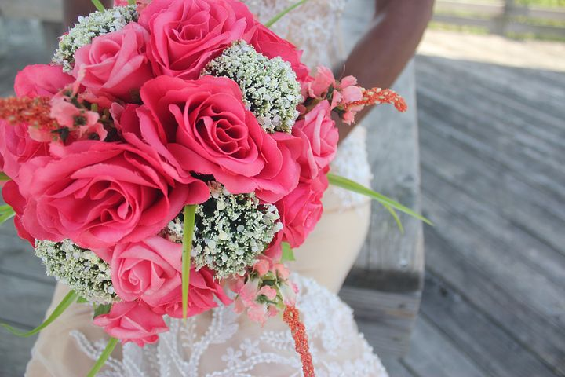

# Epistles to Colleen #6: You were not born for Marriage

[Life](https://estheradeniyi.com/category/life/)
# Epistles to Colleen #6: You were not born for Marriage

by [Esther Adeniyi](https://estheradeniyi.com/author/esther-adeniyi/)on [October 5, 2017May 25, 2018](https://estheradeniyi.com/epistles-to-colleen-6-you-were-not-born/)[Leave a Comment on Epistles to Colleen #6: You were not born for Marriage](https://estheradeniyi.com/epistles-to-colleen-6-you-were-not-born/#respond)

Sharing is caring!

- [0](https://www.facebook.com/sharer/sharer.php?u=https%3A%2F%2Festheradeniyi.com%2Fepistles-to-colleen-6-you-were-not-born%2F&amp;t=Epistles%20to%20Colleen%20%236%3A%20You%20were%20not%20born%20for%20Marriage)
- [0](https://twitter.com/intent/tweet?text=Epistles%20to%20Colleen%20%236%3A%20You%20were%20not%20born%20for%20Marriage&amp;url=https%3A%2F%2Festheradeniyi.com%2Fepistles-to-colleen-6-you-were-not-born%2F)
- [3](#)

3shares

We can&#x2019;t say we&#x2019;ve begun to grow if we don&#x2019;t find the origin of our mindset; the platform that birthed our strongholds.

The stronghold that was sold to you that you were created for marriage.

And so from birth, the Nigerian System begins preparing you for marriage. Your aspiration for marriage didn&#x2019;t begin when you entered into a love relationship. It began because you were born into a patriarchal society that is Nigeria.

Your Parents inherited that mindset grooming you in all things for the [purpose of marriage](https://www.estheradeniyi.com/why-do-you-want-to-get-married).

The society which functions basically through your Mother begins teaching you how to be marriageable; living a life from a tender age for the purpose of achieving marriage.

You see, the Nigerian system is wired to typically&#xA0;neglect your basic rights to be a female; the right to education, the right to choose your spouse, the right to be a child, the right to air your thoughts, the right to dress as you choose, the right to be polygamous,&#x2026;Related: [How to handle the pressure to get married](https://www.estheradeniyi.com/how-to-handle-pressure-to-get-married)

A society that thinks to be a female is to be a second class citizen, who should be grateful for the [institution of marriage](http://glowville.net/first-year-in-marriage-lessons/) that at least gives her a little voice to be heard.

A society where the average single lady doesn&#x2019;t have the right to air her views because she is a Miss and is yet to have a &#x2018;crown of glory&#x2019;.

Where females are expected to cower and act in a certain disposition even if different from their true selves so they could attract a male who&#x2019;d do them a favor of making them a Mrs.

They tell them to act like this, speak like that, walk slowly, speak gently, don&#x2019;t be too independent, don&#x2019;t act too intelligently, be dumb most times, don&#x2019;t speak out because [marriage to them seems to be the most important](https://www.estheradeniyi.com/when-is-best-time-to-get-married) thing.

They tell you you can&#x2019;t be beautiful and intelligent at the same time as if beauty is the antonym of intelligence.

The society never asks you what you want. Instead it forces on you it&#x2019;s idea of who you are to be. It believes a man is the head even outside marriage and the man begins to assume privileges.

That&#x2019;s why it&#x2019;s important you find yourself amidst this fixated idea of who you should be.

Never accept the society&#x2019;s definition of you. It&#x2019;s a hoax at best. A misinterpretation and misrepresentation of your identity.

A quick assemblage&#xA0; by a chauvinistic low self esteemed male who can&#x2019;t deal with your growth.

Live beyond expected dispositions and aspirations.&#xA0;Soar above predicted outcomes.&#xA0;Don&#x2019;t live for marriage. [Live in marriage when it&#x2019;s time](http://www.huffingtonpost.ca/debra-macleod/living-with-your-partner_b_4688489.html).

I celebrate you regardless of your marital status.

Sharing is caring!

- [0](https://www.facebook.com/sharer/sharer.php?u=https%3A%2F%2Festheradeniyi.com%2Fepistles-to-colleen-6-you-were-not-born%2F&amp;t=Epistles%20to%20Colleen%20%236%3A%20You%20were%20not%20born%20for%20Marriage)
- [0](https://twitter.com/intent/tweet?text=Epistles%20to%20Colleen%20%236%3A%20You%20were%20not%20born%20for%20Marriage&amp;url=https%3A%2F%2Festheradeniyi.com%2Fepistles-to-colleen-6-you-were-not-born%2F)
- [3](#)

3shares

Tags:[Life](https://estheradeniyi.com/tag/life/)[marriage](https://estheradeniyi.com/tag/marriage/)