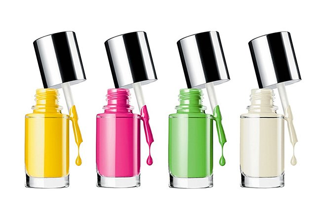

# Essential tips to Know your perfect nail polish shade

[Beauty](https://estheradeniyi.com/category/beauty/)
# Essential tips to Know your perfect nail polish shade

by [Esther Adeniyi](https://estheradeniyi.com/author/esther-adeniyi/)on [October 19, 2017May 25, 2018](https://estheradeniyi.com/essential-tips-to-know-your-perfec/)[Leave a Comment on Essential tips to Know your perfect nail polish shade](https://estheradeniyi.com/essential-tips-to-know-your-perfec/#respond)

Sharing is caring!

- [0](https://www.facebook.com/sharer/sharer.php?u=https%3A%2F%2Festheradeniyi.com%2Fessential-tips-to-know-your-perfec%2F&amp;t=Essential%20tips%20to%20Know%20your%20perfect%20nail%20polish%20shade)
- [0](https://twitter.com/intent/tweet?text=Essential%20tips%20to%20Know%20your%20perfect%20nail%20polish%20shade&amp;url=https%3A%2F%2Festheradeniyi.com%2Fessential-tips-to-know-your-perfec%2F)
- [3](#)

3shares

Ladies want to have their nails done beautifully well. Well painted and fitting nails are always admired. But sometimes, in trying to make our nails beautiful we end up having an ugly nails?
 We just found help for the trouble, no more of using wrong [nail polish](https://www.estheradeniyi.com/5-ways-to-make-your-nail-polish-last) colours.

A good place to start from is your skin colour. The nail polish you&#x2019;re using must blend with your skin colour. Let&#x2019;s see some of the nail polish colours you can use, in accordance to your skin colour.

* DARK SKIN
 As unlike what so many people think, deep shades are the best for dark skinned

Suitable Nail Polish for dark skin

*Red
 *Purples
 *Bright orange
 Avoid anything in pastel or that is too light as it can give a washed out appearance.

* TAN SKIN
 Tan Skin or Medium skin tones can wear a number of shades with ease. Some of which are
 *Light pink
 *Purple
 *Blues
 *Red
 *Peach
 Avoid shades of gold and rust

[You might like to read about Vaseline beauty hacks here](https://www.estheradeniyi.com/these-vaseline-beauty-hacks-will-make)

*FAIR SKIN
 people with fair skin can comfortably use any light shade nail polish

*All kinds of pastel shades
 *Dark red and ruby shades
 *Purple
 *Silver, white, pale pinks
 *Blue, orange, peach
 Avoid using dark shades nail polish except reds.

Knowing this now, you&#x2019;re in for a turn around in the appearance of your nails.
 You can even help the salonist to [pick the correct nail polish color](http://beauty.allwomenstalk.com/tips-for-choosing-the-right-nail-polish-color) for your shade if you are getting your nail done in a salon
 ??

Photo credit : [Style Caster](http://stylecaster.com/beauty/beauty-buzz-clinique-launches-a-new-nail-polish-how-to-trim-your-own-bangs-more/)

Sharing is caring!

- [0](https://www.facebook.com/sharer/sharer.php?u=https%3A%2F%2Festheradeniyi.com%2Fessential-tips-to-know-your-perfec%2F&amp;t=Essential%20tips%20to%20Know%20your%20perfect%20nail%20polish%20shade)
- [0](https://twitter.com/intent/tweet?text=Essential%20tips%20to%20Know%20your%20perfect%20nail%20polish%20shade&amp;url=https%3A%2F%2Festheradeniyi.com%2Fessential-tips-to-know-your-perfec%2F)
- [3](#)

3shares

Tags:[Beauty](https://estheradeniyi.com/tag/beauty/)[nail polish](https://estheradeniyi.com/tag/nail-polish/)[nails](https://estheradeniyi.com/tag/nails/)