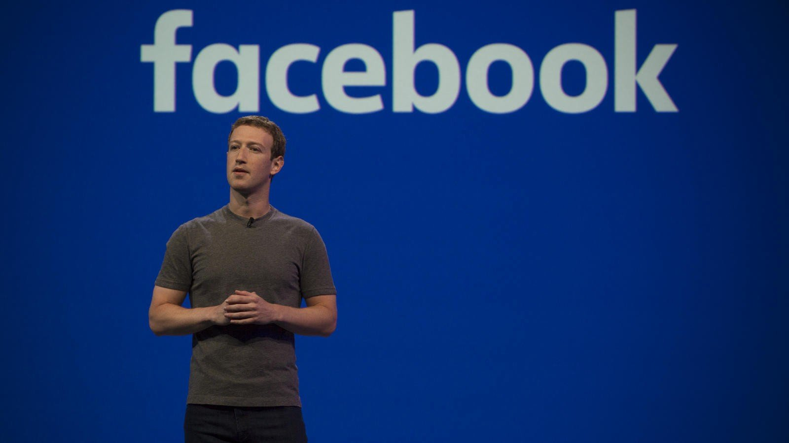

# Facebook to launch dating service

[News](https://estheradeniyi.com/category/news/)
# Facebook to launch dating service

by [Esther Adeniyi](https://estheradeniyi.com/author/esther-adeniyi/)on [May 2, 2018May 25, 2018](https://estheradeniyi.com/facebook-launch-dating-service/)[Leave a Comment on Facebook to launch dating service](https://estheradeniyi.com/facebook-launch-dating-service/#respond)

Sharing is caring!

- [11](https://www.facebook.com/sharer/sharer.php?u=https%3A%2F%2Festheradeniyi.com%2Ffacebook-launch-dating-service%2F&amp;t=Facebook%20to%20launch%20dating%20service)
- [0](https://twitter.com/intent/tweet?text=Facebook%20to%20launch%20dating%20service&amp;url=https%3A%2F%2Festheradeniyi.com%2Ffacebook-launch-dating-service%2F)
- [0](#)

11shares

## Facebook to launch dating service

Mark Zuckerberg, founder of one of the most popular [social media platforms](https://estheradeniyi.com/top-social-media-apps-in-nigeria/), Facebook, has announced that Facebook will soon be launching a new dating feature as part of its services.

According to [Linda Ikeji](https://www.lindaikejisblog.com/2018/5/facebook-announces-plan-to-launch-dating-service.html),

Zuckerberg unveiled the plans as he addressed Facebook&#x2019;s annual developers conference in San Jose, California emphasizing that the focus would be on helping people find long-term partners. &#x201C;This is going to be for building real, long-term relationships, not just hook-ups&#x201D;.

He said in presenting the new feature, noting that one in three marriages in the United States start online and that some 200 million Facebook users identify as being single. Under the new feature, users will be able to create a separate &#x201C;dating&#x201D; profile not visible to their network of friends, with potential matches recommended based on dating preferences, points in common, and mutual acquaintances.

Zuckerberg did not specify whether the feature would be free of charge, in line with Facebook&#x2019;s core offer but the announcement was enough to send shares in the online dating giant Match.com tumbling by 17 percent. The 33-year-old CEO also said the dating offer was built from the ground-up with privacy and safety in mind, as he underscored the firm&#x2019;s commitment to boosting privacy protections.

Source: [Linda Ikeji](https://www.lindaikejisblog.com/2018/5/facebook-announces-plan-to-launch-dating-service.html)

## Video on Facebook dating app

What do you think about Facebook dating service guys? I hope this is not going to be another platform to cause more fraud? I know that Facebook has reassured but then, does it stop at that?

Sharing is caring!

- [11](https://www.facebook.com/sharer/sharer.php?u=https%3A%2F%2Festheradeniyi.com%2Ffacebook-launch-dating-service%2F&amp;t=Facebook%20to%20launch%20dating%20service)
- [0](https://twitter.com/intent/tweet?text=Facebook%20to%20launch%20dating%20service&amp;url=https%3A%2F%2Festheradeniyi.com%2Ffacebook-launch-dating-service%2F)
- [0](#)

11shares

Tags:[Facebook](https://estheradeniyi.com/tag/facebook/)[News](https://estheradeniyi.com/tag/news/)