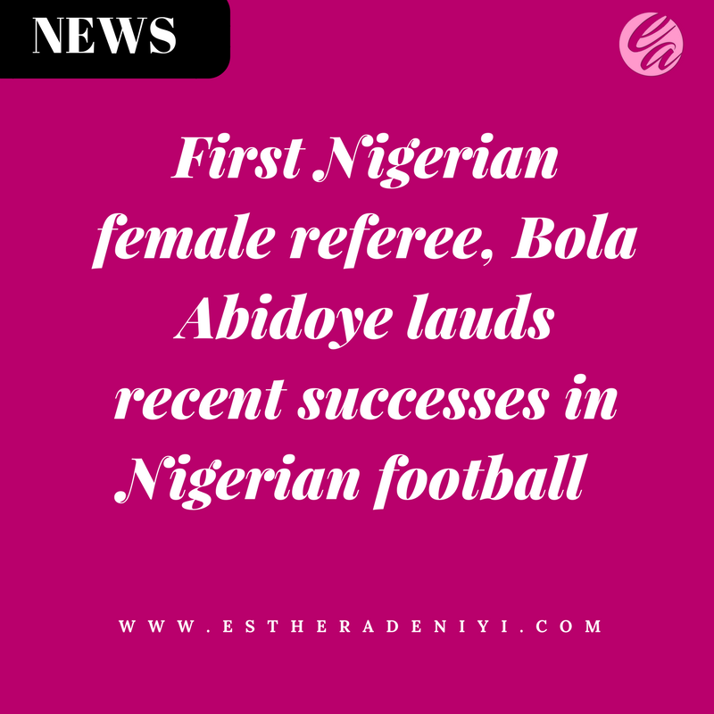

# First Nigerian female referee, Bola Abidoye lauds recent successes in Nigerian football

[News](https://estheradeniyi.com/category/news/)
# First Nigerian female referee, Bola Abidoye lauds recent successes in Nigerian football

by [Esther Adeniyi](https://estheradeniyi.com/author/esther-adeniyi/)on [October 11, 2017May 25, 2018](https://estheradeniyi.com/first-nigerian-female-referee-bola/)[Leave a Comment on First Nigerian female referee, Bola Abidoye lauds recent successes in Nigerian football](https://estheradeniyi.com/first-nigerian-female-referee-bola/#respond)

Sharing is caring!

- [0](https://www.facebook.com/sharer/sharer.php?u=https%3A%2F%2Festheradeniyi.com%2Ffirst-nigerian-female-referee-bola%2F&amp;t=First%20Nigerian%20female%20referee%2C%20Bola%20Abidoye%20lauds%20recent%20successes%20in%20Nigerian%20football)
- [0](https://twitter.com/intent/tweet?text=First%20Nigerian%20female%20referee%2C%20Bola%20Abidoye%20lauds%20recent%20successes%20in%20Nigerian%20football&amp;url=https%3A%2F%2Festheradeniyi.com%2Ffirst-nigerian-female-referee-bola%2F)
- [0](#)

0shares

&#xA0;

#### A former FIFA-badged referee, Bola Abidoye, on Tuesday said
 recent successes recorded in [Nigerian football](http://myhomepage.ng/nigerian-footballs-gradual-improvement-is-heart-gladdening-says-first-female-fifa-badged-referee/) indicate a good path to
 development and everlasting growth.

Abidoye, who is the Vice-Chairman of Kaduna State Referees
 Council stated this in Zaria, Kaduna State that it was heart-warming that
 Nigerian football was improving daily.

&#x201C;Our recent matches at senior level against Cameroon and
 Zambia show we have greatly improved.

&#x201C;It is also gratifying to note that Nigeria is the first
 African country to qualify for the 2018 FIFA World Cup finals.

&#x201C;These are good indicators of development. So, we must
 appreciate the players&#x2019; efforts,&#x2019;&#x2019; she said.

Abidoye who was the first Nigerian female referee to be
 badged by FIFA however pointed out that women football in Nigeria has also
 grown considerably in Nigeria.

&#x201C;The women are also doing well, if we go back to the
 Falconets&#x2019; victory against Tanzania some weeks ago.[Related: Folorunsho Alakija launches Flourish Africa](https://www.estheradeniyi.com/folorunsho-alakija-launches-flourish)

&#x201C;So, we must appreciate the fact that Nigerian football has
 been growing at all levels, and we should be happy with that,&#x201D; she said.

Turning to the domestic league, Abidoye said the quality of
 the 2016/2017 Nigeria Professional Football League (NPFL) which Plateau United
 Football Club of Jos won was another indicator of development.

&#x201C;There is a big difference now from what used to be some
 years back. We are having young and talented players who have the heart to play
 the game not for anything other than the good of the game.

&#x201C;And this is why we have so many of them looking good enough
 to play for bigger clubs outside Nigeria.

&#x201C;Also, a lot of our players are performing well in Europe,
 and this means we are surely there.

&#x201C;To me, we have arrived and we shall bring the FIFA World
 Cup to Nigeria one day,&#x201D;she noted.

Abidoye also said football administration in Nigeria has
 improved, with the board members of Nigeria Football Federation (NFF) trying
 their best to bring in some improvements too.

Speaking about football officiating in Nigeria, Abidoye who
 officiated at several times at the continental and global levels said Nigerian
 referees have been equal to the task.[Related: Ire Aderinokun, Nigeria&#x2019;s first female Google developer expert](https://www.estheradeniyi.com/ire-aderinokun-nigerias-first-female)

&#x201C;Because we have many young and talented referees, during
 the World Cup qualifying matches some of them officiated and they did very
 well.

&#x201C;None of them was sanctioned, or suspended, while one of
 them who went to Egypt came first.

&#x201C;So, we are very proud of them, and they have been
 positively complementing the growth of football in Nigeria and Africa,&#x201D; she
 said.

&#xA0;

NANNews source: [Vanguard](https://www.vanguardngr.com/2017/10/nigerian-footballs-gradual-improvement-heart-gladdening-says-first-female-fifa-badged-referee/)

Sharing is caring!

- [0](https://www.facebook.com/sharer/sharer.php?u=https%3A%2F%2Festheradeniyi.com%2Ffirst-nigerian-female-referee-bola%2F&amp;t=First%20Nigerian%20female%20referee%2C%20Bola%20Abidoye%20lauds%20recent%20successes%20in%20Nigerian%20football)
- [0](https://twitter.com/intent/tweet?text=First%20Nigerian%20female%20referee%2C%20Bola%20Abidoye%20lauds%20recent%20successes%20in%20Nigerian%20football&amp;url=https%3A%2F%2Festheradeniyi.com%2Ffirst-nigerian-female-referee-bola%2F)
- [0](#)

0shares

Tags:[Football](https://estheradeniyi.com/tag/football/)[News](https://estheradeniyi.com/tag/news/)[sports](https://estheradeniyi.com/tag/sports/)[Women Empowerment](https://estheradeniyi.com/tag/women-empowerment/)