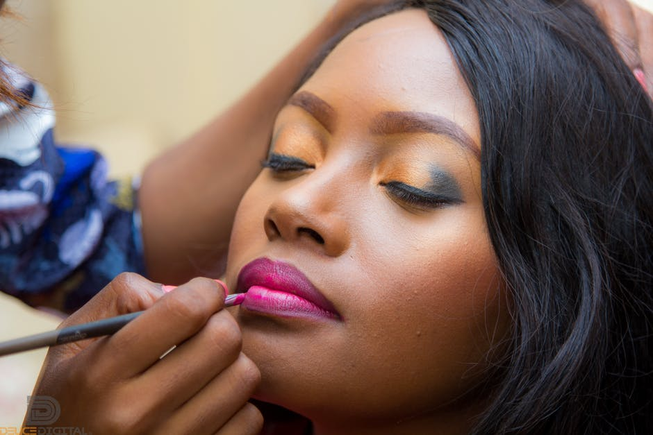

# 5 Steps to Flawless Lipstick Application

[Beauty](https://estheradeniyi.com/category/beauty/)
# 5 Steps to Flawless Lipstick Application

by [Esther Adeniyi](https://estheradeniyi.com/author/esther-adeniyi/)on [December 5, 2017May 25, 2018](https://estheradeniyi.com/flawless-lipstick-application/)[Leave a Comment on 5 Steps to Flawless Lipstick Application](https://estheradeniyi.com/flawless-lipstick-application/#respond)

Sharing is caring!

- [0](https://www.facebook.com/sharer/sharer.php?u=https%3A%2F%2Festheradeniyi.com%2Fflawless-lipstick-application%2F&amp;t=5%20Steps%20to%20Flawless%20Lipstick%20Application)
- [0](https://twitter.com/intent/tweet?text=5%20Steps%20to%20Flawless%20Lipstick%20Application&amp;url=https%3A%2F%2Festheradeniyi.com%2Fflawless-lipstick-application%2F)
- [4](#)

4shares

I stare at my colleague as I write now and damn, she fine. It&#x2019;s either she has a hang of lipstick mistakes and she&#x2019;s been able to master the art of avoiding lipstick issues or she is just naturally a lipstick genius.

Trust me, lipstick is my number one makeup item. I would rather not go out without a lipstick. I think I can categorically say why. My lips are not pink, one. I am on a journey to having supple lips, two. In conclusion, my lip esteem is low, thank you.

Over the years I have made so many lipstick mistakes and you don&#x2019;t want to know how much of ugly my lips ended up all of those times. Is it bleeding lips or wrong lipstick colour, uneven pigmentation, which one? Many lipstick disasters babe.

These days, I have been getting comments everywhere about my perfect lips. I moved from rubbish lipstick finish to totally kissable lips. Glory.

I decided to kukuma come and share with you people. Hopefully, some of you, my blog readers need this. If you get in here through Google, I hope that this is useful. I would be glad to hear from you in the comments section.

Contents

- [1 Below are my steps to flawless lipstick application:](#Below_are_my_steps_to_flawless_lipstick_application)
- [2 Step 1: Exfoliate your lips](#Step_1_Exfoliate_your_lips)
- [3 Step 2: Massage your lips with a moisturizer](#Step_2_Massage_your_lips_with_a_moisturizer)
- [4 Step 3: Line your lips](#Step_3_Line_your_lips)
- [5 Step 4: Apply your lipstick](#Step_4_Apply_your_lipstick)
- [6 Step 5: Dab your lips with tissue paper](#Step_5_Dab_your_lips_with_tissue_paper)
- [7 Extra steps to flawless lips:](#Extra_steps_to_flawless_lips)

## Below are my steps to flawless lipstick application:

## Step 1: Exfoliate your lips

You can [do this with a toothbrush](https://www.estheradeniyi.com/a-simple-way-to-exfoliate-your-lips) or with a sugar scrub. I usually do this with a toothbrush. It&#x2019;s very simple. First, you wet your toothbrush with water and gently move on your lips in a circular motion. This will help you to get rid of the dead cells on the surface of your lips.

The rough patches you are getting rid of are what make your lipstick rough at the end of your lipstick application. It&#x2019;s therefore good to prepare your lips by [exfoliating](https://www.estheradeniyi.com/best-tips-to-exfoliating-your-face) them.

## Step 2: Massage your lips with a moisturizer

After you exfoliate your lips, dab on it a cotton wool or tissue paper. After patting it dry, apply a good moisturizer on it and massage deeply. This will help to leave your lips succulent in preparation for a perfect lipstick finish.

I usually use coconut oil to massage my lips. On some other days, I use my body cream e.g Nivea moisturizer to massage them. You can also use [vaseline](https://www.estheradeniyi.com/these-vaseline-beauty-hacks-will-make) to achieve the same results. You will see the visible result on your skin as soon as you are done with step 2.

## Step 3: Line your lips

This step is optional. It is optional because some people have mastered the art of applying lipstick and not have their lips bleeding. Choose a colour similar to your lipstick and carefully line your lips with it. Not only does lining your lips help avoid bleeding lips, it helps you to define your lips.

## Step 4: Apply your lipstick

In smooth swipes, apply your lipstick in one direction and fill it in. I always try not to rub my lips together to set my lipstick because I don&#x2019;t like the final look. I create the intensity and smoothness I want with the lipstick itself.

## Step 5: Dab your lips with tissue paper

For lipsticks that are not glossy, you may like to dab excess shine off the lipstick. The matte look gives a better finishing.

## Extra steps to flawless lips:

&#x2013; Take with you the lipstick whose colour you applied. It is to help retouch the rest of the day.
 &#x2013; Insert a finger into your mouth and pull out. You will most definitely see a lipstick stain on your hand if you have excess lipstick. Excess lipstick could spoil your overall look and put stains on your teeth.
 &#x2013; You can also apply concealer or primer before your lipstick to help magnify the colour effect.

Related: [How to create the perfect ombre lips](https://www.estheradeniyi.com/how-to-create-perfect-ombre-lips-step)

Sharing is caring!

- [0](https://www.facebook.com/sharer/sharer.php?u=https%3A%2F%2Festheradeniyi.com%2Fflawless-lipstick-application%2F&amp;t=5%20Steps%20to%20Flawless%20Lipstick%20Application)
- [0](https://twitter.com/intent/tweet?text=5%20Steps%20to%20Flawless%20Lipstick%20Application&amp;url=https%3A%2F%2Festheradeniyi.com%2Fflawless-lipstick-application%2F)
- [4](#)

4shares

Tags:[Beauty](https://estheradeniyi.com/tag/beauty/)[lipstick](https://estheradeniyi.com/tag/lipstick/)[makeup](https://estheradeniyi.com/tag/makeup/)