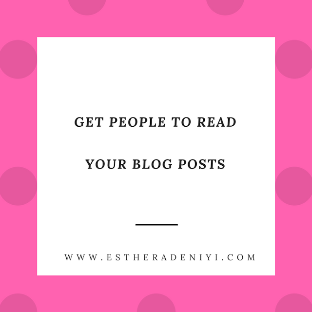

# Getting Your Readers to Actually Read Your Blog Posts

[Uncategorized](https://estheradeniyi.com/category/uncategorized/)
# Getting Your Readers to Actually Read Your Blog Posts

by [Esther Adeniyi](https://estheradeniyi.com/author/esther-adeniyi/)on [May 5, 2017April 27, 2018](https://estheradeniyi.com/getting-readers-to-read-your-blog-posts/)[6 Comments on Getting Your Readers to Actually Read Your Blog Posts](https://estheradeniyi.com/getting-readers-to-read-your-blog-posts/#comments)

Sharing is caring!

- [0](https://www.facebook.com/sharer/sharer.php?u=https%3A%2F%2Festheradeniyi.com%2Fgetting-readers-to-read-your-blog-posts%2F&amp;t=Getting%20Your%20Readers%20to%20Actually%20Read%20Your%20Blog%20Posts)
- [0](https://twitter.com/intent/tweet?text=Getting%20Your%20Readers%20to%20Actually%20Read%20Your%20Blog%20Posts&amp;url=https%3A%2F%2Festheradeniyi.com%2Fgetting-readers-to-read-your-blog-posts%2F)
- [0](#)

0shares

 An eye catching title is the first part of making your blog readable, it catches your reader&#x2019;s attention. Therefore, the first thing you need to do is to&#x2026;

1. Create Catchy Titles

Nowadays many a people just read the title and leave the actual story. This is actually from experience, In my hostel &#x201C;Awolowo hall&#x201D; obafemi awolowo university, when they visit nairaland, while eight out of 10 people will read the headline, only two out of 10 will read the rest.

Therefore, your main goal from the beginning is to find a catchy way to attract people to read that first paragraph because if they stop at the title, then your effort spent on writing the content is wasted.

Your title is like your personal appearance &#x2014; your title is majorly the first impression most readers use to judge the content. For this reason, your title should have some, if not all, of the following elements.

Understanding: Your reader should gain a general understanding about the topic of your content.

Curiousity: Never give away too much while describing your content to your reader, just give the reader enough information to make them click through to the first paragraph.

Value: What reason do readers have for reading your content? In general, understand that value comes in two ways &#x2014; making your reader happier or wealthier.

Stand Out: Unusual titles, like &#x2018;a lady in red in a sea of black suits&#x2019;, &#xA0;stands out. How can you frame your headline in a way that is unique and more interesting?

Urgency: Readers are more likely to read your content if it will no longer be relevant the next day.

To deliver great catchy titles to your readers, it takes practice, but the effort is worth it! Well written titles can increase your blog views by as much as 500 percent depending on how well you do!

Your style of writing has a big influence on your readability. if you want to deliver more entertaining, interesting and engaging content, consider getting a little creative and don&#x2019;t be afraid of inserting yourself into the conversation.

2. Determine The Length Of Your Post

There are different types of people with different styles when it comes to reading but majorly we will be discussing two which are&#x2026;

I. people who enjoy short, quick bursts of information delivered in bullet points and hyperlink.

II. People who love longer content (usually between 1,500 to 3,000 words.)

Presently the settle&#x2026; ? Discover how to balance the situation. Writing long and extensive articles everytime can be very challenging and a number of your readers may not need that.
 Write short content that will engage and interest your readers and include value, however add to your blend longer and more keen content.

4. Utilize Appealing Visuals

A standout or a unique way amongst the best approaches to make your articles clear is by changing it to a visual format, for example, an infographic, slide deck or even a video. Doing as such requires that you separate your substance to its total stripped down, which once more, for your readers makes it substantially less demanding to consume.

Likewise, while adding pictures to your post may not really make content more meaningful, high effect visuals will help make it differentiable and also noticeable.

What action(s) are you going to take to get readers to actually read your blog posts? What has been working so far?

This guest post is by Fisayo Adedoyin.
 You can find him [blogging here.&#xA0;](http://www.flywaterz.com/)

 P.S- Have you subscribed to this blog yet? Please check below (mobile) or the side bar (desktop) to subscribe to weekly newsletters. Thank you for being a part of this web space.

Sharing is caring!

- [0](https://www.facebook.com/sharer/sharer.php?u=https%3A%2F%2Festheradeniyi.com%2Fgetting-readers-to-read-your-blog-posts%2F&amp;t=Getting%20Your%20Readers%20to%20Actually%20Read%20Your%20Blog%20Posts)
- [0](https://twitter.com/intent/tweet?text=Getting%20Your%20Readers%20to%20Actually%20Read%20Your%20Blog%20Posts&amp;url=https%3A%2F%2Festheradeniyi.com%2Fgetting-readers-to-read-your-blog-posts%2F)
- [0](#)

0shares

Tags:[Blogging](https://estheradeniyi.com/tag/blogging/)[Guest post](https://estheradeniyi.com/tag/guest-post/)