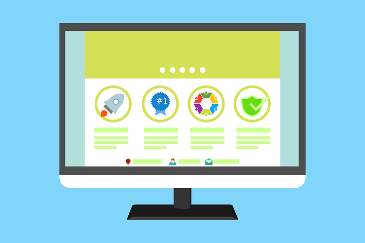

# How do I Earn Money as a Blogger?

[Uncategorized](https://estheradeniyi.com/category/uncategorized/)
# How do I Earn Money as a Blogger?

by [Esther Adeniyi](https://estheradeniyi.com/author/esther-adeniyi/)on [March 6, 2017April 27, 2018](https://estheradeniyi.com/how-do-i-earn-money-as-blogger/)[18 Comments on How do I Earn Money as a Blogger?](https://estheradeniyi.com/how-do-i-earn-money-as-blogger/#comments)

Sharing is caring!

- [0](https://www.facebook.com/sharer/sharer.php?u=https%3A%2F%2Festheradeniyi.com%2Fhow-do-i-earn-money-as-blogger%2F&amp;t=How%20do%20I%20Earn%20Money%20as%20a%20Blogger%3F)
- [0](https://twitter.com/intent/tweet?text=How%20do%20I%20Earn%20Money%20as%20a%20Blogger%3F&amp;url=https%3A%2F%2Festheradeniyi.com%2Fhow-do-i-earn-money-as-blogger%2F)
- [0](#)

0shares

 How do I monetize my blog? Why don&#x2019;t I earn from my blog like other [bloggers](https://www.estheradeniyi.com/7-ways-to-become-better-blogger)? My blog pays me so little, what do I do? Do bloggers really earn from their blogs? Who actually pays bloggers? These and many more questions are usually asked by many bloggers, &#xA0;especially the new and prospective bloggers.

These questions are valid because earning from your blog motivates you, it helps to cover some or all of the expenses involved in running your blog (e.g purchasing and renewing your blog hosting and domain, designing your blog, employing writers and editors, purchasing equipment like camera, system etc., running advertisements and so on and so forth). There is also nothing like paying yourself from your blog earnings, it&#x2019;s a dream come true.&#xA0;

I design blogs for bloggers and in the process, I get to advise and talk to them about how to make their blogs pop and earn from it. One of the first set of questions they ask is &#x2013; how do I earn money from my blog?

This blog post isn&#x2019;t going to be one of these numerous theoretically inclined blog monetizing posts all over the Internet. I am going to be as practical and real with you as possible. I won&#x2019;t come and raise your hopes and have you quit blogging because your expectations were cut short. I will tell you the nitty-gritty of this business.

Truth &#x2013; [you can earn money from your blog](https://smartblogger.com/make-money-blogging/)!

Lie- it is as easy as ABC!

A lot of general rules of blog monetization are splayed all around the Internet and it takes experience and wisdom to spot which and which won&#x2019;t ever work for you on your blog. I know that they have promised you blogging bliss and that it is only if Google Adsense approves your blog for their ad placement. It was easier for me to get approved because as it were, blogging in Nigeria wasn&#x2019;t this competitive in 2013. In fact, &#xA0;people rarely knew what blogging is all about.

I want to first of all debunk the idea that getting approved by Google Adsense is the ultimate and probably the only way to earn.

There are different many ways to earn on your blog as a Blogger. I however want you to understand that this depends on you, &#xA0;your intuition, your wisdom and your smartness. It has little to do with your blog traffic. Yes, &#xA0;I said that. Of course, blog traffic and reputation are doors to the gold room, what I mean is those are not the requirements to earning from your blog.

Let&#x2019;s discuss the most popular monetization strategies for you as a Blogger and how to benefit from them. This list is a compilation of what works here in Nigeria so it&#x2019;s not all there is to monetization.

Advert Placement

An example of this is the popular&#xA0;[Google Adsense](https://www.google.com/adsense/start/#?modal_active=none). There are also many others like Chitika, media.net, infolinks, BuySellAds, BlogAds etc. You can also put up a place on your blog for sale. To earn anything worthwhile from this type of monetization, you should have a considerable amount of traffic. There are two type of Ads:

-CPM Ads: they are also known as &#x2018;cost per 1,000 impresions&#x2019; ads. They pay you based on how many 1,000 people that view your Ads.

-CPC or PPC Ads: It means Cost per click or Pay per click ads respectively. You place banners or side ads ( some, responsive) on your blog and you are paid a commission any time a reader clicks on the Ad.

Speaking gigs

To earn from speaking gigs, you have to build authority in an aspect of blogging e.g branding, monetization, best practices etc. If after a long while of blogging, you see yourself as someone who can talk about blogging very well and can teach with enthusiasm, almost without difficulty, give speaking a shot. I am currently working with [Glowville](http://www.glowville.net/) on a seminar we will be holding very soon this year.

Offering Services&#xA0;

I primarily earn from offering services. I design blogs and offer consulting services. You can contact me if you would like to build, design, re-design or have me review your blog. You can also think up services you can offer for money. I have people patronize my services because I am an active blogger. I can invariably say that I earn indirectly from my blog.&#xA0;

You should look into areas you can earn money on account of your blogging. You can earn from designing graphics for people if you are a tech blogger. You can have a food delivery extension of your blog if you are a food blogger. You can offer fashion and image consulting services for people if you are a fashion/style blogger because you must have built authority through your fashion articles.

Sponsored posts

People who want to hold events can contact you to advertise it to your blog readers. It may also be a product or service. Brands do this very often. You may be fortunate to attract a brand in your niche through your blog links or social media marketing. Bloggers in your niche may also want to contact you to put up a post about them.

I have earned a few times by putting up a sponsored post on my blog and its social media accounts. You can wait for brands to approach you. You see, it gets to a point in your blogging life where you can&#x2019;t help but be noticed. You can&#x2019;t blog quality consistently and not be noticed. You can also approach brands too. Yes, can send a brand in your niche an email and tell them you can review one of their products and share your experience on your blog. The worst you can get is a no, nothing more.&#xA0;

Selling products

You can take up a brand&#x2019;s product and sell on your blog. It will move faster if it is related to what you blog. Say for example, you write book reviews, you can take up and market a friend&#x2019;s book and get your own commission. You can sell digital products like ebooks, apps, videos, music, online courses etc. You can create and sell your own ebook. It doesn&#x2019;t have to be voluminous.&#xA0;

Write about something you are passionate about, some very precious information you have been wanting to share. Make it into a simple ebook and get someone to design the book cover for you. Your blog is such a perfect platform to then market. You can also build some more authority on account of your ebook.

Affiliate marketing

This is almost like selling products too. The difference is that you don&#x2019;t meet the seller one on one. You place a piece of code on your blog, when a blog reader is interested in the product, he clicks. If he eventually buys the product, you receive a commission of it. Popular brands you can register for their affiliate marketing are Konga, Jumia, Amazon etc. You need to have a good amount of traffic to earn from this.

From this list, you see that there are direct and indirect methods of earning from your blog. You can earn directly by advert placement, [affiliate marketing](https://www.estheradeniyi.com/the-best-affiliate-sites-for-nigerian) etc. It&#x2019;s a matter of directly generating revenue right on your blog. Indirect methods of making money from your blogging are speaking gigs, offering services and any other method that generates you revenue because you have a blog. If you don&#x2019;t have a blog, chances of getting invited or applying to speak on blogging are slim.

Final word : you must be flexible enough to be patient. Assess your options, try a method at a time, use different tactics. No blogger got it right the first time they decided to monetize. Some bloggers have different streams of income. You don&#x2019;t have to stick to only the popular methods. In fact, you can even think up your own method. You can collaborate with other bloggers in order to earn something significant. Be patient. Starting a blog doesn&#x2019;t guarantee earning immediately.

Are you a blogger? How do you primarily [earn from your blog](https://amylynnandrews.com/how-to-make-money-blogging/)? Do you have multiple streams of income on your blog? Are you a new blogger? What monetization strategy are you looking at? Do you have any questions too? Please use the comments section.&#xA0;

Sharing is caring!

- [0](https://www.facebook.com/sharer/sharer.php?u=https%3A%2F%2Festheradeniyi.com%2Fhow-do-i-earn-money-as-blogger%2F&amp;t=How%20do%20I%20Earn%20Money%20as%20a%20Blogger%3F)
- [0](https://twitter.com/intent/tweet?text=How%20do%20I%20Earn%20Money%20as%20a%20Blogger%3F&amp;url=https%3A%2F%2Festheradeniyi.com%2Fhow-do-i-earn-money-as-blogger%2F)
- [0](#)

0shares

Tags:[Blogging](https://estheradeniyi.com/tag/blogging/)