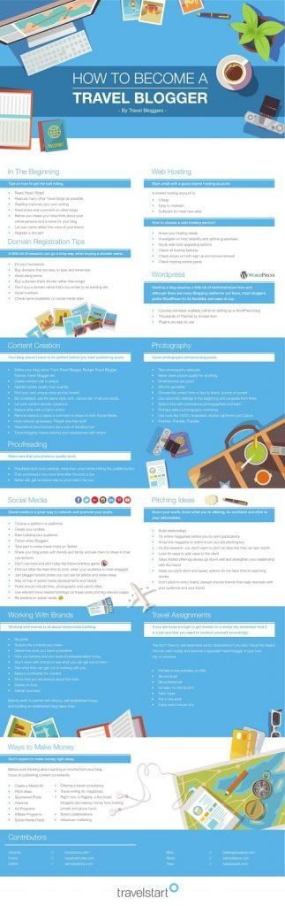

# (Infographic) How to Become a Travel Blogger

[Travel](https://estheradeniyi.com/category/travel/)
# (Infographic) How to Become a Travel Blogger

by [Esther Adeniyi](https://estheradeniyi.com/author/esther-adeniyi/)on [October 25, 2017May 25, 2018](https://estheradeniyi.com/how-to-become-travel-blogger/)[16 Comments on (Infographic) How to Become a Travel Blogger](https://estheradeniyi.com/how-to-become-travel-blogger/#comments)

Sharing is caring!

- [0](https://www.facebook.com/sharer/sharer.php?u=https%3A%2F%2Festheradeniyi.com%2Fhow-to-become-travel-blogger%2F&amp;t=%28Infographic%29%20How%20to%20Become%20a%20Travel%20Blogger)
- [0](https://twitter.com/intent/tweet?text=%28Infographic%29%20How%20to%20Become%20a%20Travel%20Blogger&amp;url=https%3A%2F%2Festheradeniyi.com%2Fhow-to-become-travel-blogger%2F)
- [0](#)

0shares

Travel blogging is fun as long as you know what you want to do. The process starts from deciding on what you want to blog about to actually blogging. There are so many in-between processes which involve getting an appropriate domain, actually traveling (hopefully, round the world), making your first travel post, gaining blog readers, making first time visitors [fall hopelessly in love with your blog](https://www.estheradeniyi.com/how-to-make-people-fall-hopelessly-in) and connecting with other bloggers in your niche.

Many times, new Travel Bloggers get confused along the line. In fact, some almost never know what to do with their travel blogs as they begin to incessantly brainstorm blog post ideas. I have to personally admit that the journey to being a successful blogger is full of a lot of ups and downs and that&#x2019;s why, really, it&#x2019;s just best to stand on the shoulders of those who have been there.

I, in conjunction with other Lifestyle/Travel Nigerian bloggers have collaborated with [TravelStart&#xA0;Nigeria](https://www.travelstart.com.ng/) to provide a very informative info-graphic. This material is to give you an overview of what it takes to be a Travel Blogger and how to successfully pull this off. It&#x2019;s a process, remember?

Find the &#x201C;How to Become a Travel Blogger&#x201D; Infographic below:

I understand that this infographic may not be as clear as you would like, you can request for a pdf version. Just send me your email in the comments section and I will send it to you within 24 hours.

&#xA0;

What do you think about this infographic? Are you ready to become a travel blogger? Go!

Related posts

[Proven ways to attract brands to work with you as a blogger](https://www.estheradeniyi.com/5-proven-ways-to-attract-brands-to-work)

[7 ways to become a better blogger](https://www.estheradeniyi.com/7-ways-to-become-better-blogger)

[How to connect with other bloggers](https://www.estheradeniyi.com/how-to-connect-with-other-bloggers)

&#xA0;

Sharing is caring!

- [0](https://www.facebook.com/sharer/sharer.php?u=https%3A%2F%2Festheradeniyi.com%2Fhow-to-become-travel-blogger%2F&amp;t=%28Infographic%29%20How%20to%20Become%20a%20Travel%20Blogger)
- [0](https://twitter.com/intent/tweet?text=%28Infographic%29%20How%20to%20Become%20a%20Travel%20Blogger&amp;url=https%3A%2F%2Festheradeniyi.com%2Fhow-to-become-travel-blogger%2F)
- [0](#)

0shares

Tags:[Blogging](https://estheradeniyi.com/tag/blogging/)[Collaborations](https://estheradeniyi.com/tag/collaborations/)[Travel](https://estheradeniyi.com/tag/travel/)[TravelStart](https://estheradeniyi.com/tag/travelstart/)