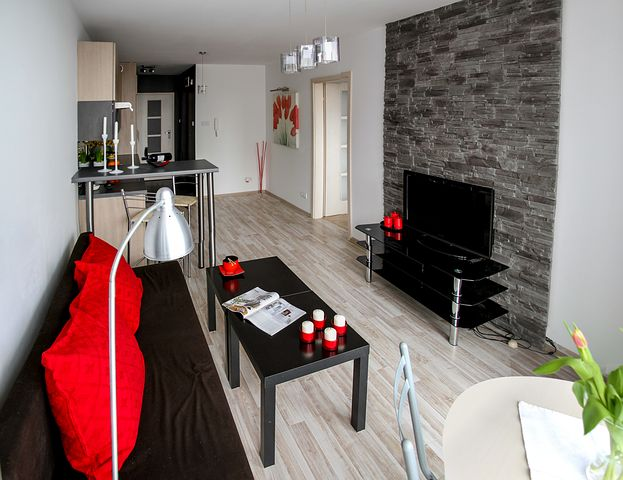

# How to find a good apartment in Lagos

[Real Estate](https://estheradeniyi.com/category/real-estate/)
# How to find a good apartment in Lagos

by [Esther Adeniyi](https://estheradeniyi.com/author/esther-adeniyi/)on [December 11, 2017May 25, 2018](https://estheradeniyi.com/how-to-find-good-apartment-in-lagos/)[4 Comments on How to find a good apartment in Lagos](https://estheradeniyi.com/how-to-find-good-apartment-in-lagos/#comments)

Sharing is caring!

- [0](https://www.facebook.com/sharer/sharer.php?u=https%3A%2F%2Festheradeniyi.com%2Fhow-to-find-good-apartment-in-lagos%2F&amp;t=How%20to%20find%20a%20good%20apartment%20in%20Lagos)
- [0](https://twitter.com/intent/tweet?text=How%20to%20find%20a%20good%20apartment%20in%20Lagos&amp;url=https%3A%2F%2Festheradeniyi.com%2Fhow-to-find-good-apartment-in-lagos%2F)
- [0](#)

0shares

February this year, I got a job at a [real estate](http://yokebay.com/real-estate-business-in-nigeria/) company in Lagos. Well, for those who know me really well, I can only navigate around two states in Nigeria successfully : Ogun state and Kwara state. I am particularly in love with Ilorin. This should be a stand alone blog post. I wish to settle down in Ilorin. The peace and tranquility, you can&#x2019;t compare to Lagos here.

Lagos drivers and bus conductors will ruin someone&#x2019;s day and still pretend that they will make heaven. I stumbled on an article about [cranky Lagos drivers on Forbes](https://www.forbes.com/sites/jimgorzelany/2017/09/27/the-worlds-best-and-worst-cities-for-drivers/amp/). Forbes! I am not going to turn this blog post into a rant, I promised to talk about searching for and getting a good apartment in Lagos. That&#x2019;s exactly what I will do. Amen.

I got this job in Maryland and I began house hunting. I wanted houses for rent around Yaba, Lagos. I wanted to be where there is life, where I can find students and where will be central as it were. By the way, I ended up in an [hostel](https://www.estheradeniyi.com/before-you-pay-for-that-hostel-bed).

I don&#x2019;t think I outrightly regret it but I made some mistakes and if you are looking for an apartment in Lagos as we speak, I think I can share some of the things to look out for, what to do, what not to do and some of my mistakes you may learn from. I will be writing based on my experience, experiences of other people and of course, detailed research.

You see, you can get almost any kind of apartment in Lagos &#x2013; cheap, neat, expensive, fair, dirty, standard, slanted buildings, what have you. Lagos, chai, Lagos! If you are therefore not smart, ready and informed, you will go on ahead to get an apartment you never would if all things were equal.

Contents

- [1 Finding an agent in Lagos](#Finding_an_agent_in_Lagos)
- [2 What is your rent budget?](#What_is_your_rent_budget)
- [3 What type of apartment do you want?&#xA0;](#What_type_of_apartment_do_you_want)
- [4 Consider the environment](#Consider_the_environment)
- [5 Also consider proximity to your workplace&#xA0;](#Also_consider_proximity_to_your_workplace)
- [6 Inspect the building](#Inspect_the_building)
- [7 Try to visit the apartment twice before making payments&#xA0;](#Try_to_visit_the_apartment_twice_before_making_payments)
- [7.1 In conclusion :](#In_conclusion)
- [7.2 One more thing:](#One_more_thing)

## Finding an agent in Lagos

The truth is that Lagos is too difficult a place to start looking for an apartment on your own. You will walk the length and breadth of the city and end up not getting what you want. If you are currently searching for an apartment here in Lagos, this is not strange. House hunting is generally not fun, it is only worse in this part of the West.

So, really, you need to get an agent. But here is the caution. Just like you are on a house search, you should go for an agent search else you end up with sly, wicked and selfish human beings who really don&#x2019;t care. All they want is their commission. And have you heard of how high agents in Lagos charge? Ridiculous!

So, you should ask around from family and friends. Be sure they have used the agent before. Let them vouch for them. This is really important. Yes, there are bad agents in Lagos but there are also good ones. You just have to find them.

So, ask around from people. Your colleagues at work will definitely know one or two people. Some of your old friends who live in Lagos. If you have family members that live in Lagos. In fact, I believe that if you have people who know their way around Lagos, they can serve as your agents. What you need here is time. You will have to be patient for them to ask around for you. Having an agent is faster if you can&#x2019;t wait.

## What is your rent budget?

How much can you afford for rent? This is your finances so you should plan. In fact, you should know how much you want to afford before going on a house search.

I would advise that you don&#x2019;t take a loan. If you want to take a loan, do from family. Getting a loan for an apartment can be dicey somewhat. Getting a loan generally is. So you have to be sure of your payback time and how convenient it will be deducting from your salary or paying back.

So, consider a rent budget and specify to your agent. In many cases, houses in Lagos usually exceed planned budget. This is if not in all cases. You find the perfect apartment and then it is slightly or very much higher than what you have set aside. If you have considered other factors, well then, you can try to get a small loan or help from your homies.

## What type of apartment do you want?&#xA0;

Remember that I said that in Lagos, you can find neat, cheap, dirty, expensive, exotic and even slanted buildings. It all depends on your budget, a thorough search and your taste.

So, determine what type of apartment you want. Duplex, hostel, three-bedroom apartment, two-bedroom, mini-flat etc. Determining the type of house you want will depend on so many factors. Do you want to share and co-habit? You might want to read my post on [how to co-habit peacefully](https://www.estheradeniyi.com/how-to-live-peacefully-with-your). Are you moving in with a family? Are you resuming school (Unilag students for example go for private hostels around Yaba). Are you single and are planning to settle down soon? Is this going to be very temporary, or relatively permanent (long term)?

&#xA0;

## Consider the environment

Lagos fanatics, enthusiasts and die-hard evangelists, you can shoot me but I will still say this. The larger part of Lagos is dirty! Kilode na? If the roads and drainages are not dirty, the inner roads are bad. Pregnant women had to literally move out of my area. I am not joking here! They had to leave because the roads are so bad, the bumps are really headache-inducing. So, tricycles are all spoilt and packed by the roadside. In fact, story for yet another blog post.

So, when an agent is taking you round, begin to calculate o. Imagine how the roads will be during the rainy season. This is if you are not looking for your apartment during the raining season. We all say that&#x2019;s the best time to look for apartments but there are instances where you just have to find houses for rent anytime.

Begin to calculate how far the proposed apartment is from the main road. How is the transportation like? How much and how long will it cost you to get to the main road? If you have a car, begin to check whether it is not the following week that your car will end up at the mechanic.

## Also consider proximity to your workplace&#xA0;

It might be your workplace or school or church or the market. Whatever is very important and primary to you. You don&#x2019;t want to get to work late because you had to choose between a cheaper apartment and a ridiculously far location. Commuting like this will generally reduce your [productivity at work](https://www.estheradeniyi.com/how-to-stay-more-productive-at-work) or at school, don&#x2019;t try it.

## Inspect the building

This is probably the most important step to finding an apartment in Lagos. Look at the building, check for cracks. What is the state of the rest room, the kitchen etc. Don&#x2019;t fall for hasty inspection in Lagos o. Hopefully, you have a sincere, truthful, God-fearing agent who wants to make heaven.

So, take your time here. You are paying the agent, you are paying for the building so no rush abeg. Check for the network on your phone. It&#x2019;s not that you will enter the apartment and you won&#x2019;t be able to place calls, haba. For someone like me, internet connection is number one!

How regular is the electricity? Lagos seems so be having steady power supply now. Be sure that your proposed area is not out of Lagos electricity radar biko. Do they pay electricity bills? Who will be responsible for paying? Will you have an electric meter.

Check the fittings, flush the toilet, look at the plumbing. Don&#x2019;t be fooled into thinking it is a new building and so you don&#x2019;t need to scrutinize.

How is the water supply? Where will you get water. You see, if I should begin to tell you about my water experience here, you will take this one seriously. The water here is hard water. Hard water has really affected me. I don&#x2019;t know how people who live here are coping, they seem to smile everyday.

I used the water here for months and I developed a very bad skin reaction. I realize that the water in the whole of the area is hard. I didn&#x2019;t ever think of checking that. Please don&#x2019;t make this mistake. There are things that can be done. Some apartments in my area treat their water but the management of my hostel has refused to follow suit.

I sadly have to use bags of water everyday. That costs a lot of money. I have my bath and cook with Sachet water. So, check, check, check water, it&#x2019;s availability, regularity etc.

## Try to visit the apartment twice before making payments&#xA0;

So, you have decided on your apartment. Try to visit one more time before making payment. This is to help you know your potential neighbours, see what your eyes skipped the first time, relate with one or two other people etc. If possible, go with a friend, your wife or family, a colleague etc..

### In conclusion :

Finding the perfect apartment in Lagos, I mean the one that ticks off all you have on your house rent checklist might be impossible. But what I advise is that you consider those that you can and cannot cope with. For factors that are too basic for you, be careful not to lose sight of them. If you don&#x2019;t mind a dirty area if your apartment is neat, well&#x2026;.

So you see that many things boil down to you personally. I have a friend whose stand alone self con is perfect but the compound, the road is very dirty. I can deal with dirty and bad roads but dirty, I mean, filthy neighbours? I can&#x2019;t deal mhen

### One more thing:

If the agent or the landlord is rushing you into paying, take a step back. It&#x2019;s not by force o. Don&#x2019;t be twisted into paying for hell. I know how difficult finding your perfect apartment is but do your due diligence. In Lagos, you have to be smart!

Alright, there we go. So, did I miss something? Is there a particular house hunt experience you would like to share? What other things should Lagos house hunters look out for? Let&#x2019;s talk in the comments section.

Next related read : [My Lagos House Hunt&#xA0;experience](https://www.estheradeniyi.com/life-of-new-lagos-jobber-1-house-hunt?m=1)

Sharing is caring!

- [0](https://www.facebook.com/sharer/sharer.php?u=https%3A%2F%2Festheradeniyi.com%2Fhow-to-find-good-apartment-in-lagos%2F&amp;t=How%20to%20find%20a%20good%20apartment%20in%20Lagos)
- [0](https://twitter.com/intent/tweet?text=How%20to%20find%20a%20good%20apartment%20in%20Lagos&amp;url=https%3A%2F%2Festheradeniyi.com%2Fhow-to-find-good-apartment-in-lagos%2F)
- [0](#)

0shares

Tags:[Real estate](https://estheradeniyi.com/tag/real-estate/)