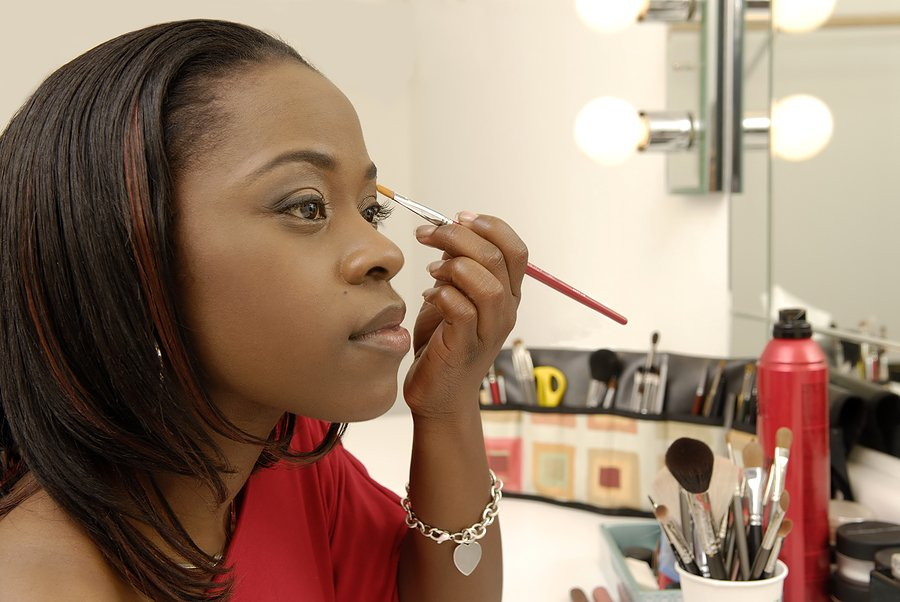

# How to Get up, Get Dressed and Get Out in 15 Minutes!

[Uncategorized](https://estheradeniyi.com/category/uncategorized/)
# How to Get up, Get Dressed and Get Out in 15 Minutes!

by [Esther Adeniyi](https://estheradeniyi.com/author/esther-adeniyi/)on [September 18, 2017April 27, 2018](https://estheradeniyi.com/how-to-get-up-get-dressed-and-get-ou/)[Leave a Comment on How to Get up, Get Dressed and Get Out in 15 Minutes!](https://estheradeniyi.com/how-to-get-up-get-dressed-and-get-ou/#respond)

Sharing is caring!

- [0](https://www.facebook.com/sharer/sharer.php?u=https%3A%2F%2Festheradeniyi.com%2Fhow-to-get-up-get-dressed-and-get-ou%2F&amp;t=How%20to%20Get%20up%2C%20Get%20Dressed%20and%20Get%20Out%20in%2015%20Minutes%21)
- [0](https://twitter.com/intent/tweet?text=How%20to%20Get%20up%2C%20Get%20Dressed%20and%20Get%20Out%20in%2015%20Minutes%21&amp;url=https%3A%2F%2Festheradeniyi.com%2Fhow-to-get-up-get-dressed-and-get-ou%2F)
- [0](#)

0shares

 Does 15 minutes sound ridiculous? Maybe. Until you give it a try, you are never going to think this will work. You have to believe that you can get up and [get dressed in 15 minutes](https://patch.com/pennsylvania/plum-oakmont/bp--10-simple-ways-to-get-ready-in-less-than-15-minutes). Only then, will the possibility transform into reality.

Women, we are notorious for spending too much time preparing for any outing. We have had to watch movies where the husband is screaming and panicking in the living room. Wifey, of course is up and about dressing up.

My sister spends so long dressing up. She goes for as long as an hour getting ready. If this is not really annoying, tell me what is. I am like, &#x2018;babe, what&#x2019;s going on?&#x2019; First, she &#x2018;sleeps&#x2019; in the bathroom. Second, she stares at her wardrobe deciding what to wear. This stage actually takes forever! Third, she is dressing up. No, that&#x2019;s not what freaks me out. What does is the makeup stage. And it&#x2019;s like we are going to see the president!

Dear sister&#x2026; If you are ever going to stumble on this blog post, you should scroll down at this point. We need to talk!

Sometimes you really can&#x2019;t afford to spend this long, especially if you are running late for work. Ideally, it&#x2019;s best to not spend too long preparing for work. This can cause a drag in your day. It can cause you to be unmotivated by the time you are exhausted from spending too long preparing to get out.

Have you ever wondered why you woke up with that feeling to slay. You spend that ridiculous amount of time dressing up and on your trip to your first lecture in school, you are exhausted. Yeah right, you should do something about it. Let me help you get out of your predicament babe. You are going to get up, get dressed and get the hell out of your house in 15 minutes.

Create a routine&#xA0;

Know what you are going to do after the next. I realize that some of us wake up aimless and we roam about the whole of the morning looking for what&#x2019;s not lost. By the time we realize that we are actually supposed to be preparing to go out, we are already late. Shame.

Create a routine. After bath, what next? Wear the clothes, like actually wear the clothes. Good, what next? Makeup. Arrrrgrrrh, this is where the wall clock stops! Listen, get your makeup session into routine too. What are you going to start with? Foundation. Get on with it. Next, powder. Yeah, get on with it. When you know what next to do after the first step and you are not making up for an owambe, you should be&#xA0;[done with your makeup in 5 ](http://advicefromatwentysomething.com/how-to-get-ready-in-5-minutes/)minutes. I meant that literally.

[Also read : how to pull off the all natural look](https://www.estheradeniyi.com/how-to-pull-off-all-natural-look?m=1)

Let me assume you are extremely late this one morning, all have to do is apply your foundation, if you do. This is to see that there is an even distribution. After that, leggo. Apply your powder and lipstick in transit. You draw your brows too? Arrrrgrrrhhhhhh&#x2026;. Just do what you have to do, I can&#x2019;t help you if you draw your brows. You are probably never going to leave your house at all.

Prepare your outfit the night before&#xA0;

You know, something tells me that you know that you should prepare your outfit the night before but if you need someone to drive that into you, I am here, girl. So, prepare. Your. Outfit. The. Night. Before.

Iron what you&#x2019;ll need to iron. Polish or clean up what you&#x2019;ll need to. By the way, baby wipes come in very handy here. If you don&#x2019;t have to iron or physically lay out your outfit, mentally prepare. Mix and match your outfit in your head.

Have all of what you want to wear close to the door. Your shoes, bag, wig etc&#x2026; Have a mirror that works too. It really has to be a mirror that works else&#x2026;.

Arrange your carry-on bag

If you have done a good job preparing your outfit, you should know what bag you are carrying. This is if you are not like me that carries one bag for a full week before I switch up. To avoid the panic, forgetfulness and overall disorganization, be a lady and have your things set in your bag.

 Make up your mind to stand up from your bed + Stand up from your bed &#x2013; 3 minutes
 Have your bath &#x2013; 3 minutes
 Actually dress up &#x2013; 3 minutes
 Makeup, maybe &#x2013; 5 minutes
 Carry your bag &#x2013; 30 seconds
 Get the heck out of your house &#x2013; 30 seconds

[Also read : Ankara styles that will hide your big tummy](https://www.estheradeniyi.com/ankara-styles-that-will-hide-your-big)

N. B

1. I assume you already know what you want to do with your hair. I assume that your hair is either pre-packed braids or you are throwing on a wig. If it&#x2019;s neither, consider 30 minutes.

2. I assume you go for light makeup, if not, consider 3 hours, literally.

3. I assume that you really are in a hurry and you have to leave in 15 minutes today or everyday. Otherwise, forget this, all of this.

4. Start your car as soon as you leave the bathroom. This is if you have one.

5. This is minus your quiet time, morning cooking, breakfast, morning workout joint devotion and any other.

Photo credit : istock photos&#xA0;

Sharing is caring!

- [0](https://www.facebook.com/sharer/sharer.php?u=https%3A%2F%2Festheradeniyi.com%2Fhow-to-get-up-get-dressed-and-get-ou%2F&amp;t=How%20to%20Get%20up%2C%20Get%20Dressed%20and%20Get%20Out%20in%2015%20Minutes%21)
- [0](https://twitter.com/intent/tweet?text=How%20to%20Get%20up%2C%20Get%20Dressed%20and%20Get%20Out%20in%2015%20Minutes%21&amp;url=https%3A%2F%2Festheradeniyi.com%2Fhow-to-get-up-get-dressed-and-get-ou%2F)
- [0](#)

0shares

Tags:[Monday Motivation](https://estheradeniyi.com/tag/monday-motivation/)[Style](https://estheradeniyi.com/tag/style/)