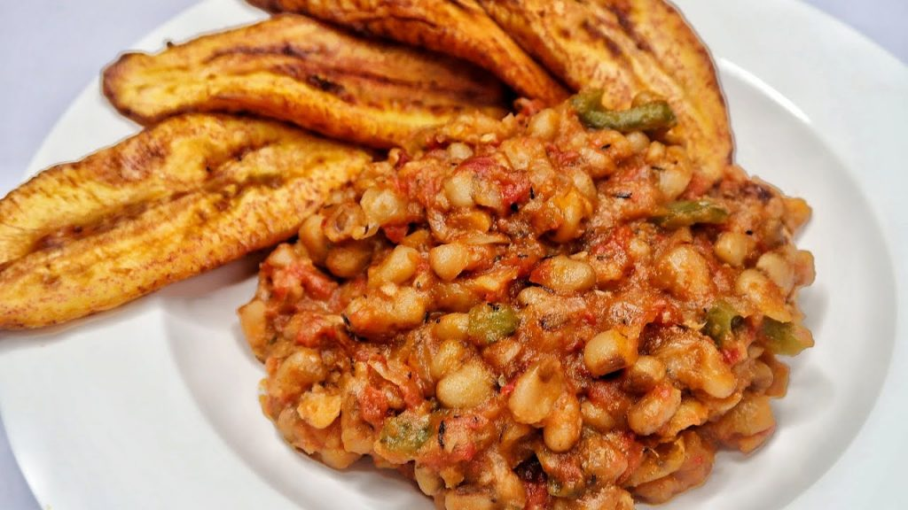

# How to make beans without palm oil by Sisiyemmie

[Uncategorized](https://estheradeniyi.com/category/uncategorized/)
# How to make beans without palm oil by Sisiyemmie

by [Esther Adeniyi](https://estheradeniyi.com/author/esther-adeniyi/)on [July 10, 2017April 27, 2018](https://estheradeniyi.com/how-to-make-beans-without-palm-oil-by/)[Leave a Comment on How to make beans without palm oil by Sisiyemmie](https://estheradeniyi.com/how-to-make-beans-without-palm-oil-by/#respond)

Sharing is caring!

- [0](https://www.facebook.com/sharer/sharer.php?u=https%3A%2F%2Festheradeniyi.com%2Fhow-to-make-beans-without-palm-oil-by%2F&amp;t=How%20to%20make%20beans%20without%20palm%20oil%20by%20Sisiyemmie)
- [0](https://twitter.com/intent/tweet?text=How%20to%20make%20beans%20without%20palm%20oil%20by%20Sisiyemmie&amp;url=https%3A%2F%2Festheradeniyi.com%2Fhow-to-make-beans-without-palm-oil-by%2F)
- [0](#)

0shares

 This is another way to make beans. If you are the [beans ](http://www.allnigerianrecipes.com/beans/beans-porridge.html)without palm oil type of person, you may want to watch this video for another beautiful twist to the preparation.

[You might also like: what you can do with beans powder](https://www.estheradeniyi.com/beans-powder-3-things-you-can-do-with-it)

###  Watch Sisiyemmie make Nigerian beans without palm oil.

What do you think of this recipe?

Sharing is caring!

- [0](https://www.facebook.com/sharer/sharer.php?u=https%3A%2F%2Festheradeniyi.com%2Fhow-to-make-beans-without-palm-oil-by%2F&amp;t=How%20to%20make%20beans%20without%20palm%20oil%20by%20Sisiyemmie)
- [0](https://twitter.com/intent/tweet?text=How%20to%20make%20beans%20without%20palm%20oil%20by%20Sisiyemmie&amp;url=https%3A%2F%2Festheradeniyi.com%2Fhow-to-make-beans-without-palm-oil-by%2F)
- [0](#)

0shares

Tags:[Food](https://estheradeniyi.com/tag/food/)