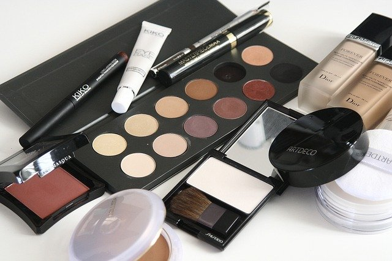

# How to Make Makeup Last All Day on Oily Skin

[Beauty](https://estheradeniyi.com/category/beauty/)
# How to Make Makeup Last All Day on Oily Skin

by [Esther Adeniyi](https://estheradeniyi.com/author/esther-adeniyi/)on [June 21, 2016May 25, 2018](https://estheradeniyi.com/how-to-make-makeup-last-on-oily-skin/)[8 Comments on How to Make Makeup Last All Day on Oily Skin](https://estheradeniyi.com/how-to-make-makeup-last-on-oily-skin/#comments)

Sharing is caring!

- [0](https://www.facebook.com/sharer/sharer.php?u=https%3A%2F%2Festheradeniyi.com%2Fhow-to-make-makeup-last-on-oily-skin%2F&amp;t=How%20to%20Make%20Makeup%20Last%20All%20Day%20on%20Oily%20Skin)
- [0](https://twitter.com/intent/tweet?text=How%20to%20Make%20Makeup%20Last%20All%20Day%20on%20Oily%20Skin&amp;url=https%3A%2F%2Festheradeniyi.com%2Fhow-to-make-makeup-last-on-oily-skin%2F)
- [1](#)

1shares

If you&#x2019;ve got an oily skin, don&#x2019;t fret. Yeah right, &#xA0;we are a team. The oily Skin is a very unique one. We get to remain fabulous and glow even during the dry, &#xA0;harmattan periods. But we can make makeup last all day on oily skin still.

[Watch this video on the secret product to make makeup last on your skin](https://www.estheradeniyi.com/this-will-help-your-makeup-to-stay?m=1)

We have that naturally moisturized skin and fewer aging signs. &#xA0;Our struggles are real too, &#xA0;very real. Applying makeup on oily skin is challenging; the &#x2018;shine&#x2019; and uncomfortable feeling after a long day, etc. There were days I went nude for fear of having to stain my cloth and every other possession with soiled, oily makeup. &#xA0;It&#x2019;s as frustrating as it &#xA0;can be.

But hope is not lost. You can have your makeup set no matter the type of your facial skin. It all depends on using the right products, knowing how to apply them and tweaking up those tricks. So, &#xA0;here we go on how to make makeup last all day on oily skin:

Contents

- [1 Always use a primer](#Always_use_a_primer)
- [2 Carry Blotting Papers](#Carry_Blotting_Papers)
- [3 Never go for oil based products](#Never_go_for_oil_based_products)
- [4 Exfoliate frequently](#Exfoliate_frequently)
- [5 Go lighter&#xA0;](#Go_lighter)
- [6 Stop touching&#xA0;](#Stop_touching)

## Always use a primer

One of the functions of your primer is to make your foundation, &#xA0;concealer etc. stay put. It not only [prepares your face for your makeup](https://www.estheradeniyi.com/makeup-for-beginners-starter-kit?m=1), &#xA0;it helps makeup last all day on oily skin. Make sure to apply it to your Oily areas especially if you have mixed skin types- your chin, forehead and nose, the T-junction of your face necessarily.

A lot of people are also beginning to use Milk of Magnesia as primer. It helps your makeup last all day on an oily skin. Try it.

## Carry Blotting Papers

The trick to using this is to press this firmly on your skin and roll it off gently. It&#x2019;ll clean off excess oil and shine. You &#xA0;can carry around a small pack that will be with you all day. It&#x2019;s such a lifesaver on days when you are beginning to &#x2018;shine&#x2019;.

## Never go for oil based products

I know that I shouldn&#x2019;t repeat this as this is clearly something you should stay off but I had to. Why? Buying beauty products can be tricky at times and that&#x2019;s why it&#x2019;s important to remind ourselves of buying oil-free foundations, moisturizers, &#xA0;concealers, SPFs etc. Also try [Absolute New York HD flawless setting powde](https://www.estheradeniyi.com/absolute-new-york-hd-powder-brightening-banana?m=1)r, I have a review there.

## Exfoliate frequently

Exfoliation helps to clean the skin in preparation for makeup. It also clears off excess oil sitting all over. Care has to be taken here though because over exfoliation can lead to breakouts and even an excessive production of oil on your skin.

## Go lighter&#xA0;

Now this is supposed to be a public announcement but we&#x2019;ll wait for this post to go viral. Many people add too much of products on the face and in unnecessarily larger quantities too. Go easy on the amount of foundation or powder you use.

Light application will also give a fine output if you apply well and make your makeup last all day on an oily skin. Oily skins begin to appear baked after a long while of applying too much of makeup.

You can find a complete guide to [choosing the right foundation for your skin](https://www.estheradeniyi.com/a-complete-guide-to-choosing-right?m=1) here.

## Stop touching&#xA0;

That soils and smears your makeup. With an oily face, &#xA0;to make your makeup last longer you need to learn how to take your hands off your face. I had to learn that too so it is possible. Apart from soiling your makeup, touching your face transfers germs from your hands onto it.

That&#x2019;s it and you are free to have your makeup last all day on your oily skin. How have you made your makeup last longer on your oily skin? Please feel free to share, &#xA0;we could learn some more.

Sharing is caring!

- [0](https://www.facebook.com/sharer/sharer.php?u=https%3A%2F%2Festheradeniyi.com%2Fhow-to-make-makeup-last-on-oily-skin%2F&amp;t=How%20to%20Make%20Makeup%20Last%20All%20Day%20on%20Oily%20Skin)
- [0](https://twitter.com/intent/tweet?text=How%20to%20Make%20Makeup%20Last%20All%20Day%20on%20Oily%20Skin&amp;url=https%3A%2F%2Festheradeniyi.com%2Fhow-to-make-makeup-last-on-oily-skin%2F)
- [1](#)

1shares

Tags:[Beauty](https://estheradeniyi.com/tag/beauty/)[makeup](https://estheradeniyi.com/tag/makeup/)