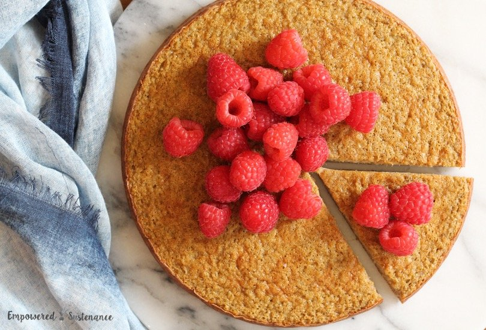
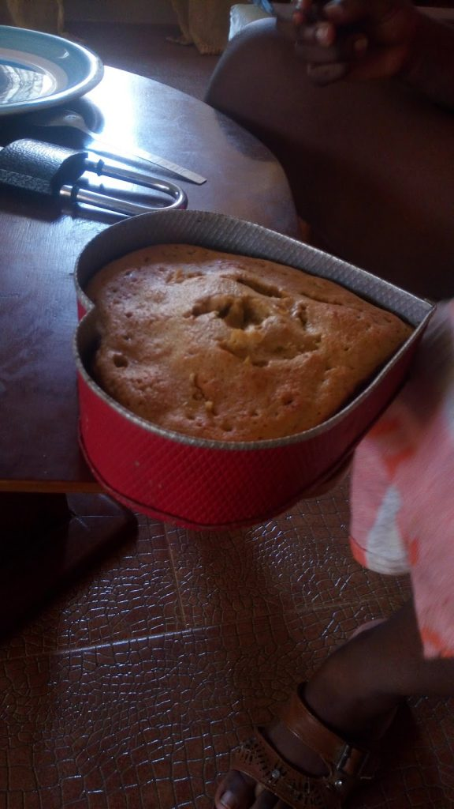

# How to Make Plantain Cake in 30 Minutes!

[Uncategorized](https://estheradeniyi.com/category/uncategorized/)
# How to Make Plantain Cake in 30 Minutes!

by [Esther Adeniyi](https://estheradeniyi.com/author/esther-adeniyi/)on [January 20, 2017April 27, 2018](https://estheradeniyi.com/how-to-make-plantain-cake-in-30-minutes/)[18 Comments on How to Make Plantain Cake in 30 Minutes!](https://estheradeniyi.com/how-to-make-plantain-cake-in-30-minutes/#comments)

Sharing is caring!

- [0](https://www.facebook.com/sharer/sharer.php?u=https%3A%2F%2Festheradeniyi.com%2Fhow-to-make-plantain-cake-in-30-minutes%2F&amp;t=How%20to%20Make%20Plantain%20Cake%20in%2030%20Minutes%21)
- [0](https://twitter.com/intent/tweet?text=How%20to%20Make%20Plantain%20Cake%20in%2030%20Minutes%21&amp;url=https%3A%2F%2Festheradeniyi.com%2Fhow-to-make-plantain-cake-in-30-minutes%2F)
- [0](#)

0shares

Photo- [Empowered Sustenance](http://empoweredsustenance.com/flourless-plantain-cake/)&#xA0;

If we are [friends on Facebook](https://www.facebook.com/adeniyi.esther.583), chances are that you have been expecting this. And well y&#x2019;all would know that I was at [Omoyele&#x2019;s](https://www.facebook.com/olamiposi.oluwa) place yesterday and we made plantain caaaaaaaaaaake. &#x2018;Our&#x2019; own is easy and quick o. No unnecessary hassles. &#xA0;Who&#x2019;s got time for senrenren when the thing can be out and on our plates in 30 Minutes?

 One of the reasons we were done in 30 Minutes is because we didn&#x2019;t use flour of any type. It&#x2019;s time to replace flour with something healthy jare. You feel us&#x2026;. Hihihihihihihihi.

It was my first time of eating or even hearing about plantain cakes. And what doesn&#x2019;t Yele cook sef? Gosh, she can cook anything for Africa! Hia! One thing I like about this plantain cake idea is that you can quickly do something to your plantains before you throw them away if they are too overripe.

Okay, back to our plantain cake. First, &#xA0;the ingredients :

Ingredients

Plantain (2 ripe ones)
 Eggs (2)
 Milk (half tin)
 Baking soda
 Butter
 Salt &#xA0;(a pinch)

Method

1. Preheat the oven

2. Dice plantains into a blender. Add the milk and eggs and a pinch of salt. We forgot to add baking soda! Lol.

3. Blend together until you have a smooth puree. We were supposed to mash and whisk but the blender gave such a beautiful batter.

4. Grease the baking pan with butter.

5. Pour the batter into the baking pan and place in the oven.

6. To know if it&#x2019;s done, insert a toothpick into the cake. It&#x2019;s done if your toothpick comes out with no trace of the batter. It should come out clean. We inserted a fork! Eh God&#x2026;. Buahahahahahahahaaaa.

7. Yas! Easy peasy. You are done with your plantain cake. The smell is diviiiiiiiiine.

I wish we had taken our own deliberate pictures but well, &#xA0;this is a lesson for next time. You can manage this one sha *covers face*

Would you like to try this someday?

Sharing is caring!

- [0](https://www.facebook.com/sharer/sharer.php?u=https%3A%2F%2Festheradeniyi.com%2Fhow-to-make-plantain-cake-in-30-minutes%2F&amp;t=How%20to%20Make%20Plantain%20Cake%20in%2030%20Minutes%21)
- [0](https://twitter.com/intent/tweet?text=How%20to%20Make%20Plantain%20Cake%20in%2030%20Minutes%21&amp;url=https%3A%2F%2Festheradeniyi.com%2Fhow-to-make-plantain-cake-in-30-minutes%2F)
- [0](#)

0shares

Tags:[Food](https://estheradeniyi.com/tag/food/)