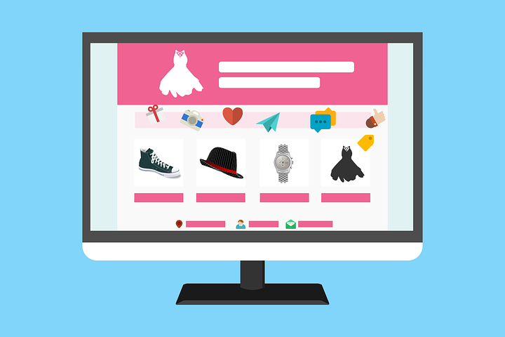

# How to Make Your Blog Shine in 2017

[Uncategorized](https://estheradeniyi.com/category/uncategorized/)
# How to Make Your Blog Shine in 2017

by [Esther Adeniyi](https://estheradeniyi.com/author/esther-adeniyi/)on [January 23, 2017April 27, 2018](https://estheradeniyi.com/how-to-make-your-blog-shine-in-2017/)[6 Comments on How to Make Your Blog Shine in 2017](https://estheradeniyi.com/how-to-make-your-blog-shine-in-2017/#comments)

Sharing is caring!

- [0](https://www.facebook.com/sharer/sharer.php?u=https%3A%2F%2Festheradeniyi.com%2Fhow-to-make-your-blog-shine-in-2017%2F&amp;t=How%20to%20Make%20Your%20Blog%20Shine%20in%202017)
- [0](https://twitter.com/intent/tweet?text=How%20to%20Make%20Your%20Blog%20Shine%20in%202017&amp;url=https%3A%2F%2Festheradeniyi.com%2Fhow-to-make-your-blog-shine-in-2017%2F)
- [0](#)

0shares

 Every blogger wants their blogs to shine. It is just the same way every writer wants to be read. To make your blog shine, &#xA0;you have to make it different and unique. Blogs that stand out are usually different in some way. Haven&#x2019;t you noticed how difficult it is to resist blogs that pop? You also can make your blog shine. Your blog can pop, it can stand out.

If you want your blog to shine in 2017, keep reading on:

1. Be consistent

I have made this the first point because it&#x2019;s no doubt that this is the most challenging part of blogging for many bloggers. This is unfortunately not negotiable for blogs that desire to shine. Blog readers want to trust that you have something for them when you promise to. If you &#xA0;want to blog once a month, be consistent. It is however advisable to blog more frequently than that if you have decided to have a blog that will constantly be on the minds of people. I blog four times per week. If you want to blog everyday, &#xA0;be consistent. On the average &#xA0;twice to thrice per week is okay. You can [click here to get more tips on how to blog consistently.&#xA0;](https://www.estheradeniyi.com/5-important-tips-to-blogging?m=1)

2. Have a clean blog layout

Let your blog be easy to navigate and browse through. Let your layout be clean enough for a first time reader to navigate. If your blog must shine this year, &#xA0;it should be neat. Many blogs are too busy with irrelevant distractions. Don&#x2019;t make your blog like that. Start by decluttering your sidebar. Remove any widget that is not top notch important. Your design also matters. Make your blog attractive enough for people to notice you. You can send a mail to esther.adeniyi@gmail.com or send me a message on Facebook (Esther Adeniyi) if you would like to design or re-design your blog.

3. Blog quality

Blog quality, write quality, report quality, photograph quality. You cannot trade quality for anything and hope for a blog that will shine. Laye! Quality matters. Quality content, quality pictures. I am so particular about content that it sometimes puts me under pressure. Let your sources be credible. Don&#x2019;t copy and paste from other bloggers. Let facts be true. If you post quality, you will over time have people recommending you as an authority in your niche. Sometimes laziness may want to get the better of you but you have to decide that you would rather not make a blog post than post crap. Yes, &#xA0;it&#x2019;s that serious. Let everything about your blog scream quality.

4. Do something different

To shine, you have to dare to be different. This rule applies to blogging too. For your blog to stand out, you may need to do something nobody is doing in your niche. The entertainment blog industry is saturated. If you must be in that niche, for example, you may need to do something your blog neighbour isn&#x2019;t doing. You may decide to organize interactive sessions on your blog on a particular day of the week. Just think up something someone else isn&#x2019;t doing. You will be surprised at how much of a difference it will make on your blog.

5. Share your blog

Talk about your blog. Share your blog on social media platforms. To have a blog that will shine, you have to let it be noticed. Let people see your blog. Don&#x2019;t be afraid to let people know that you are a blogger. [Lifestyle Bloggers ](https://www.estheradeniyi.com/what-is-lifestyle-blogging?m=1)like me actually have no choice here because I am for example, the face of my blog. If you want to stay anonymous, you can but make sure you are getting word out there about your blog in an anonymous way. Ask your friends to share your blog too.

To have a blog that will shine this year, you must be intentional about it. With these tips, you are on your way to making your blog pop in 2017. Do you have any more tips you would like to share? Please share in the comments section.

P. S- If you want to learn more on how to make your blog shine, [Sisiyemmie has another wonderful article on it.&#xA0;](https://draft.blogger.com/)

Sharing is caring!

- [0](https://www.facebook.com/sharer/sharer.php?u=https%3A%2F%2Festheradeniyi.com%2Fhow-to-make-your-blog-shine-in-2017%2F&amp;t=How%20to%20Make%20Your%20Blog%20Shine%20in%202017)
- [0](https://twitter.com/intent/tweet?text=How%20to%20Make%20Your%20Blog%20Shine%20in%202017&amp;url=https%3A%2F%2Festheradeniyi.com%2Fhow-to-make-your-blog-shine-in-2017%2F)
- [0](#)

0shares

Tags:[Blogging](https://estheradeniyi.com/tag/blogging/)