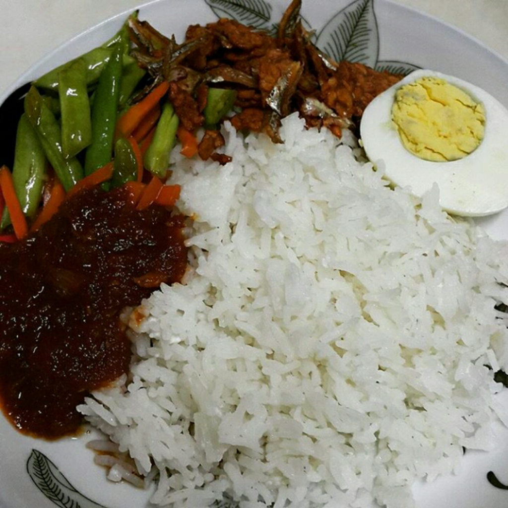

# How to Prepare Nigerian Coconut Rice

[Uncategorized](https://estheradeniyi.com/category/uncategorized/)
# How to Prepare Nigerian Coconut Rice

by [Esther Adeniyi](https://estheradeniyi.com/author/esther-adeniyi/)on [May 8, 2017April 27, 2018](https://estheradeniyi.com/how-to-prepare-nigerian-coconut-rice/)[Leave a Comment on How to Prepare Nigerian Coconut Rice](https://estheradeniyi.com/how-to-prepare-nigerian-coconut-rice/#respond)

Sharing is caring!

- [0](https://www.facebook.com/sharer/sharer.php?u=https%3A%2F%2Festheradeniyi.com%2Fhow-to-prepare-nigerian-coconut-rice%2F&amp;t=How%20to%20Prepare%20Nigerian%20Coconut%20Rice)
- [0](https://twitter.com/intent/tweet?text=How%20to%20Prepare%20Nigerian%20Coconut%20Rice&amp;url=https%3A%2F%2Festheradeniyi.com%2Fhow-to-prepare-nigerian-coconut-rice%2F)
- [0](#)

0shares

Photo via @jayaerial
 Nigerian coconut rice is coconut rice the Nigerian way. Hihihihihihihihi. I was looking for rhymes to make it sound deep but naaaaaa, this is food. Ain&#x2019;t nothing deep about food. Let&#x2019;s just eat and belch, shebi? Bad habit somebody I am. Worefa. Oya, let&#x2019;s go and see how to make this coconut rice the naija style.

Required ingredients:

-parboiled rice

-coconut milk extracted from whole coconut

-carrot (optional)&#xA0;

-chicken or beef stock

-2 medium sized barbecue or ground fish

-onion (1 medium sized)

-Ground crayfish

-seasoning

-pepper

-salt

-vegetable oil (optional)

Preparing the dish:

1)Extract coconut milk from the coconut.

2)Cook the chicken or beef and reserve the stock.

3)Grill the fish or barbecue with salt.

4)Parboil your rice for about 15 minutes and let it drain in a sieve.

5)Grind the crayfish and set it aside.

6)Pour in the meat stock and the extraced coconut milk &#xA0;into a pot and leave to boil for 5 minutes.

7)Pour the parboiled rice into the pot, and the chopped onions, ground crayfish, seasoning of choice, pepper and salt to taste. Make sure that the liquid on the pot is at the same level as the rice in the pot, if not, and some more to top it up. Add the barbecued fish later.

8)Cover and leave the rice to cook on medium heat until the liquid in the pot is dried up.

9)Then add the diced carrots if you want.

10) Voila, we have our coconut rice.

Will you try this sometime? It makes sense o, I am serious.

Sharing is caring!

- [0](https://www.facebook.com/sharer/sharer.php?u=https%3A%2F%2Festheradeniyi.com%2Fhow-to-prepare-nigerian-coconut-rice%2F&amp;t=How%20to%20Prepare%20Nigerian%20Coconut%20Rice)
- [0](https://twitter.com/intent/tweet?text=How%20to%20Prepare%20Nigerian%20Coconut%20Rice&amp;url=https%3A%2F%2Festheradeniyi.com%2Fhow-to-prepare-nigerian-coconut-rice%2F)
- [0](#)

0shares

Tags:[Food](https://estheradeniyi.com/tag/food/)