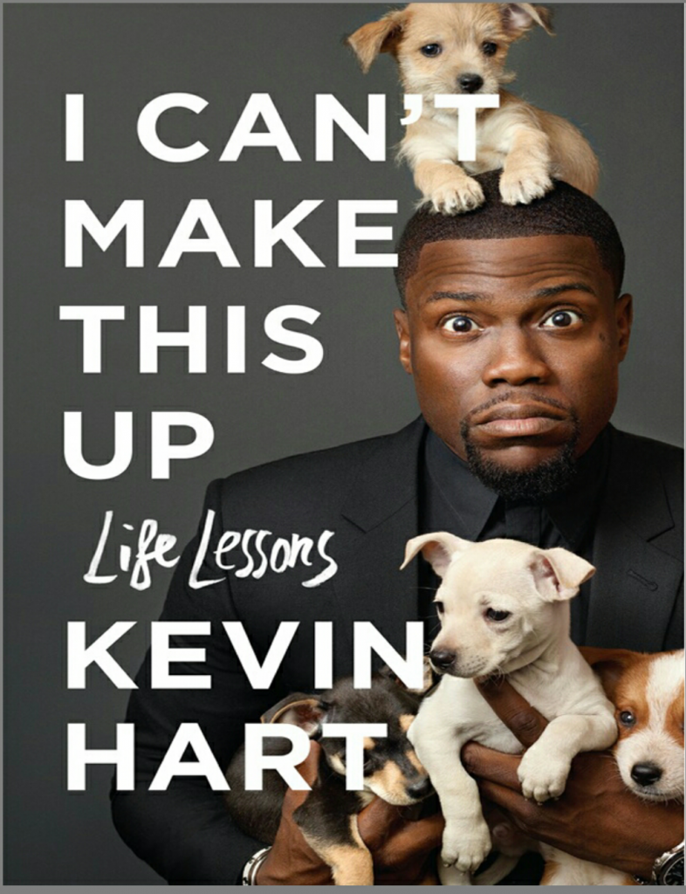

# I can’t make this up : Life Lessons by Kevin Hart

[Books](https://estheradeniyi.com/category/books/)
# I can&#x2019;t make this up : Life Lessons by Kevin Hart

by [Esther Adeniyi](https://estheradeniyi.com/author/esther-adeniyi/)on [December 20, 2017April 27, 2018](https://estheradeniyi.com/i-cant-make-this-up-life-lessons-by/)[Leave a Comment on I can&#x2019;t make this up : Life Lessons by Kevin Hart](https://estheradeniyi.com/i-cant-make-this-up-life-lessons-by/#respond)

Sharing is caring!

- [0](https://www.facebook.com/sharer/sharer.php?u=https%3A%2F%2Festheradeniyi.com%2Fi-cant-make-this-up-life-lessons-by%2F&amp;t=I%20can%27t%20make%20this%20up%20%3A%20Life%20Lessons%20by%20Kevin%20Hart)
- [0](https://twitter.com/intent/tweet?text=I%20can%27t%20make%20this%20up%20%3A%20Life%20Lessons%20by%20Kevin%20Hart&amp;url=https%3A%2F%2Festheradeniyi.com%2Fi-cant-make-this-up-life-lessons-by%2F)
- [0](#)

0shares

I didn&#x2019;t know I had gotten to the end of &#x2018;I Can&#x2019;t Make This Up&#x2019; when I reached page 407. I didn&#x2019;t want to stop learning. Kevin Hart&#x2019;s book is a killer ride y&#x2019;all need to jump on. You need that text to survive.

From growing up under a strict mum whose parenting would later mould his life&#x2019;s perspective to hustling from the scratch to experiencing life&#x2019;s fair share of ups and downs, Kevin Hart in I Can&#x2019;t Make This Up bares it all.

[I Can&#x2019;t Make This Up](https://www.goodreads.com/book/show/33347428-i-can-t-make-this-up) is a must read for every entrepreneur, every &#x2018;start from scratch&#x2019; hustler, every passionate person and practically anyone who has decided that they want to make it in life.

This book is such an eye opener to the world of possibilities when you take the bull by the horns. I am so happy that I read &#x2018;I Can&#x2019;t Make This Up&#x2019;. The 407 paged book is as raw as it can be, the stories are real and the life lessons are practical.

 I had just reached the middle of Kevin Hart&#x2019;s book when I called a friend who&#x2019;s a comedian. &#x2018;This is perfect for him&#x2019;, I said to myself. And really, it is. Anyone needs to read this book but comedians will get to understand the art and intricacies of this business. Anyone in the creative industry will get to understand what is means to be resilient, how to be hardworking, persistent, determined, crazy and radical.Kevin Hart&#x2019;s book is also a practical one on how to graciously handle rejection and keep pushing violently through the hurdles like they are never staring at you.
&#x2018;I can&#x2019;t make this up&#x2019; is perfect for people who intend to make something meaningful out of their lives. I could relate with so many of Kevin Hart&#x2019;s stories on a great level. His book is a complete recipe for success.

&#x2018;I can&#x2019;t Make it up : Life Lessons &#x2018; by Kevin Hart is your next book, just believe me.

Related: [#Girlboss by Sophia Amoruso](https://www.estheradeniyi.com/book-review-girl-boss-by-sophia-amoruso)

Sharing is caring!

- [0](https://www.facebook.com/sharer/sharer.php?u=https%3A%2F%2Festheradeniyi.com%2Fi-cant-make-this-up-life-lessons-by%2F&amp;t=I%20can%27t%20make%20this%20up%20%3A%20Life%20Lessons%20by%20Kevin%20Hart)
- [0](https://twitter.com/intent/tweet?text=I%20can%27t%20make%20this%20up%20%3A%20Life%20Lessons%20by%20Kevin%20Hart&amp;url=https%3A%2F%2Festheradeniyi.com%2Fi-cant-make-this-up-life-lessons-by%2F)
- [0](#)

0shares

Tags:[Book reviews](https://estheradeniyi.com/tag/book-reviews/)[Books](https://estheradeniyi.com/tag/books/)