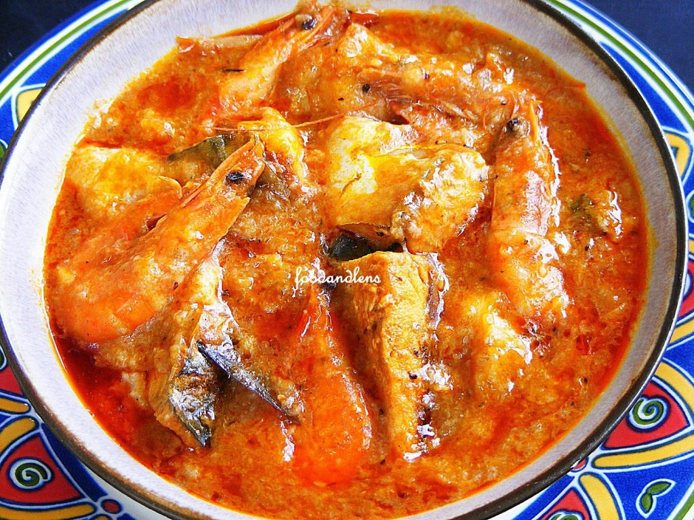

# Ijebu Original : Ikokore

[Uncategorized](https://estheradeniyi.com/category/uncategorized/)
# Ijebu Original : Ikokore

by [Esther Adeniyi](https://estheradeniyi.com/author/esther-adeniyi/)on [November 23, 2016May 5, 2018](https://estheradeniyi.com/ijebu-original-ikokore/)[Leave a Comment on Ijebu Original : Ikokore](https://estheradeniyi.com/ijebu-original-ikokore/#respond)

Sharing is caring!

- [0](https://www.facebook.com/sharer/sharer.php?u=https%3A%2F%2Festheradeniyi.com%2Fijebu-original-ikokore%2F&amp;t=Ijebu%20Original%20%3A%20Ikokore)
- [0](https://twitter.com/intent/tweet?text=Ijebu%20Original%20%3A%20Ikokore&amp;url=https%3A%2F%2Festheradeniyi.com%2Fijebu-original-ikokore%2F)
- [0](#)

0shares

ikokore ijebu picture
Ikokore is yam redefined. If you agree with me, say yay. Yeah, right. It&#x2019;s one of the Ijebu&#x2019;s favourites. It is simple to prepare. I don&#x2019;t know if to say it is easy because this recipe involves some yam grating. This is basically what people run away from, the grating. Other than that, it is easy.

&#xA0;

## Ingredients for Ikokore:

Water yam- 1 big size
 Smoked fish- 2 small sizes
 Crayfish (ground)- 3 tablespoons
 Tomatoes &#x2013; 1 medium size
 Seasoning &#x2013; 2 cubes
 Salt &#x2013; to taste
 Fresh pepper- 4 medium sizes
 Palm oil- 2 cooking spoons
 Onion &#x2013; 1 medium size
 Water

[You might also like to read a twist to yam porridge](https://www.estheradeniyi.com/this-is-not-your-regular-yam-porridge)

## How to prepare Ikokore

&#xA0;

Peel, wash and grate the water yam.

Blend the tomatoes, onions and pepper together.

Pour all the water into a pot , add the smoked fish, crayfish and blended pepper.

Allow to boil.

Add palm oil and the 2 cubes of seasoning.

Mix the grated water yam with a little salt and water if necessary.

Drop the mixture a bit at a time into the pot.

Cover the pot and cook for 15 minutes.

Stir and add salt if required.

There you go, &#xA0;Ikokore.

&#xA0;

You might also like to [read and watch Sisiyemmie&#x2019;s Ikokore recipe here](http://www.sisiyemmie.com/2014/04/recipe-how-to-cook-ikokore-popular.html)

 What do you think about this recipe? Will you try this sometime? Any other ideas?Photo via: [Food and lens](http://www.foodandlens.com/2015/08/ikokore.html)

Sharing is caring!

- [0](https://www.facebook.com/sharer/sharer.php?u=https%3A%2F%2Festheradeniyi.com%2Fijebu-original-ikokore%2F&amp;t=Ijebu%20Original%20%3A%20Ikokore)
- [0](https://twitter.com/intent/tweet?text=Ijebu%20Original%20%3A%20Ikokore&amp;url=https%3A%2F%2Festheradeniyi.com%2Fijebu-original-ikokore%2F)
- [0](#)

0shares

Tags:[Food](https://estheradeniyi.com/tag/food/)[Ijebu Ikokore](https://estheradeniyi.com/tag/ijebu-ikokore/)[Ikokore](https://estheradeniyi.com/tag/ikokore/)