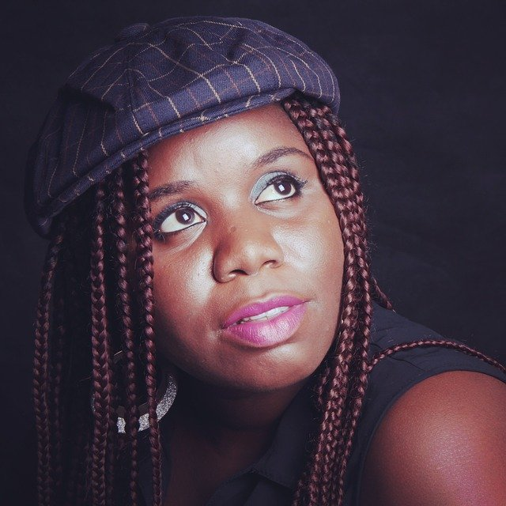

# Important things to look out for before you date him

[Uncategorized](https://estheradeniyi.com/category/uncategorized/)
# Important things to look out for before you date him

by [Esther Adeniyi](https://estheradeniyi.com/author/esther-adeniyi/)on [May 19, 2017April 27, 2018](https://estheradeniyi.com/important-things-to-look-out-for-before/)[4 Comments on Important things to look out for before you date him](https://estheradeniyi.com/important-things-to-look-out-for-before/#comments)

Sharing is caring!

- [0](https://www.facebook.com/sharer/sharer.php?u=https%3A%2F%2Festheradeniyi.com%2Fimportant-things-to-look-out-for-before%2F&amp;t=Important%20things%20to%20look%20out%20for%20before%20you%20date%20him)
- [0](https://twitter.com/intent/tweet?text=Important%20things%20to%20look%20out%20for%20before%20you%20date%20him&amp;url=https%3A%2F%2Festheradeniyi.com%2Fimportant-things-to-look-out-for-before%2F)
- [0](#)

0shares

 On plenty occasions, I&#x2019;ve had to use the phrase &#x2018;Birds of the same feather&#x2019; not as a compliment for a purposeful relationship but as a censure to an illicit relationship. This suggests to me that we notice when two people do not gel enough to be together.

Ade (not real name) is a commercial bike rider, he&#x2019;s been trailing me for months now or so I thought. It always looks as though he&#x2019;s keeping a close tab on me or probably has an informant who&#x2019;s close to me such that he knows when I&#x2019;m getting dressed to step out to town, because he&#x2019;s always at my gate once I&#x2019;m step out of the compound.

It became evident this guy likes me a lot when one day, he brought someone on his bike to my neighborhood as as soon as I flagged down another bike man, he pleaded with him to go with his passenger while he transports me to where I was headed.

At a time, I felt I needed to stop him and probably talks some senses into him before he does anything stipid but then, I decided to let him enjoy his moments while I ask myself sincere questions like;

1. What will happen if he decides to ask me out?
 2. What will my reasons be to decline his proposal?
 3. What if he isn&#x2019;t a bad guy after all?
 4. Why do I think he may be a good guy?
 5. Will I be able to submit to a man who seems not to be on the same pedestal with me even if he loves me?

When I answered these questions honestly, I noticed I would not date him, not because of his status or because I&#x2019;m proud but because he doesn&#x2019;t match my &#x2018;what-I-want-in-my-man&#x2019; list.

I like that he&#x2019;s diligent in his work but what about his educational/academic background that matters to me. Even if I decided to roll with him and put my shoulder pads down for him, what if he gets intimidated by my success and status as a successful and respected entrepreneur in later years. What if his folks influence him to misbehave? What if he doesn&#x2019;t appreciate what I am about (my job, ministry, buiness) and all that matter to me.

See, even the Bible says two won&#x2019;t work except they are in sync/agreement.

Before you agree to settle with a friend, boo or Bae, be sure you&#x2019;re on the same page about things that matter to you.

Ask questions, intentional ones

Be open minded and ready to sacrifice some leisure to make the relationship work but most importantly, be sure you can cope with his or her excesses.

As much as age, financial or academic status, etc. shouldn&#x2019;t be factors to be pertinent about when it comes to marriage, they are factors to be critically and objectively considered.

I declined a serious proposal from a man who is 15 years older than me not for his age really, but because I noticed our thinking facilities are very much wide apart.

He doesn&#x2019;t seem to reason with stuffs that matter to me. He sees things that are in vogue as vague and would always want to prove to me not to be &#x2018;that old&#x2019; by acting childish irritatingly.

So in all, it may not be about the age, physical looks, financial buoyancy, academic status, etc as much as it is about the personality of the intended spouse/friend, but these things can&#x2019;t be crossed out as they may be factors to who/what the personality is. So they matter as well.

Summarily, be on the same page at least in eight things out of ten before deciding to stick with a friend/boo or Bae. Ignoring this not so red flags may cost you your peace in years into the relationship or marriage and you really wouldn&#x2019;t want that.

Selah!

Sharing is caring!

- [0](https://www.facebook.com/sharer/sharer.php?u=https%3A%2F%2Festheradeniyi.com%2Fimportant-things-to-look-out-for-before%2F&amp;t=Important%20things%20to%20look%20out%20for%20before%20you%20date%20him)
- [0](https://twitter.com/intent/tweet?text=Important%20things%20to%20look%20out%20for%20before%20you%20date%20him&amp;url=https%3A%2F%2Festheradeniyi.com%2Fimportant-things-to-look-out-for-before%2F)
- [0](#)

0shares

Tags:[Relationships](https://estheradeniyi.com/tag/relationships/)